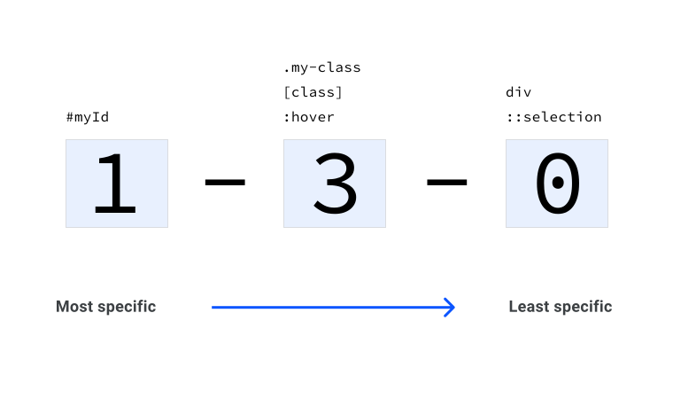

[Volver al Menú](../root.md)

# `Specificity `

Este módulo analiza en profundidad la especificidad, una parte clave de la cascada.

- !important overrides all other styles regardless of the specificity of the selector where it is used - 10000
- Inline Styles - 1000
- ID selectors - 100
- Classes, Attributes and Pseudo-classes - 10
- Elements and Pseudo-elements - 1

# `Puntuación de especificidad`

Cada regla de selección obtiene una puntuación. Puede pensar en la especificidad como una puntuación total y cada tipo de selector gana puntos para esa puntuación. El selector con la puntuación más alta gana.

En un proyecto real con especificidad, debe haber un balance entre el asegurarse de que las reglas de CSS que espera aplicar, realmente se apliquen, y que, en general, se mantengan las puntuaciones bajas para evitar la complejidad. El puntaje solo debe ser tan alto como sea necesario, en lugar de ser lo más alto posible. En el futuro, puede que sea necesario aplicar algunos CSS más importantes. Si busca el puntaje más alto, hará que ese trabajo sea difícil.

# `Puntuación de cada tipo de selector`

Cada tipo de selector gana puntos. Agregue todos estos puntos para calcular la especificidad general de un selector.

## `Selector universal`

Un selector `universal (*)` no tiene especificidad y obtiene 0 puntos. Esto significa que cualquier regla con 1 o más puntos lo anulará.

```
* {
  color: red;
}
```

## `Selector de elementos o pseudoelementos`

Un selector de elemento (tipo) o pseudoelemento obtiene 1 punto de especificidad.

Selector de tipo

```

div {
  color: red;
}
```

Selector de pseudoelementos

```
::selection {
  color: red;
}
```

## `Selector de clase, pseudoclase o atributo`

Un selector de clase, pseudoclase o atributo obtiene 10 puntos de especificidad.

Selector de clases

```
.my-class {
  color: red;
}
```

Selector de pseudoclase

```
:hover {
  color: red;
}
```

Selector de atributos

```
[href='#'] {
  color: red;
}
```

## `Selector de ID`

Un selector de ID obtiene 100 puntos de especificidad, siempre que use un selector de ID (#myID) y no un selector de atributo ([id="myID"]).

```
#myID {
  color: red;
}
```

## `Atributo de estilo en línea`

El CSS aplicado directamente al atributo style del elemento HTML, obtiene una puntuación de especificidad de 1.000 puntos. Esto significa que para anularlo en CSS, debe escribir un selector extremadamente específico.

```
<div style="color: red"></div>
```

## `Regla !important`

Por último, escribir !important al final de un valor de CSS obtiene una puntuación de especificidad de 10.000 puntos. Esta es la mayor especificidad que puede obtener un objeto individual.

Una regla !important se aplica a una propiedad CSS, por lo que todo en la regla general (selector y propiedades) no obtiene la misma puntuación de especificidad.

# `Especificidad en contexto`

La especificidad de cada selector que coincide con un elemento se suma. Considere este ejemplo de HTML:

Este enlace tiene dos clases. Agregue el siguiente CSS y obtendrá 1 punto de especificidad:

```
a {
  color: red;
}
```

Haga referencia a una de las clases en esta regla, ahora tiene 11 puntos de especificidad:

```
a.my-class {
color: green;
}
```

Agregue la otra clase al selector, ahora tiene 21 puntos de especificidad:

```
a.my-class.another-class {
  color: rebeccapurple;
}
```

Agregue el atributo href al selector, ahora tiene 31 puntos de especificidad:

```
a.my-class.another-class[href] {
color: goldenrod;
}
```

Finalmente, agregue una pseudiclase :hover, y el selector termina con 41 puntos de especificida

```
a.my-class.another-class[href]:hover {
  color: lightgrey;
}
```

# `Visualizando la especificidad`

En diagramas y calculadoras de especificidad, la especificidad a menudo se visualiza así:



El grupo de la izquierda son los selectores de id. El segundo grupo son los selectores de clase, atributo y pseudoclase. El grupo final son los selectores de elementos y pseudoelementos.

Como referencia, el siguiente selector es 0-4-1:

```
a.my-class.another-class[href]:hover {
  color: lightgrey;
}
```

# `Especificidad pragmáticamente creciente`

Digamos que tenemos algo de CSS que se parece a esto:

```
.my-button {
  background: blue;
}

button[onclick] {
  background: grey;
}
```

Con un HTML que se ve así:

```
<button class="my-button" onclick="alert('hello')">Click me</button>
```

El botón tiene un fondo gris, porque el segundo selector gana 11 puntos de especificidad (0-1-1). Esto se debe a que tiene un selector de tipo (button), que es de 1 punto y un selector de atributo `([onclick])`, que es de 10 puntos.

La regla anterior, .my-button obtiene 10 puntos (0-1-0), porque tiene un selector de clase.

Si desea mejorar esta regla, repita el selector de clases de la siguiente manera:

```
.my-button.my-button {
  background: blue;
}

button[onclick] {
  background: grey;
}
```

<h2 style="color: red">Precaución</h2>

`Si encuentra que necesita aumentar la especificidad de esta manera con frecuencia, puede indicar que está escribiendo selectores demasiado específicos. Considere si puede refactorizar su CSS para reducir la especificidad de otros selectores para evitar este problema.`

# `Una puntuación de especificidad coincidente hace que la instancia más nueva gane`

Sigamos con el ejemplo del botón por ahora y cambiemos el CSS a esto:

```
.my-button {
  background: blue;
}

[onclick] {
  background: grey;
}
```

El botón tiene un fondo gris, porque ambos selectores tienen una puntuación de especificidad idéntica ( 0-1-0 ).

Esta es la única instancia en la que gana el CSS más nuevo. Para hacerlo, debe coincidir con la especificidad de otro selector que apunte al mismo elemento.
