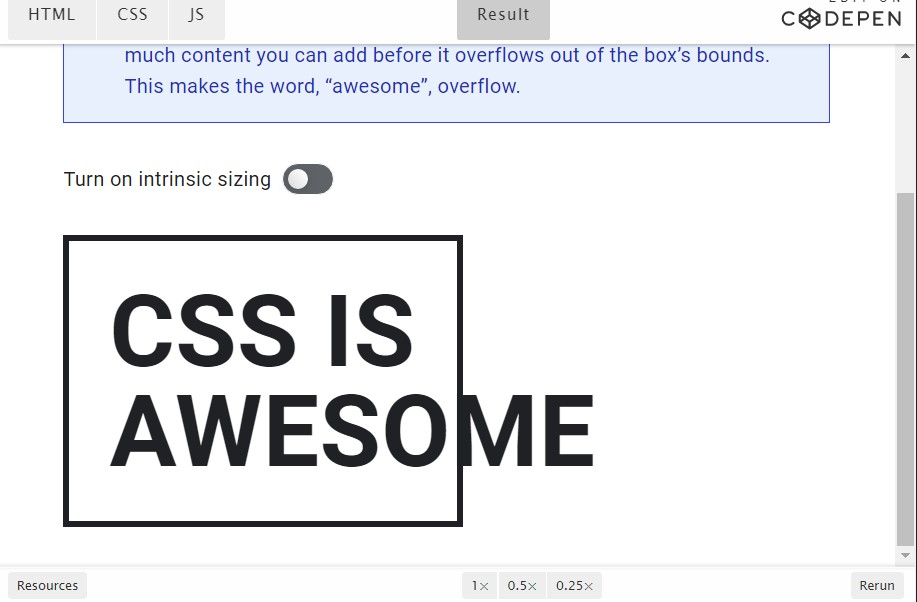

[Volver al Menú](../root.md)

# `Box Model`

Todo lo que muestra CSS es una caja.
Por lo tanto, comprender cómo funciona el modelo de caja CSS es una base fundamental de CSS.

Al maquetar un documento, el motor de renderizado del navegador representa cada elemento como una caja rectangular, conforme al estándar del modelo de caja básico de CSS. CSS determina el tamaño, la posición y las propiedades (color, fondo, tamaño del borde, etc.) de estas cajas.

Cada caja está compuesta de cuatro partes (o áreas), definidas por sus respectivos límites: límite de contenido (content edge) , límite de relleno (padding edge) , límite de borde (border edge) y límite de margen (margin edge) .

## `Área de contenido (content area)`

El área de contenido o content area, delimitada por el límite de contenido (Content edge en la imagen), contiene el contenido "real" del elemento, como texto, una imagen o un reproductor de video. Sus dimensiones son "content width" o ("content-box width") que hace referencia al ancho del contenido, y "content height" o ("content-box height") que hace referencia al alto. A menudo, tiene un color o una imagen de fondo.

Si la propiedad `box-sizing` está definida como content-box (que es el valor por defecto) y el elemento es un "elemento de bloque", el tamaño del área de contenido puede definirse explícitamente con las propiedades width , `min-width` , `max-width` (en-US) , height , `min-height` y `max-height` .

## `Área de relleno (padding area)`

El área de relleno o padding area, delimitada por el límite de relleno (Padding Edge en la imagen), extiende el área de contenido para incluir el relleno del elemento. Sus dimensiones son "padding-box width" para el ancho y "padding-box height" para el alto.

El tamaño del relleno viene determinado por las propiedades `padding-top` , `padding-right` (en-US) , `padding-bottom` , `padding-left` (en-US) y la propiedad resumida padding .

## `Área de borde (border area)`

El área de borde o border area, delimitada por el límite de borde (Border Edge en la imagen), extiende el área de relleno para incluir los bordes del elemento. Sus dimensiones son "`border-box` width" para el ancho y "`border-box` height" para el alto.

El espesor de los bordes está determinado por la propiedad border-width y la propiedad resumida border . Si la propiedad `box-sizing` se establece como `border-box` , el tamaño del área de borde puede definirse explícitamente con los parámetros width , `min-width` , `max-width` (en-US) , height , `min-height` , `max-height`. Cuando hay un fondo background-color o background-image establecido en una caja, éste se extiende hasta el límite exterior del borde (es decir, se extiende por debajo del borde en el orden Z). Este comportamiento, que es el que tiene por defecto, puede ser alterado con la propiedad CSS background-clip.

## `Área de margen (margin area)`

El área de margen o margin area, delimitada por el límite de margen (Margin edge en la imagen), extiende el área de borde para incluir un área vacía, utilizada para separar al elemento del resto de sus vecinos. Sus dimensiones son "margin-box width" para el ancho y "margin-box height" para el alto.

El tamaño del área de margen está determinado por las propiedades `margin-top` (en-US) , `margin-right` , `margin-bottom` , `margin-left` (en-US) y la propiedad resumida margin . Cuando se produce un colapso de margen, el área de margen no está claramente definida ya que los márgenes se comparten entre cajas.

Por último, tenga en cuenta que para los elementos en línea no modificados, la cantidad de espacio ocupado (la contribución a la altura de la línea) está determinada por la propiedad line-height , aunque los bordes y el relleno sigan apareciendo alrededor del contenido.

## `Contenido y tamaño #`

Las cajas tienen un comportamiento diferente según su display, sus dimensiones establecidas y el contenido que vive dentro de ellas. Este contenido podría ser incluso más cajas, generadas por elementos secundarios, o por contenido de texto sin formato. De cualquier manera, este contenido afectará la forma predeterminada del tamaño de la caja.

Puedes controlar esto mediante el tamaño extrínseco, o puedes seguir permitiendo que el navegador tome decisiones por ti en función del tamaño del contenido, utilizando el tamaño intrínseco.

La demostración tiene las palabras, "CSS is awesome" en una caja con dimensiones fijas y un borde grueso. La caja tiene un ancho, por lo que tiene un tamaño extrínseco, el cual controla el tamaño de su contenido hijo. Sin embargo, el problema con esto es que la palabra "awesome" es demasiado grande para la caja, por lo que se desborda fuera del borde de la caja del elemento padre (más sobre esto más adelante en la lección). Una forma de evitar este desbordamiento es permitir que la caja tenga un tamaño intrínseco ya sea removiendo el tamaño del ancho o, en este caso, estableciendo el width en min-content. El min-content le dice a la caja que sea tan ancha como el ancho mínimo intrínseco de su contenido (la palabra "awesome"). Esto permite que la caja se ajuste perfectamente a "CSS is awesome".

<h2 style="color: red">Término clave</h1>

Cuando el contenido es demasiado grande para la caja en la que se encuentra, lo llamamos desbordamiento. Puedes definir cómo un elemento maneja el contenido de desbordamiento, utilizando la propiedad de `overflow`.

## `The box-sizing property can be used to adjust this behavior:`

- `content-box`: gives you the default CSS box-sizing behavior. If you set an element's width to 100 pixels, then the element's content box will be 100 pixels wide, and the width of any border or padding will be added to the final rendered width, making the element wider than 100px.

- `border-box`: tells the browser to account for any border and padding in the values you specify for an element's width and height. If you set an element's width to 100 pixels, that 100 pixels will include any border or padding you added, and the content box will shrink to absorb that extra width. This typically makes it much easier to size elements. box-sizing: border-box is the default styling that browsers use for the `<table>`, `<select>`, and `<button>` elements, and for `<input>` elements whose type is radio, checkbox, reset, button, submit, color, or search.
