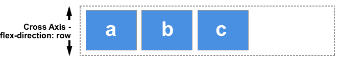

[Volver al Menú](../root.md)

# `Flexbox`


# `El eje principal y el eje transversal`

La clave para comprender flexbox es comprender el concepto de eje principal y eje transversal. El eje principal es el que establece su propiedad `flex-direction`. Si esa es `row`, su eje principal está a lo largo de la fila, si es `column` su eje principal está a lo largo de la columna.

## `El eje principal`

El eje principal está definido por flex-direction, que posee cuatro posibles valores:

- row

- row-reverse

- column

- column-reverse

Si elegimos `row` o `row-reverse`, el eje principal correrá a lo largo de la fila según la dirección de la línea .


Al elegir `column` o `column-reverse` el eje principal correrá desde el borde superior de la página hasta el final — según la dirección del bloque.


Imagen para dar contexto


Los elementos flex se mueven como un grupo en el eje principal. Recuerde: tenemos un montón de cosas y estamos tratando de obtener el mejor diseño para ellas como grupo.

El eje transversal corre en la otra dirección al eje principal, por lo que si `flex-direction` es `row` el eje transversal corre a lo largo de la columna.

## `El eje cruzado - transversal`

El eje cruzado va perpendicular al eje principal, y por lo tanto si `flex-direction` (del eje principal) es `row` o `row-reverse` el eje cruzado irá por las columnas.



Si el eje principal es `column` o `column-reverse` entonces el eje cruzado corre a lo largo de las filas.


Entender cuál eje es cuál es importante cuando empezamos a mirar la alineación y justificación flexible de los ítems; flexbox posee propiedades que permiten alinear y justificar el contenido sobre un eje o el otro.

---

# `Properties for the Parent (flex container)`

## `display`

This defines a flex container; inline or block depending on the given value. It enables a flex context for all its direct children.

```bash
.container {
  display: flex; /* or inline-flex */
}
```

## `flex-direction`

This establishes the main-axis, thus defining the direction flex items are placed in the flex container.

```bash
.container {
  flex-direction: row | row-reverse | column | column-reverse;
}
```

## `flex-wrap`

By default, flex items will all try to fit onto one line. You can change that and allow the items to wrap as needed with this property.

```bash
.container {
  flex-wrap: nowrap | wrap | wrap-reverse;
}
```

## `flex-flow`

This is a shorthand for the `flex-direction` and `flex-wrap` properties, which together define the flex container’s main and cross axes. The default value is row nowrap.

```bash
.container {
  flex-flow: column wrap;
}
```

## `justify-content`

```bash
.container {
  justify-content: flex-start | flex-end | center | space-between | space-around | space-evenly | start | end | left | right ... + safe | unsafe;
}
```

## `align-items`

This defines the default behavior for how flex items are laid out along the cross axis on the current line. Think of it as the justify-content version for the cross-axis (perpendicular to the main-axis).

```bash
.container {
  align-items: stretch | flex-start | flex-end | center | baseline | first baseline | last baseline | start | end | self-start | self-end + ... safe | unsafe;
}
```

## `align-content`

This aligns a flex container’s lines within when there is extra space in the cross-axis, similar to how justify-content aligns individual items within the main-axis.

```bash
.container {
  align-content: flex-start | flex-end | center | space-between | space-around | space-evenly | stretch | start | end | baseline | first baseline | last baseline + ... safe | unsafe;
}
```

## `gap, row-gap, column-gap`

The gap property explicitly controls the space between flex items. It applies that spacing only between items not on the outer edges.

```bash
.container {
  display: flex;
  ...
  gap: 10px;
  gap: 10px 20px; /* row-gap column gap */
  row-gap: 10px;
  column-gap: 20px;
}
```

---

# `Properties for the Children (flex items)`

## `order`

By default, flex items are laid out in the source order. However, the order property controls the order in which they appear in the flex container.

```bash
.item {
  order: 5; /* default is 0 */
}
```

## `flex-grow`

This defines the ability for a flex item to grow if necessary. It accepts a unitless value that serves as a proportion. It dictates what amount of the available space inside the flex container the item should take up.

```bash
.item {
  flex-grow: 4; /* default 0 */
}
```

## `flex-shrink`

This defines the ability for a flex item to shrink if necessary.

```bash
.item {
  flex-shrink: 3; /* default 1 */
}
```

## `flex-basis`

This defines the default size of an element before the remaining space is distributed.

```bash
.item {
  flex-basis:  | auto; /* default auto */
}
```

## `flex`

This is the shorthand for flex-grow, flex-shrink and flex-basis combined

```bash
.item {
  flex: none | [ <'flex-grow'> <'flex-shrink'>? || <'flex-basis'> ]
}
```

## `align-self`

This allows the default alignment (or the one specified by align-items) to be overridden for individual flex items.

```bash
.item {
  align-self: auto | flex-start | flex-end | center | baseline | stretch;
}
```

<!-- # `FLEXBOX FROGGY`

## `justify-content: Distribución del espacio en el eje principal `

- `flex-start`: Alinea elementos al lado izquierdo del contenedor.

- `flex-end`: Alinea elementos al lado derecho del contenedor.

- `center`: Alinea elementos en el centro del contenedor.

- `space-between`: Muestra elementos con la misma distancia entre ellos.

- `space-around`: Muestra elementos con la misma separación alrededor de ellos.

## `align-items: Alinea todos los elementos como un grupo en el eje transversal`

- `flex-start`: Alinea elementos a la parte superior del contenedor.

- `flex-end`: Alinea elementos a la parte inferior del contenedor.

- `center`: Alinea elementos en el centro (verticalmente hablando) del contenedor.

- `baseline`: Muestra elementos en la línea base del contenedor

- `stretch`: Elementos se estiran para ajustarse al contenedor.

## `flex-direction`

- `row`: Elementos son colocados en la misma dirección del texto.

- `row-reverse`: Elementos son colocados en la dirección opuesta al texto.

- `column`: Elementos se colocan de arriba hacia abajo.

- `column-reverse`: Elementos se colocan de abajo hacia arriba.

## `order`

## `align-self`

## `flex-flow`

## ` align-content`

- `flex-start`: Las líneas se posicionan en la parte superior del contenedor.

- `flex-end`: Las líneas se posicionan en la parte inferior del contenedor.

- `center`: Las líneas se posicionan en el centro (verticalmente hablando) del contenedor.

- `space-between`: Las líneas se muestran con la misma distancia entre ellas.

- `space-around`: Las líneas se muestran con la misma separación alrededor de ellas.

- `stretch`: Las líneas se estiran para ajustarse al contenedor. -->

[TOP](#flexbox)
