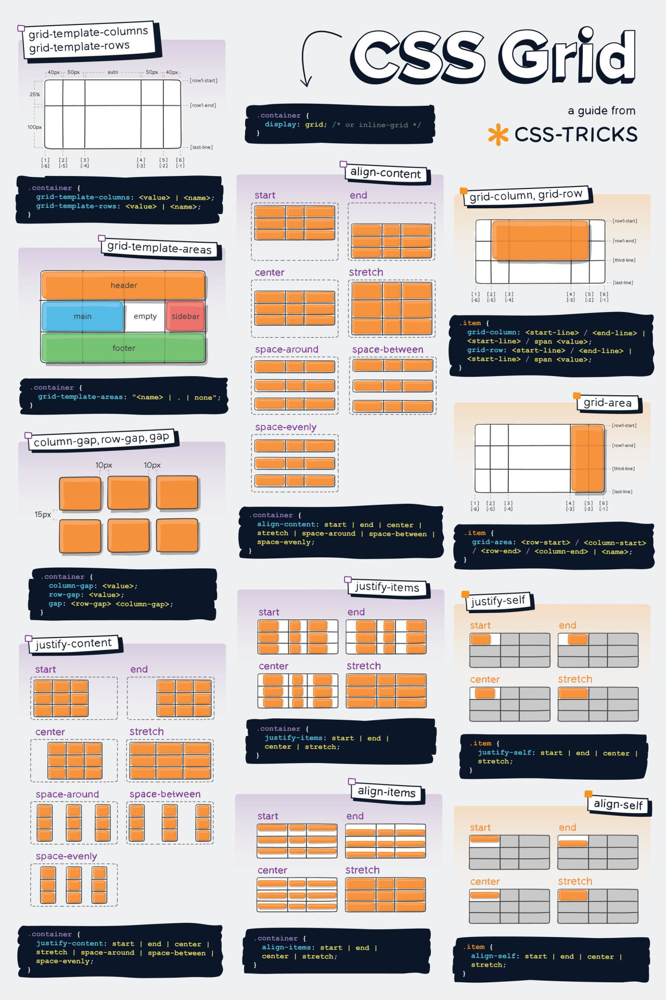

[Volver al Menú](../root.md)

# `Grid`



---

# `Important CSS Grid terminology`

## `Grid Container`

The element on which display: grid is applied. It’s the direct parent of all the grid items. In this example container is the grid container.

```bash
<div class="container">
  <div class="item item-1"> </div>
  <div class="item item-2"> </div>
  <div class="item item-3"> </div>
</div>
```

## `Grid Item`

The children (i.e. direct descendants) of the grid container. Here the item elements are grid items, but sub-item isn’t.

```bash
<div class="container">
  <div class="item"> </div>
  <div class="item">
    <p class="sub-item"> </p>
  </div>
  <div class="item"> </div>
</div>
```

---

# `Properties for the Parent (Grid Container)`

## `display`

Defines the element as a grid container and establishes a new grid formatting context for its contents.

Values:

- `grid`: generates a block-level grid
- `inline-grid`: generates an inline-level grid

```bash
.container {
  display: grid | inline-grid;
}
```

## `grid-template-columns - grid-template-rows`

Defines the columns and rows of the grid with a space-separated list of values. The values represent the track size, and the space between them represents the grid line.

```bash
.container {
  grid-template-columns: ...  ...;
  /* e.g.
      1fr 1fr
      minmax(10px, 1fr) 3fr
      repeat(5, 1fr)
      50px auto 100px 1fr
  */
  grid-template-rows: ... ...;
  /* e.g.
      min-content 1fr min-content
      100px 1fr max-content
  */
}
```

## `grid-template-areas`

Defines a grid template by referencing the names of the grid areas which are specified with the grid-area property. Repeating the name of a grid area causes the content to span those cells. A period signifies an empty cell. The syntax itself provides a visualization of the structure of the grid.

## `grid-template`

A shorthand for setting grid-template-rows, grid-template-columns, and grid-template-areas in a single declaration.

## `column-gap - row-gap - grid-column-gap - grid-row-gap`

Specifies the size of the grid lines. You can think of it like setting the width of the gutters between the columns/rows.

```bash
.container {
  /* standard */
  column-gap: <line-size>;
  row-gap: <line-size>;

  /* old */
  grid-column-gap: <line-size>;
  grid-row-gap: <line-size>;
}
```

## `gap grid-gap`

A shorthand for row-gap and column-gap

```bash
.container {
  /* standard */
  gap: <grid-row-gap> <grid-column-gap>;

  /* old */
  grid-gap: <grid-row-gap> <grid-column-gap>;
}
```

## `justify-items`

Aligns grid items along the inline (row) axis (as opposed to align-items which aligns along the block (column) axis). This value applies to all grid items inside the container.

```bash
.container {
  justify-items: start;
}
```

## `align-items`

Aligns grid items along the block (column) axis (as opposed to justify-items which aligns along the inline (row) axis). This value applies to all grid items inside the container.

```bash
.container {
  align-items: start | end | center | stretch;
}
```

## `place-items`

place-items sets both the align-items and justify-items properties in a single declaration.

```bash
.center {
  display: grid;
  place-items: center;
}
```

## `justify-content`

Sometimes the total size of your grid might be less than the size of its grid container. This could happen if all of your grid items are sized with non-flexible units like px. In this case you can set the alignment of the grid within the grid container. This property aligns the grid along the inline (row) axis (as opposed to align-content which aligns the grid along the block (column) axis).

```bash
.container {
  justify-content: start | end | center | stretch | space-around | space-between | space-evenly;
}
```

## `align-content`

Sometimes the total size of your grid might be less than the size of its grid container. This could happen if all of your grid items are sized with non-flexible units like px. In this case you can set the alignment of the grid within the grid container. This property aligns the grid along the block (column) axis (as opposed to justify-content which aligns the grid along the inline (row) axis).

## `place-content`

place-content sets both the align-content and justify-content properties in a single declaration.

## `grid-auto-columns - grid-auto-rows`

Specifies the size of any auto-generated grid tracks (aka implicit grid tracks). Implicit tracks get created when there are more grid items than cells in the grid or when a grid item is placed outside of the explicit grid. (see The Difference Between Explicit and Implicit Grids)

## `grid-auto-flow`

If you have grid items that you don’t explicitly place on the grid, the auto-placement algorithm kicks in to automatically place the items. This property controls how the auto-placement algorithm works.

```bash
.container {
  grid-auto-flow: row | column | row dense | column dense;
}
```

---

# `Properties for the Children (Grid Items)`

## `grid-column-start - grid-column-end - grid-row-start - grid-row-end`

Determines a grid item’s location within the grid by referring to specific grid lines. grid-column-start/grid-row-start is the line where the item begins, and grid-column-end/grid-row-end is the line where the item ends.

```bash
.item {
  grid-column-start: <number> | <name> | span <number> | span <name> | auto;
  grid-column-end: <number> | <name> | span <number> | span <name> | auto;
  grid-row-start: <number> | <name> | span <number> | span <name> | auto;
  grid-row-end: <number> | <name> | span <number> | span <name> | auto;
}
```

```bash
.item-b {
  grid-column-start: 1;
  grid-column-end: span col4-start;
  grid-row-start: 2;
  grid-row-end: span 2;
}
```

### `values`

- `<line> `: can be a number to refer to a numbered grid line, or a name to refer to a named grid line
- `span <number>`: the item will span across the provided number of grid tracks
- `span <name>`: the item will span across until it hits the next line with the provided name
- `auto`: indicates auto-placement, an automatic span, or a default span of one

## `grid-column - grid-row`

Shorthand for grid-column-start + grid-column-end, and grid-row-start + grid-row-end, respectively.

```bash
.item-c {
  grid-column: 3 / span 2;
  grid-row: third-line / 4;
}
```

## `grid-area`

Gives an item a name so that it can be referenced by a template created with the grid-template-areas property. Alternatively, this property can be used as an even shorter shorthand `for grid-row-start + grid-column-start + grid-row-end + grid-column-end.`

```bash
.item {
  grid-area: <name> | <row-start> / <column-start> / <row-end> / <column-end>;
}
```

## `justify-self`

Aligns a grid item inside a cell along the inline (row) axis (as opposed to align-self which aligns along the block (column) axis). This value applies to a grid item inside a single cell.

```bash
.item {
  justify-self: start | end | center | stretch;
}
```

## `align-self`

Aligns a grid item inside a cell along the block (column) axis (as opposed to justify-self which aligns along the inline (row) axis). This value applies to the content inside a single grid item.

```bash
.item {
  align-self: start | end | center | stretch;
}
```

## `place-self`

place-self sets both the align-self and justify-self properties in a single declaration.

## `order`

Items can overlap each other. You can use z-index to control their stacking order.

# `Special Units & Functions`

## `fr units`

Las vías se pueden definir usando cualquier unidad de medida. Grid también introduce una unidad de longitud adicional para ayudarnos a crear vías de cuadrícula flexibles. La nueva unidad fr representa una fracción del espacio disponible en el contenedor de la cuadrícula. La siguiente definición de cuadrícula crearía tres vias con el mismo ancho, que se expanden y se encogen de acuerdo el espacio disponible.

```bash
<div class="wrapper">
  <div>One</div>
  <div>Two</div>
  <div>Three</div>
  <div>Four</div>
  <div>Five</div>
</div>
```

```bash
.wrapper {
  display: grid;
  grid-template-columns: 1fr 1fr 1fr;
}
```

## `Sizing Keywords`

When sizing rows and columns, you can use all the lengths you are used to, like px, rem, %, etc, but you also have keywords:

- `min-content`: the minimum size of the content. Imagine a line of text like “E pluribus unum”, the min-content is likely the width of the word “pluribus”.
- `max-content`: the maximum size of the content. Imagine the sentence above, the max-content is the length of the whole sentence.
- `auto`: this keyword is a lot like fr units, except that they “lose” the fight in sizing against fr units when allocating the remaining space.
- `Fractional units`: see above

## `Sizing Functions`

- `The fit-content()` function uses the space available, but never less than min-content and never more than max-content.

- `The minmax()` function does exactly what it seems like: it sets a minimum and maximum value for what the length is able to be. This is useful for in combination with relative units. Like you may want a column to be only able to shrink so far. This is extremely useful and probably what you want:

- The `min()` function.
- The `max()` function.

```bash
grid-template-columns: minmax(100px, 1fr) 3fr;
```

## `The repeat() Function and Keywords`

The repeat() function can save some typing:

```bash
grid-template-columns:
  1fr 1fr 1fr 1fr 1fr 1fr 1fr 1fr;

/* easier: */
grid-template-columns:
  repeat(8, 1fr);

/* especially when: */
grid-template-columns:
  repeat(8, minmax(10px, 1fr));
```

## `Masonry`

An experimental feature of CSS grid is masonry layout. Note that there are lots of approaches to CSS masonry, but mostly of them are trickery and either have major downsides or aren’t what you quite expect.

The spec has an official way now, and this is behind a flag in Firefox:

```bash
.container {
  display: grid;
  grid-template-columns: repeat(4, 1fr);
  grid-template-rows: masonry;
}
```

## `Subgrid`

Subgrid is an extremely useful feature of grids that allows grid items to have a grid of their own that inherits grid lines from the parent grid.

```bash
.parent-grid {
  display: grid;
  grid-template-columns: repeat(9, 1fr);
}
.grid-item {
  grid-column: 2 / 7;

  display: grid;
  grid-template-columns: subgrid;
}
.child-of-grid-item {
  /* gets to participate on parent grid! */
  grid-column: 3 / 6;
}
```

# `Fluid columns snippet`

```bash
.grid {
  display: grid;
  grid-template-columns: repeat(auto-fill, minmax(200px, 1fr));
  /* This is better for small screens, once min() is better supported */
  /* grid-template-columns: repeat(auto-fill, minmax(min(200px, 100%), 1fr)); */
  gap: 1rem;
}
```

[TOP](#grid)
