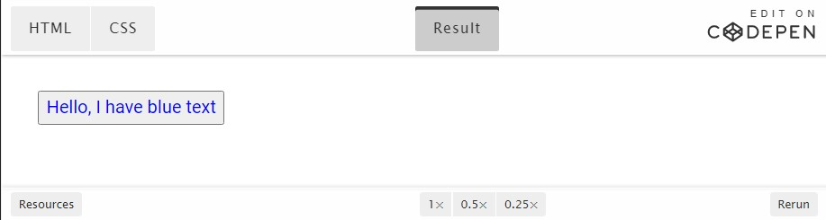
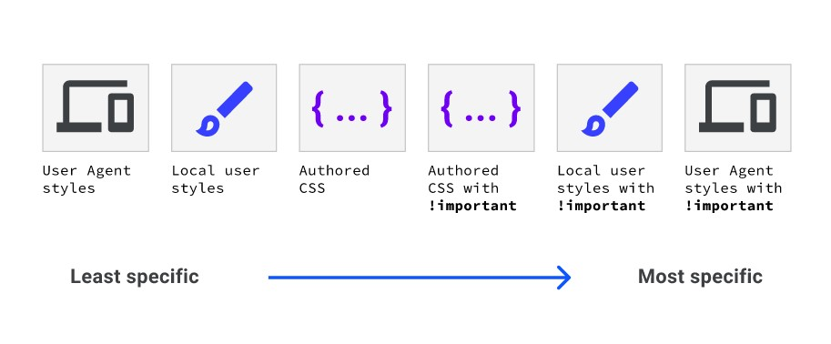

[Volver al Menú](../root.md)

# `The Cascade`

A veces, dos o más reglas CSS pueden aplicarse a un elemento.
En este módulo, descubre cómo el navegador elige cuál usar y cómo controlar esta selección.

CSS son las siglas para Cascading Stylesheets (hojas de estilo en cascada). La cascada es el algoritmo para resolver conflictos donde se aplican múltiples reglas CSS a un elemento HTML. Es la razón por la que el texto del botón con el siguiente CSS será azul.

```
button {
  color: red;
}

button {
  color: blue;
}
```



Comprender el algoritmo en cascada te ayuda a comprender en cómo el navegador resuelve conflictos como este. El algoritmo en cascada se divide en 4 etapas distintas.

- `Posición y orden de aparición:` El orden en el que aparecen tus reglas CSS
- `Especificidad:` Un algoritmo que determina qué selector de CSS tiene la coincidencia más fuerte
- `Origen:` El orden en el que aparece CSS y de dónde proviene, ya sea un estilo de navegador, CSS de una extensión de navegador o tu propio CSS creado
- `Importancia:` Algunas reglas CSS tienen más peso que otras, especialmente con el tipo de regla !important

# `Posición y orden de aparición`

La cascada tiene en cuenta el orden en que aparecen las reglas CSS y cómo aparecen mientras calcula la resolución de conflictos.

La demostración que se encuentra al comienzo de esta lección es el ejemplo más sencillo de posición. Hay dos reglas que tienen selectores de especificidad idéntica, por lo que la última en ser declarada fue la que ganó.

Los estilos pueden provenir de varias fuentes en una página HTML, como una etiqueta de `<link>`, una etiqueta `<style>` incrustada y CSS en línea como se define en el atributo de style.

Si tienes un `<link>` que incluye CSS en la parte superior de tu página HTML y tienes otro `<link>` que incluye un CSS en la parte inferior de tu página, el `<link>` inferior tendrá la mayor especificidad. Lo mismo ocurre con los elementos de `<style>`. Se vuelven más específicos cuanto más abajo están en la página.

The `<style> `element is declared in the `<head>`, while the `<link>` element is declared in the `<body>`. This means the `<link>` gets more specificity than the `<style> `element and the blue hex code (#3740ff) is applied to the button’s background.

Un atributo style en línea con CSS declarado anulará todos los demás CSS, independientemente de su posición, a menos que una declaración tenga definido el atributo de !important.

La posición también se aplica en el orden de tus reglas CSS. En este ejemplo, el elemento tendrá un fondo violeta porque background: purple se declaró en último lugar. Debido a que el fondo verde se declaró antes que el fondo violeta, el primero será ignorado por el navegador.

```
.my-element {
  background: green;
  background: purple;
}
```

Poder especificar dos valores para la misma propiedad puede ser una forma sencilla de crear alternativas para los navegadores que no admiten un valor en particular.

# `Especificidad`

La especificidad es un algoritmo que determina qué selector de CSS es el más específico, utilizando un sistema de ponderación o puntuación para realizar esos cálculos. Al hacer una regla más específica, puede hacer que se aplique incluso si algún otro CSS que coincida con el selector aparece más adelante en el CSS.

# `Origen`

El CSS que escribes no es el único CSS que se aplica a una página. La cascada tiene en cuenta el origen del CSS. Este origen incluye la hoja de estilo interna del navegador, los estilos agregados por las extensiones del navegador o el sistema operativo y tu CSS creado. El orden de especificidad de estos orígenes, desde el menos específico al más específico, son los siguientes:

- `Estilos base de agente de usuario`. Estos son los estilos que tu navegador aplica a los elementos HTML de forma predeterminada.

- `Estilos de usuarios locales`. Estos pueden provenir del nivel del sistema operativo, como un tamaño de fuente base o una preferencia de movimiento reducido. También pueden provenir de extensiones de navegador, como una extensión de navegador que permite al usuario escribir su propio CSS personalizado para una página web.

- `CSS creado`. El CSS que tú creas.

- `Los !important creados`. Cualquier !important que agregues a tus declaraciones creadas.

- `Estilos de usuarios locales !important`. Cualquier !important que provenga del nivel del sistema operativo o del nivel de extensión del navegador CSS.

- `Agente de usuario !important`. Cualquier !important que se define en el CSS predeterminado, proporcionado por el navegador.



# `Importancia`

No todas las reglas de CSS se calculan de la misma manera entre sí, ni se les da la misma especificidad entre sí.

El orden de importancia, de menor a mayor importancia, es el siguiente:

- tipo de regla normal, como `font-size` , `background` o `color`

- tipo de regla de `animation`

- tipo de regla de `!important` (siguiendo el mismo orden que el origen)

- tipo de regla de `transition`

Los tipos de reglas de transition (transición) y animation (animación) tienen más importancia que las reglas normales. En el caso de las transiciones, es más importante que los tipos de reglas !important. Esto se debe a que cuando una animación o transición se activa, su comportamiento esperado es cambiar el estado visual.
