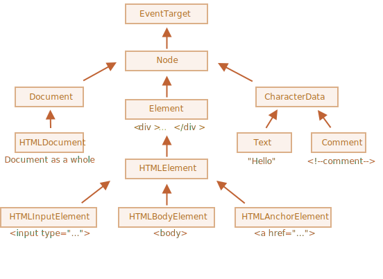

[Volver al Menú](../root.md)


# `Entorno del navegador, especificaciones`

El lenguaje JavaScript fue creado inicialmente para los navegadores web. Desde entonces, ha evolucionado en un lenguaje con muchos usos y plataformas.

Una plataforma puede ser un navegador, un servidor web u otro host (“anfitrión”); incluso una máquina de café “inteligente”, si puede ejecutar JavaScript. Cada uno de ellos proporciona una funcionalidad específica de la plataforma. La especificación de JavaScript llama a esto entorno de host.

Un entorno host proporciona sus propios objetos y funciones adicionales al núcleo del lenguaje. Los navegadores web proporcionan un medio para controlar las páginas web. Node.js proporciona características del lado del servidor, etc.

Aquí tienes una vista general de lo que tenemos cuando JavaScript se ejecuta en un navegador web:


Hay un objeto “raíz” llamado window. Tiene dos roles:

Primero, es un objeto global para el código JavaScript, como se describe en el capítulo Objeto Global.

Segundo, representa la “ventana del navegador” y proporciona métodos para controlarla.
Por ejemplo, podemos usarlo como objeto global:
```
function sayHi() {
  alert("Hola");
}

// Las funciones globales son métodos del objeto global:
window.sayHi();
```

## `DOM (Modelo de Objetos del Documento)`

Document Object Model, o DOM, representa todo el contenido de la página como objetos que pueden ser modificados.

El objeto document es el punto de entrada a la página. Con él podemos cambiar o crear cualquier cosa en la página.

Por ejemplo:
```
// cambiar el color de fondo a rojo
document.body.style.background = "red";

// deshacer el cambio después de 1 segundo
setTimeout(() => document.body.style.background = "", 1000);
```

## `BOM (Modelo de Objetos del Navegador)`

El Modelo de Objetos del Navegador (Browser Object Model, BOM) son objetos adicionales proporcionados por el navegador (entorno host) para trabajar con todo excepto el documento.

Por ejemplo:

- El objeto navigator proporciona información sobre el navegador y el sistema operativo. Hay muchas propiedades, pero las dos más conocidas son: navigator.userAgent: acerca del navegador actual, y navigator.platform: acerca de la plataforma (ayuda a distinguir Windows/Linux/Mac, etc.).

- El objeto location nos permite leer la URL actual y puede redirigir el navegador a una nueva.
Aquí vemos cómo podemos usar el objeto location:

```
alert(location.href); // muestra la URL actual
if (confirm("Ir a wikipedia?")) {
  location.href = "https://wikipedia.org"; // redirigir el navegador a otra URL
}
```

Las funciones alert/confirm/prompt también forman parte de BOM: no están directamente relacionadas con el documento, sino que representan métodos puros de comunicación del navegador con el usuario.

<h2 style='color: green'>Resumen</h2>

En términos de estándares, tenemos:

`La especificación del DOM`
Describe la estructura del documento, las manipulaciones y los eventos; consulte https://dom.spec.whatwg.org.

`La especificación del CSSOM`
Describe las hojas de estilo y las reglas de estilo, las manipulaciones con ellas y su vínculo a los documentos. Consulte https://www.w3.org/TR/cssom-1/.

`La especificación del HTML`
Describe el lenguaje HTML (por ejemplo, etiquetas), y también el BOM (modelo de objeto del navegador) que describe varias funciones del navegador como setTimeout, alert, location, etc. Esta toma la especificación DOM y la extiende con muchas propiedades y métodos adicionales. Consulta https://html.spec.whatwg.org.
Adicionalmente, algunas clases son descritas separadamente en https://spec.whatwg.org/.

Ten en cuenta los enlaces anteriores, ya que hay tantas cosas que es imposible cubrir y recordar todo.

Cuando desees leer sobre una propiedad o un método, el manual de Mozilla en https://developer.mozilla.org/es/search es un buen recurso, pero leer las especificaciones correspondientes puede ser mejor: es más complejo y hay más para leer, pero hará que su conocimiento de los fundamentos sea sólido y completo.

Para encontrar algo, a menudo es conveniente usar una búsqueda como “WHATWG [término]” o “MDN [término]”. Por ejemplo https://google.com?q=whatwg+localstorage, https://google.com?q=mdn+localstorage.

Ahora nos concentraremos en aprender el DOM, porque document juega el papel central en la interfaz de usuario.

# `Árbol del Modelo de Objetos del Documento (DOM)`

La estructura de un documento HTML son las etiquetas.

Según el Modelo de Objetos del Documento (DOM), cada etiqueta HTML es un objeto. Las etiquetas anidadas son llamadas “hijas” de la etiqueta que las contiene. El texto dentro de una etiqueta también es un objeto.

Todos estos objetos son accesibles empleando JavaScript, y podemos usarlos para modificar la página.

Por ejemplo, document.body es el objeto que representa la etiqueta <body>.

Ejecutar el siguiente código hará que el <body> sea de color rojo durante 3 segundos:
```
document.body.style.background = 'red'; // establece un color de fondo rojo

setTimeout(() => document.body.style.background = '', 3000); // volver atrás
```

 ## `Autocorrección`

Si el navegador encuentra HTML mal escrito, lo corrige automáticamente al construir el DOM.

Por ejemplo, la etiqueta superior siempre será <html>. Incluso si no existe en el documento, ésta existirá en el DOM, puesto que, el navegador la creará. Sucede lo mismo con la etiqueta <body>.

Como ejemplo de esto, si el archivo HTML es la palabra "Hello", el navegador lo envolverá con las etiquetas <html> y <body>, y añadirá la etiqueta <head> la cual es requerida.

## `Otros tipos de nodos`

Existen otros tipos de nodos además de elementos y nodos de texto.

Por ejemplo, los comentarios:
```
<!DOCTYPE HTML>
<html>
<body>
  The truth about elk.
  <ol>
    <li>An elk is a smart</li>
    <!-- comentario -->
    <li>...y el astuto animal!</li>
  </ol>
</body>
</html>
```

Podemos pensar – ¿Por qué se agrega un comentario al DOM? Esto no afecta la representación de ninguna manera. Pero hay una regla – si algo está en el código HTML, entonces también debe estar en el árbol DOM.

`Todo en HTML, incluso los comentarios, se convierte en parte del DOM.`

Hasta la declaración <!DOCTYPE...> al principio del HTML es un nodo del DOM. Su ubicación en el DOM es justo antes de la etiqueta <html>. No vamos a tocar ese nodo, por esa razón ni siquiera lo dibujamos en diagramas, pero esta ahí.

El objeto document que representa todo el documento es también, formalmente, un nodo DOM.

Hay 12 tipos de nodos. En la práctica generalmente trabajamos con 4 de ellos:

- document – el “punto de entrada” en el DOM.
- nodos de elementos – Etiquetas-HTML, los bloques de construcción del árbol.
- nodos de texto – contienen texto.
- comentarios – a veces podemos colocar información allí, no se mostrará, pero JS puede leerla desde el DOM.

# `Recorriendo el DOM`

El DOM nos permite hacer cualquier cosa con sus elementos y contenidos, pero lo primero que tenemos que hacer es llegar al objeto correspondiente del DOM.

Todas las operaciones en el DOM comienzan con el objeto document. Este es el principal “punto de entrada” al DOM. Desde ahí podremos acceder a cualquier nodo.

Esta imagen representa los enlaces que nos permiten viajar a través de los nodos del DOM:


## `En la parte superior: documentElement y body`

`<html> = document.documentElement`

`<body> = document.body`

`<head> = document.head`

<h2 style='color: red'>Hay una trampa: document.body puede ser null</h2>

Un script no puede acceder a un elemento que no existe en el momento de su ejecución.

Por ejemplo, si un script está dentro de <head>, entonces document.body no está disponible, porque el navegador no lo ha leído aún.

## `Hijos: childNodes, firstChild, lastChild`

Existen dos términos que vamos a utilizar de ahora en adelante:

- Nodos hijos (`childNodes`) – elementos que son hijos directos, es decir sus descendientes inmediatos. Por ejemplo, <head> y <body> son hijos del elemento <html>.

- Descendientes – todos los elementos anidados de un elemento dado, incluyendo los hijos, sus hijos y así sucesivamente.

La colección `childNodes` enumera todos los nodos hijos, incluidos los nodos de texto.

El ejemplo inferior muestra todos los hijos de document.body:
```
<html>
<body>
  <div>Begin</div>

  <ul>
    <li>Information</li>
  </ul>

  <div>End</div>

  <script>
    for (let i = 0; i < document.body.childNodes.length; i++) {
      alert( document.body.childNodes[i] ); // Texto, DIV, Texto, UL, ..., SCRIPT
    }
  </script>
  ...más cosas...
</body>
</html>
```

## `Hermanos y el padre`

Los hermanos son nodos que son hijos del mismo padre.

El hermano siguiente está en la propiedad `nextSibling` y el anterior – en `previousSibling`.

El padre está disponible en `parentNode`.

## `Navegación solo por elementos`

Las propiedades de navegación enumeradas abajo se refieren a todos los nodos. Por ejemplo, en childNodes podemos ver nodos de texto, nodos elementos; y si existen, incluso los nodos de comentarios.

Pero para muchas tareas no queremos los nodos de texto o comentarios. Queremos manipular el nodo que representa las etiquetas y formularios de la estructura de la página.

Los enlaces son similares a los de arriba, solo que tienen dentro la palabra Element:

- `children` – solo esos hijos que tienen el elemento nodo.
- `firstElementChild`, `lastElementChild` – el primer y el último elemento hijo.
- `previousElementSibling`, `nextElementSibling` – elementos vecinos.
- `parentElement` – elemento padre.


<h2 style='color: green'>Resumen</h2>

Dado un nodo del DOM, podemos ir a sus inmediatos vecinos utilizando las propiedades de navegación.

Hay dos conjuntos principales de ellas:

Para todos los nodos: `parentNode`, `childNodes`, `firstChild`, `lastChild`, `previousSibling`, `nextSibling`.

Para los nodos elementos: `parentElement`, `children`, `firstElementChild`, `lastElementChild`, `previousElementSibling`, `nextElementSibling`.

# `Buscar: getElement*, querySelector*`

Las propiedades de navegación del DOM son ideales cuando los elementos están cerca unos de otros. Pero, ¿y si no lo están? ¿Cómo obtener un elemento arbitrario de la página?

Para estos casos existen métodos de búsqueda adicionales.

## `document.getElementById o sólo id`

Si un elemento tiene el atributo id, podemos obtener el elemento usando el método `document.getElementById(id)`, sin importar dónde se encuentre.

## `querySelectorAll`

Sin duda el método más versátil, elem.querySelectorAll(css) devuelve todos los elementos dentro de elem que coinciden con el selector CSS dado.

Aquí buscamos todos los elementos `<li>` que son los últimos hijos:
```
<ul>
  <li>La</li>
  <li>prueba</li>
</ul>
<ul>
  <li>ha</li>
  <li>pasado/li>
</ul>
<script>
  let elements = document.querySelectorAll('ul > li:last-child');

  for (let elem of elements) {
    alert(elem.innerHTML); // "prueba", "pasado"
  }
</script>
```

Este método es muy poderoso, porque se puede utilizar cualquier selector de CSS.

## `querySelector`

La llamada a `elem.querySelector(css)` devuelve el primer elemento para el selector CSS dado.

En otras palabras, el resultado es el mismo que `elem.querySelectorAll(css)[0]`, pero este último busca todos los elementos y elige uno, mientras que `elem.querySelector` sólo busca uno. Así que es más rápido y también más corto de escribir.

## `matches`

Los métodos anteriores consistían en buscar en el DOM.

El `elem.matches(css)` no busca nada, sólo comprueba si el elem coincide con el selector CSS dado. Devuelve true o false.

Este método es útil cuando estamos iterando sobre elementos (como en un array) y tratando de filtrar los que nos interesan.

Por ejemplo:
```
<a href="http://example.com/file.zip">...</a>
<a href="http://ya.ru">...</a>

<script>
  // puede ser cualquier colección en lugar de document.body.children
  for (let elem of document.body.children) {
    if (elem.matches('a[href$="zip"]')) {
      alert("La referencia del archivo: " + elem.href );
    }
  }
</script>
```

## `closest`

Los ancestros de un elemento son: el padre, el padre del padre, su padre y así sucesivamente. Todos los ancestros juntos forman la cadena de padres desde el elemento hasta la cima.

El método elem.closest(css) busca el ancestro más cercano que coincide con el selector CSS. El propio elem también se incluye en la búsqueda.

En otras palabras, el método closest sube del elemento y comprueba cada uno de los padres. Si coincide con el selector, entonces la búsqueda se detiene y devuelve dicho ancestro.

Por ejemplo:
```
<h1>Contenido</h1>

<div class="contents">
  <ul class="book">
    <li class="chapter">Capítulo 1</li>
    <li class="chapter">Capítulo 2</li>
  </ul>
</div>

<script>
  let chapter = document.querySelector('.chapter'); // LI

  alert(chapter.closest('.book')); // UL
  alert(chapter.closest('.contents')); // DIV

  alert(chapter.closest('h1')); // null (porque h1 no es un ancestro)
</script>
```

## `getElementsBy*`

También hay otros métodos que permiten buscar nodos por una etiqueta, una clase, etc.

Hoy en día, son en su mayoría historia, ya que `querySelector` es más poderoso y corto de escribir.

Aquí los cubrimos principalmente por completar el temario, aunque todavía se pueden encontrar en scripts antiguos.

- `elem.getElementsByTagName(tag)` busca elementos con la etiqueta dada y devuelve una colección con ellos. El parámetro tag también puede ser un asterisco "*" para “cualquier etiqueta”.
- `elem.getElementsByClassName(className)` devuelve elementos con la clase dada.
- `document.getElementsByName(name)` devuelve elementos con el atributo name dado, en todo el documento. Muy raramente usado.

## `Colecciones vivas`

Todos los métodos "getElementsBy*" devuelven una colección viva (live collection). Tales colecciones siempre reflejan el estado actual del documento y se “auto-actualizan” cuando cambia.

En el siguiente ejemplo, hay dos scripts.

- El primero crea una referencia a la colección de `<div>`. Por ahora, su longitud es 1.
- El segundo script se ejecuta después de que el navegador se encuentre con otro `<div>`, por lo que su longitud es de 2.

Por el contrario, querySelectorAll devuelve una colección estática. Es como un array de elementos fijos.

Si lo utilizamos en lugar de getElementsByTagName, entonces ambos scripts dan como resultado 1:
```
<div>Primer div</div>

<script>
  let divs = document.querySelectorAll('div');
  alert(divs.length); // 1
</script>

<div>Segundo div</div>

<script>
  alert(divs.length); // 1
</script>
```

Ahora podemos ver fácilmente la diferencia. La colección estática no aumentó después de la aparición de un nuevo div en el documento.

<h2 style='color: green'>Resumen</h2>

Hay 6 métodos principales para buscar nodos en el DOM:

<table>
<thead>
<tr>
<td>Método</td>
<td>Busca por...</td>
<td>¿Puede llamar a un elemento?</td>
<td>¿Vivo?</td>
</tr>
</thead>
<tbody>
<tr>
<td><code>querySelector</code></td>
<td>selector CSS</td>
<td>✔</td>
<td>-</td>
</tr>
<tr>
<td><code>querySelectorAll</code></td>
<td>selector CSS</td>
<td>✔</td>
<td>-</td>
</tr>
<tr>
<td><code>getElementById</code></td>
<td><code>id</code></td>
<td>-</td>
<td>-</td>
</tr>
<tr>
<td><code>getElementsByName</code></td>
<td><code>name</code></td>
<td>-</td>
<td>✔</td>
</tr>
<tr>
<td><code>getElementsByTagName</code></td>
<td>etiqueta o <code>'*'</code></td>
<td>✔</td>
<td>✔</td>
</tr>
<tr>
<td><code>getElementsByClassName</code></td>
<td>class</td>
<td>✔</td>
<td>✔</td>
</tr>
</tbody>
</table>

Los más utilizados son `querySelector` y `querySelectorAll`, pero `getElementBy`* puede ser de ayuda esporádicamente o encontrarse en scripts antiguos.

Aparte de eso:

- Existe elem.`matches`(css) para comprobar si elem coincide con el selector CSS dado.
- Existe elem.`closest`(css) para buscar el ancestro más cercano que coincida con el selector CSS dado. El propio elem también se comprueba.

Y mencionemos un método más para comprobar la relación hijo-padre, ya que a veces es útil:

- elemA.`contains`(elemB) devuelve true si elemB está dentro de elemA (un descendiente de elemA) o cuando elemA==elemB.


# `Propiedades del nodo: tipo, etiqueta y contenido`

## `Clases de nodo DOM`

Los diferentes nodos DOM pueden tener diferentes propiedades. Por ejemplo, un nodo de elemento correspondiente a la etiqueta `<a>` tiene propiedades relacionadas con el enlace, y el correspondiente a `<input>` tiene propiedades relacionadas con la entrada y así sucesivamente. Los nodos de texto no son lo mismo que los nodos de elementos. Pero también hay propiedades y métodos comunes entre todos ellos, porque todas las clases de nodos DOM forman una única jerarquía.

Cada nodo DOM pertenece a la clase nativa correspondiente.

La raíz de la jerarquía es EventTarget, que es heredada por Node, y otros nodos DOM heredan de él.

Aquí está la imagen, con las explicaciones a continuación:



Las clases son:

- `EventTarget` – es la clase raíz “abstracta”.

  Los objetos de esta clase nunca se crean. Sirve como base, es por la que todos los nodos DOM soportan los llamados “eventos” que estudiaremos más adelante.

- `Node` – también es una clase “abstracta”, sirve como base para los nodos DOM.

  Proporciona la funcionalidad del árbol principal: parentNode, nextSibling, childNodes y demás (son getters). Los objetos de la clase Node nunca se crean. Pero hay clases de nodos concretas que heredan de ella (y también heredan la funcionalidad de Node).

- `Document`, por razones históricas, heredado a menudo por HTMLDocument (aunque la última especificación no lo exige) – es el documento como un todo.

  El objeto global document pertenece exactamente a esta clase. Sirve como punto de entrada al DOM.

- `CharacterData` – una clase “abstract” heredada por:

    `Text` – la clase correspondiente a texto dentro de los elementos, por ejemplo Hello en `<p>Hello</p>`.

    `Comment` – la clase para los “comentarios”. No se muestran, pero cada comentario se vuelve un miembro del DOM.

- `Element` – es una clase base para elementos DOM.

  Proporciona navegación a nivel de elemento como nextElementSibling, children y métodos de búsqueda como getElementsByTagName, querySelector.

  Un navegador admite no solo HTML, sino también XML y SVG. La clase Element sirve como base para clases más específicas: SVGElement, XMLElement (no las necesitamos aquí) y HTMLElement.

- Finalmente, `HTMLElement` – es la clase básica para todos los elementos HTML. Trabajaremos con ella la mayor parte del tiempo.

Es heredado por elementos HTML concretos:

- `HTMLInputElement` – la clase para elementos `<input>`,
- `HTMLBodyElement` – la clase para los elementos `<body>`,
- `HTMLAnchorElement` – la clase para elementos `<a>`,
- …y así sucesivamente.

Hay muchas otras etiquetas con sus propias clases que pueden tener propiedades y métodos específicos, mientras que algunos elementos, tales como `<span>`, `<section>`, `<article>`, no tienen ninguna propiedad específica entonces derivan de la clase HTMLElement.

## `La propiedad “nodeType”`

La propiedad nodeType proporciona una forma “anticuada” más de obtener el “tipo” de un nodo DOM.

Tiene un valor numérico:

- elem.nodeType == 1 para nodos de elementos,
- elem.nodeType == 3 para nodos de texto,
- elem.nodeType == 9 para el objeto de documento,
- hay algunos otros valores en la [especificación](https://dom.spec.whatwg.org/#node).

## `Tag: nodeName y tagName`

Dado un nodo DOM, podemos leer su nombre de etiqueta en las propiedades de `nodeName` o `tagName`:

Por ejemplo:
```
alert( document.body.nodeName ); // BODY
alert( document.body.tagName ); // BODY
```
¿Hay alguna diferencia entre `tagName` y `nodeName`?

Claro, la diferencia se refleja en sus nombres, pero de hecho es un poco sutil.

- La propiedad `tagName` existe solo para los nodos Element.
- El `nodeName` se define para cualquier Node:
    -para los elementos, significa lo mismo que `tagName`.
    -para otros tipos de nodo (texto, comentario, etc.) tiene una cadena con el tipo de nodo.

En otras palabras, `tagName` solo es compatible con los nodos de elementos (ya que se origina en la clase Element), mientras que nodeName puede decir algo sobre otros tipos de nodos.

## `innerHTML: los contenidos`

La propiedad innerHTML permite obtener el HTML dentro del elemento como un string.

También podemos modificarlo. Así que es una de las formas más poderosas de cambiar la página.

El ejemplo muestra el contenido de document.body y luego lo reemplaza por completo

Podemos intentar insertar HTML no válido, el navegador corregirá nuestros errores

<h2 style="color: red">Nota</h2>

Si innerHTML inserta una etiqueta `<script>` en el documento, se convierte en parte de HTML, pero no se ejecuta.

En otras palabras, innerHTML+= hace esto:

- Se elimina el contenido antiguo.
- En su lugar, se escribe el nuevo innerHTML (una concatenación del antiguo y el nuevo).

## `outerHTML: HTML completo del elemento`

La propiedad outerHTML contiene el HTML completo del elemento. Eso es como innerHTML más el elemento en sí.

```
<div id="elem">Hola <b>Mundo</b></div>

<script>
  alert(elem.outerHTML); // <div id="elem">Hola <b>Mundo</b></div>
</script>
```
<h2 style="color: red">Cuidado: a diferencia de innerHTML, escribir en outerHTML no cambia el elemento. En cambio, lo reemplaza en el DOM.</h2>

Sí, suena extraño, y es extraño, por eso hacemos una nota aparte al respecto aquí. Echa un vistazo.

Considera el ejemplo:

```
<div>`¡Hola, mundo!`</div>

<script>
  let div = document.querySelector('div');

  // reemplaza div.outerHTML con <p>...</p>
  div.outerHTML = '<p>Un nuevo elemento</p>'; // (*)

  // ¡Guauu! ¡'div' sigue siendo el mismo!
  alert(div.outerHTML); // <div>¡Hola, mundo!</div> (**)
</script>
```

## `nodeValue/data: contenido del nodo de texto`

La propiedad `innerHTML` solo es válida para los nodos de elementos.

Otros tipos de nodos, como los nodos de texto, tienen su contraparte: propiedades `nodeValue` y `data`. Estas dos son casi iguales para uso práctico, solo hay pequeñas diferencias de especificación. Entonces usaremos data, porque es más corto.

Un ejemplo de lectura del contenido de un nodo de texto y un comentario:

```
<body>
  Hola
  <!-- Comentario -->
  <script>
    let text = document.body.firstChild;
    alert(text.data); // Hola

    let comment = text.nextSibling;
    alert(comment.data); // Comentario
  </script>
</body>
```
Para los nodos de texto podemos imaginar una razón para leerlos o modificarlos, pero ¿por qué comentarios?

A veces, los desarrolladores incorporan información o instrucciones de plantilla en HTML, así:
```
<!-- if isAdmin -->
  <div>¡Bienvenido, administrador!</div>
<!-- /if -->
```
…Entonces JavaScript puede leerlo desde la propiedad data y procesar las instrucciones integradas.

## `textContent: texto puro`

El textContent proporciona acceso al texto dentro del elemento: solo texto, menos todas las `<tags>`.

Por ejemplo:
```
<div id="news">
  <h1>¡Titular!</h1>
  <p>¡Los marcianos atacan a la gente!</p>
</div>

<script>
  // ¡Titular! ¡Los marcianos atacan a la gente!
  alert(news.textContent);
</script>
```

Como podemos ver, solo se devuelve texto, como si todas las `<etiquetas>` fueran recortadas, pero el texto en ellas permaneció.

En la práctica, rara vez se necesita leer este tipo de texto.

Escribir en `textContent` es mucho más útil, porque permite escribir texto de “forma segura”.

Digamos que tenemos un string arbitrario, por ejemplo, ingresado por un usuario, y queremos mostrarlo.

- Con `innerHTML` lo tendremos insertado “como HTML”, con todas las etiquetas HTML.
- Con `textContent` lo tendremos insertado “como texto”, todos los símbolos se tratan literalmente.

## `La propiedad “hidden”`

El atributo “hidden” y la propiedad DOM especifican si el elemento es visible o no.

Podemos usarlo en HTML o asignarlo usando JavaScript, así:
```
<div>Ambos divs a continuación están ocultos</div>

<div hidden>Con el atributo "hidden"</div>

<div id="elem">JavaScript asignó la propiedad "hidden"</div>

<script>
  elem.hidden = true;
</script>
```

Técnicamente, `hidden` funciona igual que `style="display:none"`. Pero es más corto de escribir.

## `Más propiedades`

Los elementos DOM también tienen propiedades adicionales, en particular aquellas que dependen de la clase:

- value – el valor para `<input>`, `<select>` y `<textarea>` (HTMLInputElement, HTMLSelectElement…).
- href – el “href” para `<a href="...">` (HTMLAnchorElement).
- id – el valor del atributo “id”, para todos los elementos (HTMLElement).
- …y mucho más…

<h2 style="color: green">Resumen</h2>

Cada nodo DOM pertenece a una determinada clase. Las clases forman una jerarquía. El conjunto completo de propiedades y métodos proviene de la herencia.

Las propiedades principales del nodo DOM son:

`nodeType`
  Podemos usarla para ver si un nodo es un texto o un elemento. Tiene un valor numérico: 1 para elementos, 3 para nodos de texto y algunos otros para otros tipos de nodos. Solo lectura.
  
`nodeName/tagName`
  Para los elementos, nombre de la etiqueta (en mayúsculas a menos que esté en modo XML). Para los nodos que no son elementos, nodeName describe lo que es. Solo lectura.
  
`innerHTML`
  El contenido HTML del elemento. Puede modificarse.
  
`outerHTML`
  El HTML completo del elemento. Una operación de escritura en elem.outerHTML no toca a elem en sí. En su lugar, se reemplaza con el nuevo HTML en el contexto externo.
  
`nodeValue/data`
  El contenido de un nodo que no es un elemento (text, comment). Estos dos son casi iguales, usualmente usamos data. Puede modificarse.
  
`textContent`
  El texto dentro del elemento: HTML menos todas las `<tags>`. Escribir en él coloca el texto dentro del elemento, con todos los caracteres especiales y etiquetas tratados exactamente como texto. Puede insertar de forma segura texto generado por el usuario y protegerse de inserciones HTML no deseadas.
  
`hidden`
  Cuando se establece en `true`, hace lo mismo que CSS `display:none`.
  

Los nodos DOM también tienen otras propiedades dependiendo de su clase. Por ejemplo, los elementos `<input>` (HTMLInputElement) admiten value, type, mientras que los elementos `<a>` (HTMLAnchorElement) admiten href, etc. La mayoría de los atributos HTML estándar tienen una propiedad DOM correspondiente.


# `Atributos y propiedades`

Cuando el navegador carga la página, “lee” (o “parser”(analiza en inglés")) el HTML y genera objetos DOM a partir de él. Para los nodos de elementos, la mayoría de los atributos HTML estándar se convierten automáticamente en propiedades de los objetos DOM.

Por ejemplo, si la etiqueta es `<body id="page">`, entonces el objeto DOM tiene body.id="page".

¡Pero el mapeo de propiedades y atributos no es uno a uno! En este capítulo, prestaremos atención para separar estas dos nociones, para ver cómo trabajar con ellos, cuándo son iguales y cuándo son diferentes.

## `Propiedades DOM`

Ya hemos visto propiedades DOM integradas. Hay muchas. Pero técnicamente nadie nos limita, y si no hay suficientes, podemos agregar las nuestras.

Los nodos DOM son objetos JavaScript normales. Podemos alterarlos.

Por ejemplo, creemos una nueva propiedad en document.body:

```
document.body.myData = {
  name: 'Cesar',
  title: 'Emperador'
};

alert(document.body.myData.title); // Emperador
```

También podemos agregar un método:
```
document.body.sayTagName = function() {
  alert(this.tagName);
};

document.body.sayTagName(); // BODY (el valor de 'this' en el método es document.body)
```

También podemos modificar prototipos incorporados como Element.prototype y agregar nuevos métodos a todos los elementos:
```
Element.prototype.sayHi = function() {
  alert(`Hola, yo soy ${this.tagName}`);
};

document.documentElement.sayHi(); // Hola, yo soy HTML
document.body.sayHi(); // Hola, yo soy BODY
```
Por lo tanto, las propiedades y métodos DOM se comportan igual que los objetos JavaScript normales:

- Pueden tener cualquier valor.
- Distingue entre mayúsculas y minúsculas (escribir elem.nodeType, no es lo mismo que elem.NoDeTyPe).

## `Atributos HTML`

En HTML, las etiquetas pueden tener atributos. Cuando el navegador analiza el HTML para crear objetos DOM para etiquetas, reconoce los atributos estándar y crea propiedades DOM a partir de ellos.

Entonces, cuando un elemento tiene id u otro atributo estándar, se crea la propiedad correspondiente. Pero eso no sucede si el atributo no es estándar.

Por ejemplo:
```
<body id="test" something="non-standard">
  <script>
    alert(document.body.id); // prueba
    // el atributo no estándar no produce una propiedad
    alert(document.body.something); // undefined
  </script>
</body>
```

Tenga en cuenta que un atributo estándar para un elemento puede ser desconocido para otro. Por ejemplo, "type" es estándar para `<input>` (HTMLInputElement), pero no para `<body>` (HTMLBodyElement). Los atributos estándar se describen en la especificación para la clase del elemento correspondiente.

Aquí podemos ver esto:
```
<body id="body" type="...">
  <input id="input" type="text">
  <script>
    alert(input.type); // text
    alert(body.type); // undefined: Propiedad DOM no creada, porque no es estándar
  </script>
</body>
```

Entonces, si un atributo no es estándar, no habrá una propiedad DOM para él. ¿Hay alguna manera de acceder a tales atributos?

Claro. Todos los atributos son accesibles usando los siguientes métodos:

- elem.hasAttribute(nombre) – comprueba si existe.
- elem.getAttribute(nombre) – obtiene el valor.
- elem.setAttribute(nombre, valor) – establece el valor.
- elem.removeAttribute(nombre) – elimina el atributo.

Los atributos HTML tienen las siguientes características:

- Su nombre no distingue entre mayúsculas y minúsculas (id es igual aID).
- Sus valores son siempre strings.

## `Las propiedades DOM tienen tipo`

Las propiedades DOM no siempre son strings. Por ejemplo, la propiedad input.checked (para casillas de verificación) es un booleano:

```
<input id="input" type="checkbox" checked> checkbox

<script>
  alert(input.getAttribute('checked')); // el valor del atributo es: string vacía
  alert(input.checked); // el valor de la propiedad es: true
</script>
```

Hay otros ejemplos. El atributo style es un string, pero la propiedad style es un objeto:
```
<div id="div" style="color:red;font-size:120%">Hola</div>

<script>
  // string
  alert(div.getAttribute('style')); // color:red;font-size:120%

  // object
  alert(div.style); // [object CSSStyleDeclaration]
  alert(div.style.color); // red
</script>
```

## `Atributos no estándar, dataset`

Cuando escribimos HTML, usamos muchos atributos estándar. Pero, ¿qué pasa con los no personalizados y personalizados? Primero, veamos si son útiles o no. ¿Para qué?

A veces, los atributos no estándar se utilizan para pasar datos personalizados de HTML a JavaScript, o para “marcar” elementos HTML para JavaScript.

Como esto:

```
<!-- marque el div para mostrar "nombre" aquí -->
<div show-info="nombre"></div>
<!-- y "edad" aquí -->
<div show-info="edad"></div>

<script>
 // el código encuentra un elemento con la marca y muestra lo que se solicita
  let user = {
    nombre: "Pete",
    edad: 25
  };

  for(let div of document.querySelectorAll('[show-info]')) {
    // inserta la información correspondiente en el campo
    let field = div.getAttribute('show-info');
    div.innerHTML = user[field]; // primero Pete en "nombre", luego 25 en "edad"
  }
</script>
```

También se pueden usar para diseñar un elemento.

Por ejemplo, aquí para el estado del pedido se usa el atributo order-state:
```
<style>
  /* los estilos se basan en el atributo personalizado "order-state" */
  .order[order-state="nuevo"] {
    color: green;
  }

  .order[order-state="pendiente"] {
    color: blue;
  }

  .order[order-state="cancelado"] {
    color: red;
  }
</style>

<div class="order" order-state="nuevo">
  Un nuevo pedido.
</div>

<div class="order" order-state="pendiente">
  Un pedido pendiente.
</div>

<div class="order" order-state="cancelado">
  Un pedido cancelado
</div>
```

¿Por qué sería preferible usar un atributo a tener clases como .order-state-new, .order-state-pending, .order-state-canceled?

Porque un atributo es más conveniente de administrar. El estado se puede cambiar tan fácil como:
```
// un poco más simple que eliminar/agregar clases
div.setAttribute('order-state', 'canceled');
```

Pero puede haber un posible problema con los atributos personalizados. ¿Qué sucede si usamos un atributo no estándar para nuestros propósitos y luego el estándar lo introduce y hace que haga algo? El lenguaje HTML está vivo, crece y cada vez hay más atributos que aparecen para satisfacer las necesidades de los desarrolladores. Puede haber efectos inesperados en tal caso.

Para evitar conflictos, existen atributos data-*.

`Todos los atributos que comienzan con “data-” están reservados para el uso de los programadores. Están disponibles en la propiedad dataset.`

Por ejemplo, si un elem tiene un atributo llamado "data-about", está disponible como elem.dataset.about.

Como esto:
```
<body data-about="Elefante">
<script>
  alert(document.body.dataset.about); // Elefante
</script>
```

Los atributos de varias palabras como data-order-state se convierten en camel-case: dataset.orderState

Aquí hay un ejemplo reescrito de “estado del pedido”:
```
<style>
  .order[data-order-state="nuevo"] {
    color: green;
  }

  .order[data-order-state="pendiente"] {
    color: blue;
  }

  .order[data-order-state="cancelado"] {
    color: red;
  }
</style>

<div id="order" class="order" data-order-state="nuevo">
  Una nueva orden.
</div>

<script>
  // leer
  alert(order.dataset.orderState); // nuevo

  // modificar
  order.dataset.orderState = "pendiente"; // (*)
</script>
```
El uso de los atributos data- * es una forma válida y segura de pasar datos personalizados.

Tenga en cuenta que no solo podemos leer, sino también modificar los atributos de datos. Luego, CSS actualiza la vista en consecuencia: en el ejemplo anterior, la última línea (*) cambia el color a azul.

<h2 style="color: green">Resumen</h2>

- Atributos: es lo que está escrito en HTML.
- Propiedades: es lo que hay en los objetos DOM.

Una pequeña comparación:

<table>
<thead>
<tr>
<th></th>
<th>Propiedades</th>
<th>Atributos</th>
</tr>
</thead>
<tbody>
<tr>
<td>Tipo</td>
<td>Cualquier valor, las propiedades estándar tienen tipos descritos en la especificación</td>
<td>Un string</td>
</tr>
<tr>
<td>Nombre</td>
<td>El nombre distingue entre mayúsculas y minúsculas</td>
<td>El nombre no distingue entre mayúsculas y minúsculas</td>
</tr>
</tbody>
</table>

Los métodos para trabajar con atributos son:

- elem.hasAttribute(nombre) – para comprobar si existe.
- elem.getAttribute(nombre) – para obtener el valor.
- elem.setAttribute(nombre, valor) – para dar un valor.
- elem.removeAttribute(nombre) – para eliminar el atributo.
- elem.attributes es una colección de todos los atributos.

Para la mayoría de las situaciones, es preferible usar las propiedades DOM. Deberíamos referirnos a los atributos solo cuando las propiedades DOM no nos convienen, cuando necesitamos exactamente atributos, por ejemplo:

Necesitamos un atributo no estándar. Pero si comienza con data-, entonces deberíamos usar dataset.
Queremos leer el valor “como está escrito” en HTML. El valor de la propiedad DOM puede ser diferente, por ejemplo, la propiedad href siempre es una URL completa, y es posible que queramos obtener el valor "original ".

# `Modificando el documento`

La modificación del DOM es la clave para crear páginas “vivas”, dinámicas.

### `Creando un elemento`

Para crear nodos DOM, hay dos métodos:

`document.createElement(tag)`
Crea un nuevo nodo elemento con la etiqueta HTML dada:

`let div = document.createElement('div');`

### `Creando el mensaje`

Crear el div de mensaje toma 3 pasos:
```
// 1. Crear elemento <div>
let div = document.createElement('div');

// 2. Establecer su clase a "alert"
div.className = "alert";

// 3. Agregar el contenido
div.innerHTML = "<strong>¡Hola!</strong> Usted ha leído un importante mensaje.";
```

## `Métodos de inserción`
Para hacer que el div aparezca, necesitamos insertarlo en algún lado dentro de document. Por ejemplo, en el elemento `<body>`, referenciado por document.body.

Hay un método especial append para ello: document.body.append(div).

Aquí hay más métodos de inserción, ellos especifican diferentes lugares donde insertar:

- `node.append(...nodos o strings)` – agrega nodos o strings al final de node,
- `node.prepend(...nodos o strings)` – insert nodos o strings al principio de node,
- `node.before(...nodos o strings)` –- inserta nodos o strings antes de node,
- `node.after(...nodos o strings)` –- inserta nodos o strings después de node,
- `node.replaceWith(...nodos o strings)` –- reemplaza node con los nodos o strings dados.


## `insertAdjacentHTML/Text/Element`

El primer parámetro es un palabra código que especifica dónde insertar relativo a elem. Debe ser uno de los siguientes:

- "beforebegin" – inserta html inmediatamente antes de elem
- "afterbegin" – inserta html en elem, al principio
- "beforeend" – inserta html en elem, al final
- "afterend" – inserta html inmediatamente después de elem

El segundo parámetro es un string HTML, que es insertado “como HTML”.

Por ejemplo:
```
<div id="div"></div>
<script>
  div.insertAdjacentHTML('beforebegin', '<p>Hola</p>');
  div.insertAdjacentHTML('afterend', '<p>Adiós</p>');
</script>
```


[Mas Información](https://es.javascript.info/modifying-document)

## `Eliminación de nodos`

Para quitar un nodo, tenemos el método node.remove().

Hagamos que nuestro mensaje desaparezca después de un segundo:
```
<style>
.alert {
  padding: 15px;
  border: 1px solid #d6e9c6;
  border-radius: 4px;
  color: #3c763d;
  background-color: #dff0d8;
}
</style>

<script>
  let div = document.createElement('div');
  div.className = "alert";
  div.innerHTML = "<strong>¡Hola!</strong> Usted ha leído un importante mensaje.";

  document.body.append(div);
  setTimeout(() => div.remove(), 1000);
</script>
```

Nota que si queremos mover un elemento a un nuevo lugar, no hay necesidad de quitarlo del viejo.

Todos los métodos de inserción automáticamente quitan el nodo del lugar viejo.

## `Clonando nodos: cloneNode`

A veces, cuando tenemos un elemento grande, esto es más simple y rápido.

La llamada elem.cloneNode(true) crea una clonación “profunda” del elemento, con todos los atributos y subelementos. Si llamamos elem.cloneNode(false), la clonación se hace sin sus elementos hijos.

Un ejemplo de copia del mensaje:
```
<style>
.alert {
  padding: 15px;
  border: 1px solid #d6e9c6;
  border-radius: 4px;
  color: #3c763d;
  background-color: #dff0d8;
}
</style>

<div class="alert" id="div">
  <strong>¡Hola!</strong> Usted ha leído un importante mensaje.
</div>

<script>
  let div2 = div.cloneNode(true); // clona el mensaje
  div2.querySelector('strong').innerHTML = '¡Adiós!'; // altera el clon

  div.after(div2); // muestra el clon después del div existente
</script>
```

## `DocumentFragment`

DocumentFragment es un nodo DOM especial que sirve como contenedor para trasladar listas de nodos.

Podemos agregarle nodos, pero cuando lo insertamos en algún lugar, lo que se inserta es su contenido.

Por ejemplo, getListContent de abajo genera un fragmento con items `<li>`, que luego son insertados en `<ul>`:

```
<ul id="ul"></ul>

<script>
function getListContent() {
  let fragment = new DocumentFragment();

  for(let i=1; i<=3; i++) {
    let li = document.createElement('li');
    li.append(i);
    fragment.append(li);
  }

  return fragment;
}

ul.append(getListContent()); // (*)
</script>
```

Es raro que DocumentFragment se use explícitamente. ¿Por qué añadir un tipo especial de nodo si en su lugar podemos devolver un array de nodos? El ejemplo reescrito:
```
<ul id="ul"></ul>

<script>
function getListContent() {
  let result = [];

  for(let i=1; i<=3; i++) {
    let li = document.createElement('li');
    li.append(i);
    result.push(li);
  }

  return result;
}

ul.append(...getListContent()); // append +  el operador "..." = ¡amigos!
</script>
```

## `Métodos de la vieja escuela para insertar/quitar`

Hay también métodos de manipulación de DOM de “vieja escuela”, existentes por razones históricas.

Estos métodos vienen de realmente viejos tiempos. No hay razón para usarlos estos días, ya que los métodos modernos como `append`, `prepend`, `before`, `after`, `remove`, `replaceWith`, son más flexibles.

La única razón por la que los listamos aquí es porque podrías encontrarlos en viejos scripts:

`parentElem.appendChild(node)`
Añade node como último hijo de parentElem.

`parentElem.insertBefore(node, nextSibling)`
Inserta node antes de nextSibling dentro de parentElem.

`parentElem.replaceChild(node, oldChild)`
Reemplaza oldChild con node entre los hijos de parentElem.

`parentElem.removeChild(node)`
Quita node de parentElem (asumiendo que node es su hijo).

## `Una palabra acerca de “document.write”`

  Hay uno más, un método muy antiguo para agregar algo a una página web: document.write.

La sintaxis:
```
<p>En algún lugar de la página...</p>
<script>
  document.write('<b>Saludos de JS</b>');
</script>
<p>Fin</p>
```
El llamado a document.write(html) escribe el html en la página “aquí y ahora”. El string html puede ser generado dinámicamente, así que es muy flexible. Podemos usar JavaScript para crear una página completa al vuelo y escribirla.

El método viene de tiempos en que no había DOM ni estándares… Realmente viejos tiempos. Todavía vive, porque hay scripts que lo usan.

En scripts modernos rara vez lo vemos, por una importante limitación:

El llamado a document.write solo funciona mientras la página está cargando.

Si la llamamos después, el contenido existente del documento es borrado.

<h2 style="color:green">Resumen</h2>

Métodos para crear nuevos nodos:

  - document.`createElement`(tag) – crea un elemento con la etiqueta HTML dada
  - document.`createTextNode`(value) – crea un nodo de texto (raramente usado)
  - elem.`cloneNode`(deep) – clona el elemento. Si deep==true, lo clona con todos sus descendientes.

Inserción y eliminación:

  - node.`append`(...nodes or strings) – inserta en node, al final
  - node.`prepend`(...nodes or strings) – inserta en node, al principio
  - node.`before`(...nodes or strings) –- inserta inmediatamente antes de node
  - node.`after`(...nodes or strings) –- inserta inmediatamente después de node
  - node.`replaceWith`(...nodes or strings) –- reemplaza node
  - node.`remove`() –- quita el node.

    Los strings de texto son insertados “como texto”.

También hay métodos “de vieja escuela”:

  - parent.`appendChild`(node)
  - parent.`insertBefore`(node, nextSibling)
  - parent.`removeChild`(node)
  - parent.`replaceChild`(newElem, node)

  Todos estos métodos devuelven node.

Dado cierto HTML en html, elem.insertAdjacentHTML(where, html) lo inserta dependiendo del valor where:

  - "`beforebegin`" – inserta html inmediatamente antes de elem
  - "`afterbegin`" – inserta html en elem, al principio
  - "`beforeend`" – inserta html en elem, al final
  - "`afterend`" – inserta html inmediatamente después deelem

    También hay métodos similares, elem.insertAdjacentText y elem.insertAdjacentElement, que insertan strings de texto y elementos, pero son raramente usados.

Para agregar HTML a la página antes de que haya terminado de cargar:

  - document.`write`(html)

Después de que la página fue cargada tal llamada borra el documento. Puede verse principalmente en scripts viejos.

# `Estilos y clases`

Antes de profundizar en cómo JavaScript maneja las clases y los estilos, hay una regla importante. Aunque es lo suficientemente obvio, aún tenemos que mencionarlo.

Por lo general, hay dos formas de dar estilo a un elemento:

- Crear una clase css y agregarla: `<div class="...">`
- Escribir las propiedades directamente en style: `<div style="...">`.

JavaScript puede modificar ambos, clases y las propiedades de style.

Nosotros deberíamos preferir las clases css en lugar de style. Este último solo debe usarse si las clases “no pueden manejarlo”.

## `className y classList`

Cambiar una clase es una de las acciones más utilizadas.

En la antigüedad, había una limitación en JavaScript: una palabra reservada como "class" no podía ser una propiedad de un objeto. Esa limitación no existe ahora, pero en ese momento era imposible tener una propiedad "class", como elem.class.

Entonces para clases de similares propiedades, "className" fue introducido: el elem.className corresponde al atributo "class".

Si asignamos algo a elem.className, reemplaza toda la cadena de clases. A veces es lo que necesitamos, pero a menudo queremos agregar o eliminar una sola clase.

Hay otra propiedad para eso: elem.classList.

El elem.classList es un objeto especial con métodos para agregar, eliminar y alternar (add/remove/toggle) una sola clase.

Por ejemplo:
```
<body class="main page">
  <script>
    // agregar una clase
    document.body.classList.add('article');

    alert(document.body.className); // clase "article" de la página principal
  </script>
</body>
```

Entonces podemos trabajar con ambos: todas las clases como una cadena usando className o con clases individuales usando classList. Lo que elijamos depende de nuestras necesidades.

Métodos de classList:

- elem.classList.add/remove("class") – agrega o remueve la clase.
- elem.classList.toggle("class") – agrega la clase si no existe, si no la remueve.- 
- elem.classList.contains("class") – verifica si tiene la clase dada, devuelve true/false.- 

Además, classList es iterable, entonces podemos listar todas las clases con for..of.

## `style de un elemento`

La propiedad elem.style es un objeto que corresponde a lo escrito en el atributo "style". Establecer elem.style.width="100px" funciona igual que sí tuviéramos en el atributo style una cadena con width:100px.

Para propiedades de varias palabras se usa camelCase:

```
background-color  => elem.style.backgroundColor
z-index           => elem.style.zIndex
border-left-width => elem.style.borderLeftWidth
```

### `Propiedades prefijadas`

Propiedades con prefijos del navegador como -moz-border-radius, -webkit-border-radius también siguen la misma regla: un guion significa mayúscula.

Por ejemplo:
```
button.style.MozBorderRadius = '5px';
button.style.WebkitBorderRadius = '5px';
```

## `Reseteando la propiedad style`

A veces queremos asignar una propiedad de estilo y luego removerla.

Por ejemplo, para ocultar un elemento, podemos establecer elem.style.display = "none".

Luego, más tarde, es posible que queramos remover style.display como si no estuviera establecido. En lugar de delete elem.style.display deberíamos asignarle una cadena vacía: elem.style.display = "".
```
// si ejecutamos este código, el <body> parpadeará
document.body.style.display = "none"; // ocultar

setTimeout(() => document.body.style.display = "", 1000); // volverá a lo normal
```

Si establecemos style.display como una cadena vacía, entonces el navegador aplica clases y estilos CSS incorporados normalmente por el navegador, como si no existiera tal style.display.

También hay un método especial para eso, elem.style.removeProperty('style property'). Así, podemos quitar una propiedad:
```
document.body.style.background = 'red'; //establece background a rojo

setTimeout(() => document.body.style.removeProperty('background'), 1000); 
```

### `Reescribir todo usando style.cssText`

Normalmente, podemos usar style.* para asignar propiedades de estilo individuales. No podemos establecer todo el estilo como div.style="color: red; width: 100px", porque div.style es un objeto y es solo de lectura.

Para establecer todo el estilo como una cadena, hay una propiedad especial: style.cssText:
```
<div id="div">Button</div>

<script>
  // podemos establecer estilos especiales con banderas como "important"
  div.style.cssText=`color: red !important;
    background-color: yellow;
    width: 100px;
    text-align: center;
  `;

  alert(div.style.cssText);
</script>
```
Esta propiedad es rara vez usada, porque tal asignación remueve todo los estilos: no agrega estilos sino que los reemplaza en su totalidad. Ocasionalmente podría eliminar algo necesario. Pero podemos usarlo de manera segura para nuevos elementos, cuando sabemos que no vamos a eliminar un estilo existente.

Lo mismo se puede lograr estableciendo un atributo: div.setAttribute('style', 'color: red...').

## `Cuidado con las unidades CSS`

No olvidar agregar las unidades CSS a los valores.

Por ejemplo, nosotros no debemos establecer elem.style.top a 10, sino más bien a 10px. De lo contrario no funcionaría:

```
<body>
  <script>
    // ¡no funciona!
    document.body.style.margin = 20;
    alert(document.body.style.margin); // '' (cadena vacía, la asignación es ignorada)

    // ahora agregamos la unidad CSS (px) y esta sí funciona
    document.body.style.margin = '20px';
    alert(document.body.style.margin); // 20px

    alert(document.body.style.marginTop); // 20px
    alert(document.body.style.marginLeft); // 20px
  </script>
</body>
```
Tenga en cuenta: el navegador “desempaqueta” la propiedad style.margin en las últimas lineas e infiere style.marginLeft y style.marginTop de eso.

## `Estilos calculados: getComputedStyle`

Entonces, modificar un estilo es fácil. ¿Pero cómo leerlo?

Por ejemplo, queremos saber el tamaño, los márgenes, el color de un elemento. ¿Cómo hacerlo?

La propiedad style solo opera en el valor del atributo "style", sin ninguna cascada de css.

Entonces no podemos leer ninguna clase CSS usando elem.style.

Por ejemplo, aquí style no ve el margen:
```
<head>
  <style> body { color: red; margin: 5px } </style>
</head>
<body>

  El texto en rojo
  <script>
    alert(document.body.style.color); // vacío
    alert(document.body.style.marginTop); // vacío
  </script>
</body>
```

Pero si necesitamos incrementar el margen a 20px? vamos el querer el valor de la misma.

Hay otro método para eso: getComputedStyle.

La sintaxis es:

`getComputedStyle(element, [pseudo])`

`element`
Elemento del cual se va a leer el valor.

`pseudo`
Un pseudo-elemento es requerido, por ejemplo ::before. Una cadena vacía o sin argumento significa el elemento mismo.

El resultado es un objeto con estilos, como elem.style, pero ahora con respecto a todas las clases CSS.

Por ejemplo:
```
<head>
  <style> body { color: red; margin: 5px } </style>
</head>
<body>

  <script>
    let computedStyle = getComputedStyle(document.body);

    // ahora podemos leer los márgenes y el color de ahí

    alert( computedStyle.marginTop ); // 5px
    alert( computedStyle.color ); // rgb(255, 0, 0)
  </script>

</body>
```

### `Valores calculado y resueltos`

Hay dos conceptos en CSS:

- Un estilo calculado es el valor final de aplicar todas las reglas y herencias CSS, como resultado de la cascada CSS. Puede parecer height:1em o font-size:125%.
- Un estilo resuelto es la que finalmente se aplica al elemento. Valores como 1em o 125% son relativos. El navegador toma el valor calculado y hace que todas las unidades sean fijas y absolutas, por ejemplo: height:20px o font-size:16px. Para las propiedades de geometría los valores resueltos pueden tener un punto flotante, como width:50.5px.

<h2 style="color:green">Resumen</h2>

Para manejar clases, hay dos propiedades del DOM:

- `className` – el valor de la cadena, perfecto para manejar todo el conjunto de clases.
- `classList` – el objeto con los métodos: add/remove/toggle/contains, perfecto para clases individuales.

Para cambiar los estilos:

- La propiedad style es un objeto con los estilos en camelcase. Leer y escribir tiene el mismo significado que modificar propiedades individuales en el atributo "style". Para ver cómo aplicar important y otras cosas raras, hay una lista de métodos en MDN.

- La propiedad style.cssText corresponde a todo el atributo "style", la cadena completa de estilos.

Para leer los estilos resueltos (con respecto a todas las clases, después de que se aplica todo el css y se calculan los valores finales):

- El método getComputedStyle(elem, [pseudo]) retorna el objeto de estilo con ellos (solo lectura).

# `Tamaño de elementos y desplazamiento`

Hay muchas propiedades en JavaScript que nos permiten leer información sobre el ancho, alto y otras características geométricas de los elementos.

A menudo necesitamos de ellas cuando movemos o posicionamos un elemento en JavaScript.

## `Elemento de muestra`

Como un elemento de muestra para demostrar las propiedades, usaremos el que se indica a continuación:

```
<div id="example">
  ...Texto...
</div>
<style>
  #example {
    width: 300px;
    height: 200px;
    border: 25px solid #E8C48F;
    padding: 20px;
    overflow: auto;
  }
</style>
```

Este tiene borde, relleno y desplazamiento. El conjunto completo de funciones. No hay márgenes porque no son parte del elemento en sí, y no tienen propiedades especiales.

El elemento tiene este aspecto:


## `Geometría`

Aquí está la imagen general con propiedades geométricas:


[Mas Información](https://es.javascript.info/size-and-scroll)

# `Tamaño de ventana y desplazamiento`

¿Cómo encontramos el ancho y el alto de la ventana del navegador? ¿Cómo obtenemos todo el ancho y la altura del documento, incluida la parte desplazada? ¿Cómo desplazamos la página usando JavaScript?

Para la mayoría de estas cuestiones, podemos usar el elemento de documento raíz document.documentElement, que corresponde a la etiqueta `<html>`. Pero hay métodos y peculiaridades adicionales lo suficientemente importantes para considerar.

## `Ancho/alto de la ventana`

Para obtener el ancho y alto de la ventana, podemos usar `clientWidth` / `clientHeight` de document.documentElement

### `DOCTYPE es importante`

Tenga en cuenta que las propiedades de geometría de nivel superior pueden funcionar de manera un poco diferente cuando no hay `<!DOCTYPE HTML>` en HTML. Pueden suceder cosas extrañas.

En HTML moderno siempre debemos escribir DOCTYPE.

## `Ancho/Alto del documento`

Teóricamente, como el elemento del documento raíz es document.documentElement, e incluye todo el contenido, podríamos medir el tamaño completo del documento con document.documentElement.scrollWidth / scrollHeight.

Pero en ese elemento, para toda la página, estas propiedades no funcionan según lo previsto. ¡En Chrome/Safari/Opera si no hay desplazamiento, entonces documentElement.scrollHeight puede ser incluso menor que documentElement.clientHeight! Suena como una tontería, raro, ¿verdad?

## `Obtener el desplazamiento actual`

  Los elementos DOM tienen su estado de desplazamiento actual en sus propiedades elem.scrollLeft/scrollTop.

El desplazamiento de documentos, document.documentElement.scrollLeft / Top funciona en la mayoría de los navegadores, excepto los más antiguos basados en WebKit, como Safari (bug 5991), donde deberíamos usar document.body en lugar de document.documentElement.

Afortunadamente, no tenemos que recordar estas peculiaridades en absoluto, porque el desplazamiento está disponible en las propiedades especiales window.pageXOffset/pageYOffset:

### `También disponible como propiedades window: scrollX y scrollY`

Por razones históricas existen ambas propiedades, pero ambas son lo mismo:

- window.pageXOffset es un alias de window.scrollX.
- window.pageYOffset es un alias de window.scrollY.

## `scrollIntoView`

Para completar, cubramos un método más: elem.scrollIntoView(top).

La llamada a elem.scrollIntoView(top) desplaza la página para hacer visible elem. Tiene un argumento:

- si top=true (ese es el valor predeterminado), la página se desplazará para que aparezca element en la parte superior de la ventana. El borde superior del elemento está alineado con la parte superior de la ventana.
- si top=false, la página se desplaza para hacer que element aparezca en la parte inferior. El borde inferior del elemento está alineado con la parte inferior de la ventana.

## `Prohibir el desplazamiento`

A veces necesitamos hacer que el documento sea “inescrutable”. Por ejemplo, cuando necesitamos cubrirlo con un mensaje grande que requiere atención inmediata, y queremos que el visitante interactúe con ese mensaje, no con el documento.

Para hacer que el documento sea inescrutable, es suficiente establecer document.body.style.overflow="hidden". La página se congelará en su desplazamiento actual.

<h2 style="color:green">Resumen</h2>

Geometría:

- Ancho/alto de la parte visible del documento (área de contenido ancho/alto): document.documentElement.clientWidth/Height

- Ancho/alto de todo el documento, con la parte desplazada:

let scrollHeight = Math.max(
  document.body.scrollHeight, document.documentElement.scrollHeight,
  document.body.offsetHeight, document.documentElement.offsetHeight,
  document.body.clientHeight, document.documentElement.clientHeight
);

Desplazamiento:

- Lee el desplazamiento actual: window.pageYOffset/pageXOffset.

- Cambia el desplazamiento actual:

  - window.scrollTo(pageX,pageY) – coordenadas absolutas
  - window.scrollBy(x,y) – desplazamiento relativo al lugar actual,
  - elem.scrollIntoView(top) – desplácese para hacer visible el elem (alineación con la parte superior/inferior de la ventana).

# `Coordenadas`

Para mover elementos debemos estar familiarizados con las coordenadas.

La mayoría de los métodos de JavaScript tratan con uno de dos sistemas de coordenadas:

- `Relativo a la ventana`: similar a position:fixed, calculado desde el borde superior/izquierdo de la ventana.

  - Designaremos estas coordenadas como clientX/clientY, el razonamiento para tal nombre se aclarará más adelante, cuando estudiemos las propiedades de los eventos.

- `Relative al documento` – similar a position:absolute en la raíz del documento, calculado a partir del borde superior/izquierdo del documento.

  - Las designaremos como pageX/pageY.

Cuando la página se desplaza hasta el comienzo, de modo que la esquina superior/izquierda de la ventana es exactamente la esquina superior/izquierda del documento, estas coordenadas son iguales entre sí. Pero después de que el documento cambia, las coordenadas relativas a la ventana de los elementos cambian, a medida que los elementos se mueven a través de la ventana, mientras que las coordenadas relativas al documento permanecen iguales.

## `Coordenadas de elemento: getBoundingClientRect`

[Mas Informacion](https://es.javascript.info/coordinates)


[TOP](#entorno-del-navegador-especificaciones)