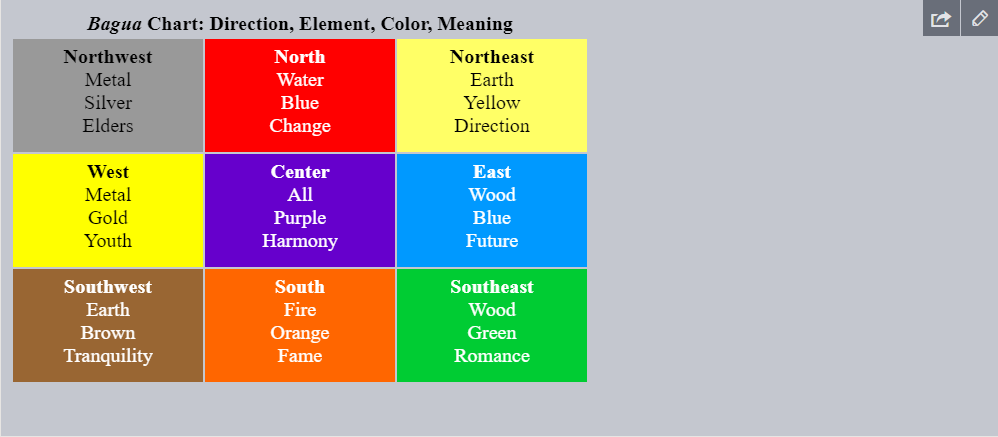

[Volver al Menú](../root.md)

# `Events`

# `Introducción a los eventos en el navegador`

Un evento es una señal de que algo ocurrió. Todos los nodos del DOM generan dichas señales (pero los eventos no están limitados sólo al DOM).

Aquí hay una lista con los eventos del DOM más utilizados, solo para echar un vistazo:

`Eventos del mouse:`

- `click` – cuando el mouse hace click sobre un elemento (los dispositivos touch lo generan con un toque).
- `contextmenu` – cuando el mouse hace click derecho sobre un elemento.
- `mouseover` / `mouseout` – cuando el cursor del mouse ingresa/abandona un elemento.
- `mousedown` / `mouseup` – cuando el botón del mouse es presionado/soltado sobre un elemento.
- `mousemove` – cuando el mouse se mueve.

`Eventos del teclado:`

- `keydown` / `keyup` – cuando se presiona/suelta una tecla.

`Eventos del elemento form:`

- `submit` – cuando el visitante envía un `<form>`.
- `focus` – cuando el visitante se centra sobre un elemento, por ejemplo un `<input>`.

`Eventos del documento:`

- `DOMContentLoaded` --cuando el HTML es cargado y procesado, el DOM está completamente construido

`Eventos del CSS:`

- `transitionend` – cuando una animación CSS concluye.

## `Controladores de eventos`

Para reaccionar con eventos podemos asignar un handler (controlador) el cual es una función que se ejecuta en caso de un evento.

Los handlers son una forma de ejecutar código JavaScript en caso de acciones por parte del usuario.

Hay muchas maneras de asignar un handler. Vamos a verlas empezando por las más simples.

### `Atributo HTML`

Un handler puede ser establecido en el HTML con un atributo llamado` on<event>.`

Por ejemplo, para asignar un handler click para un input podemos usar onclick, como aquí:

`<input value="Click me" onclick="alert('Click!')" type="button">`

Al hacer click, el código dentro de onclick se ejecuta.

Toma en cuenta que dentro de onclick usamos comillas simples, porque el atributo en sí va entre comillas dobles. Si olvidamos que el código está dentro del atributo y usamos comillas dobles dentro, así: onclick="alert("Click!")", no funcionará correctamente.

Un atributo HTML no es un lugar conveniente para escribir un motón de código, así que mejor creamos una función JavaScript y la llamamos allí.

Aquí un click ejecuta la función countRabbits():
```
<script>
  function countRabbits() {
    for(let i=1; i<=3; i++) {
      alert("Conejo número " + i);
    }
  }
</script>

<input type="button" onclick="countRabbits()" value="¡Cuenta los conejos!">
```

Como ya sabemos, los nombres de los atributos HTML no distinguen entre mayúsculas y minúsculas, entonces ONCLICK funciona bien al igual que onClick y onCLICK… Pero usualmente los atributos van con minúsculas: onclick.

### `Propiedad del DOM`

Podemos asignar un handler usando una propiedad del DOM `on<event>`.

Por ejemplo, elem.onclick:
```
<input id="elem" type="button" value="Haz click en mí">
<script>
  elem.onclick = function() {
    alert('¡Gracias!');
  };
</script>
```

Si el handler es asignado usando un atributo HTML entonces el navegador lo lee, crea una nueva función desde el contenido del atributo y lo escribe en la propiedad del DOM.

Esta forma en realidad es la misma que ya habíamos visto antes.

Estás dos piezas de código funcionan igual:

Solo HTML:
```
<input type="button" onclick="alert('¡Click!')" value="Botón">
```

HTML + JS:
```
<input type="button" id="button" value="Botón">
<script>
  button.onclick = function() {
    alert('¡Click!');
  };
</script>
```
En el primer ejemplo el atributo HTML es usado para inicializar el button.onclick. Mientras que en el segundo ejemplo se usa el script, esa es toda la diferencia.

Como solo hay una propiedad onclick, no podemos asignar más de un handler.

En el siguiente ejemplo se agrega un handler con JavaScript que sobrescribe el handler existente:
```
<input type="button" id="elem" onclick="alert('Antes')" value="¡Haz click en mí!">
<script>
  elem.onclick = function() { // sobrescribe el handler existente
    alert('Después'); // solo se mostrará este
  };
</script>
```

## `Accediendo al elemento: this`

El valor de this dentro de un handler es el elemento. El cuál tiene el handler dentro.

En el siguiente código el button muestra su contenido usando this.innerHTML:

`<button onclick="alert(this.innerHTML)">Haz click en mí</button>`

## `Posibles errores`

Si estás empezando a trabajar con eventos, por favor, nota algunas sutilezas.

Nosotros podemos establecer una función existente como un handler:

```
function sayThanks() {
  alert('¡Gracias!');
}

elem.onclick = sayThanks;
```

Pero ten cuidado: la función debe ser asignada como sayThanks, no sayThanks().
```
// correcto
button.onclick = sayThanks;

// incorrecto
button.onclick = sayThanks();
```

Si agregamos paréntesis, sayThanks() se convierte en una llamada de función. En ese caso la última linea toma el resultado de la ejecución de la función, que es undefined (ya que la función no devuelve nada), y lo asigna a onclick. Esto no funciona.

…Por otro lado, en el markup necesitamos los paréntesis:

`<input type="button" id="button" onclick="sayThanks()">`

`No uses setAttribute para handlers.`

Tal llamada no funcionará:
```
// un click sobre <body> generará errores,
// debido a que los atributos siempre son strings, la función se convierte en un string
document.body.setAttribute('onclick', function() { alert(1) });
```

`Las mayúsculas en las propiedades DOM importan.`

Asignar un handler a elem.onclick, en lugar de elem.ONCLICK, ya que las propiedades DOM son sensibles a mayúsculas.

## `addEventListener`

El problema fundamental de las formas ya mencionadas para asignar handlers es que no podemos asignar multiples handlers a un solo evento.

Digamos que una parte de nuestro código quiere resaltar un botón al hacer click, y otra quiere mostrar un mensaje en el mismo click.

Nos gustaría asignar dos handlers de eventos para eso. Pero una nueva propiedad DOM sobrescribirá la que ya existe:

```
input.onclick = function() { alert(1); }
// ...
input.onclick = function() { alert(2); } //  el handler reemplaza el handler anterior
```

Los desarrolladores de estándares de la web entendieron eso hace mucho tiempo y sugirieron una forma alternativa de administrar los handlers utilizando los métodos especiales addEventListener y removeEventListener, que no tienen este problema.

La sintaxis para agregar un handler:

`element.addEventListener(event, handler, [options]);`

- `event`
Nombre del evento, por ejemplo: "click".

- `handler`
La función handler.

- `options`
Un objeto adicional, opcional, con las propiedades:

    - `once`: si es true entonces el listener se remueve automáticamente después de activarlo.
    - `capture`: la fase en la que se controla el evento, que será cubierta en el capítulo Propagación y captura. Por razones históricas, options también puede ser false/true, lo que es igual a {capture: false/true}.
    - `passive`: si es true entonces el handler no llamará a preventDefault(), esto lo explicaremos más adelante en Acciones predeterminadas del navegador.

Para remover el handler, usa removeEventListener:

- element.removeEventListener(event, handler, `[options]`);

Múltiples llamadas a addEventListenerpermiten agregar múltiples handlers:
```
<input id="elem" type="button" value="Haz click en mí"/>

<script>
  function handler1() {
    alert('¡Gracias!');
  };

  function handler2() {
    alert('¡Gracias de nuevo!');
  }

  elem.onclick = () => alert("Hola");
  elem.addEventListener("click", handler1); // Gracias!
  elem.addEventListener("click", handler2); // Gracias de nuevo!
</script>
```

`Para algunos eventos, los handlers solo funcionan con addEventListener`

Hay eventos que no pueden ser asignados por medio de una propiedad del DOM. Solamente con addEventListener.

Por ejemplo, el evento DOMContentLoaded, que se activa cuando el documento está cargado y el DOM está construido.
```
// nunca se ejecutará
document.onDOMContentLoaded = function() {
  alert("DOM construido");
};
```
```
// Así sí funciona
document.addEventListener("DOMContentLoaded", function() {
  alert("DOM construido");
});
```
Por lo que addEventListener es más universal. Aún así, tales eventos son una excepción más que la regla.

## `Objeto del evento`

Pero para manejar correctamente un evento nos gustaría saber todavía más acerca de lo que está pasando. No solo si fue un “click” o un “teclazo”, sino ¿cuáles eran coordenadas del cursor o qué tecla fue oprimida? Y así.

Cuando un evento ocurre, el navegador crea un objeto del evento que coloca los detalles dentro y los pasa como un argumento al handler.

Aquí hay un ejemplo para obtener las coordenadas del cursor a partir del objeto del evento:

```
<input type="button" value="¡Haz click en mí!" id="elem">

<script>
  elem.onclick = function(event) {
    // muestra el tipo de evento, el elemento y las coordenadas del click
    alert(event.type + " en el " + event.currentTarget);
    alert("Coordenadas: " + event.clientX + ":" + event.clientY);
  };
</script>
```

Algunas propiedades del objeto event:

`event.type`
Tipo de evento, en este caso fue "click".

`event.currentTarget`
Elemento que maneja el evento. Lo que exactamente igual a this, a menos que el handler sea una función de flecha o su this esté vinculado a otra cosa, entonces podemos obtener el elemento desde event.currentTarget.

`event.clientX / event.clientY`
Coordenadas del cursor relativas a la ventana, para eventos de cursor.

## `Objetos handlers: handleEvent`

Podemos asignar no solo una función, sino un objeto como handler del evento usando addEventListener. Cuando el evento ocurre, el método handleEvent es llamado.

Por ejemplo:

```
<button id="elem">Haz click en mí</button>

<script>
  let obj = {
    handleEvent(event) {
      alert(event.type + " en " + event.currentTarget);
    }
  };

  elem.addEventListener('click', obj);
</script>
```

<h2 style="color: green">Resumen</h2>

Hay tres formas de asignar handlers:

- Atributos HTML: onclick="...".
- Propiedades del DOM: elem.onclick = function.
- Métodos: elem.addEventListener(event, handler[, phase]) para agregar ó removeEventListener para remover.

Los atributos HTML se usan con moderación, porque JavaScript en medio de una etiqueta HTML luce un poco extraño y ajeno. Además no podemos escribir montones de código ahí.

Las propiedades del DOM son buenas para usar, pero no podemos asignar más de un handler a un evento en particular. En la mayoría de casos esta limitación no es apremiante.

La última forma es la más flexible, pero también es la más larga para escribir. Hay pocos eventos que solo funcionan con ésta, por ejemplo transitionend y DOMContentLoaded (que veremos después). Además addEventListener soporta objetos como handlers de eventos. En este caso handleEvent es llamado en caso del evento.

No importa como asignes el handler, este obtiene un objeto como primer argumento. Este objeto contiene los detalles sobre lo que pasó.

Vamos a aprender más sobre eventos en general y sobre diferentes tipos de eventos en los siguientes capítulos.

# `Propagación y captura`

Vamos a empezar con un ejemplo.

Este manejador está asignado a `<div>`, pero también se ejecuta si haces clic a cualquier elemento anidado como `<em>` ó `<code>`:

```
<div onclick="alert('¡El manejador!')">
  <em>Si haces clic en<code>EM</code>, el manejador en <code>DIV</code> es ejecutado.</em>
</div>
```

¿No es un poco extraño? ¿Por qué el manejador en `<div>` es ejecutado, si el clic fue hecho en `<em>`?

## `Propagación`

El principio de propagación es simple.

Cuando un evento ocurre en un elemento, este primero ejecuta los manejadores que tiene asignados, luego los manejadores de su padre, y así hasta otros ancestros.

Digamos que tenemos 3 elementos anidados FORM > DIV > P con un manejador en cada uno de ellos:

```
<style>
  body * {
    margin: 10px;
    border: 1px solid blue;
  }
</style>

<form onclick="alert('form')">FORM
  <div onclick="alert('div')">DIV
    <p onclick="alert('p')">P</p>
  </div>
</form>
```

Un clic en el elemento del interior `<p>` primero ejecuta onclick:

- En ese `<p>`.
- Luego en el `<div>` de arriba.
- Luego en el `<form>` de más arriba.
- Y así sucesivamente hasta el objeto document.

Así si hacemos clic en `<p>`, entonces veremos 3 alertas: p → div → form.

Este proceso se conoce como “propagación” porque los eventos “se propagan” desde el elemento más al interior, a través de los padres, como una burbuja en el agua.


`Casi todos los elementos se propagan.`

La palabra clave en esta frase es “casi”.

Por ejemplo, un evento focus no se propaga. Hay otros ejemplos también, los veremos. Pero aún así, esta es la excepción a la regla, la mayoría de eventos sí se propagan.

## `event.target`

Un manejador en un elemento padre siempre puede obtener los detalles sobre dónde realmente ocurrió el evento.

El elemento anidado más profundo que causó el evento es llamado elemento objetivo, accesible como event.target

Nota la diferencia de this (=event.currentTarget):

- `event.target` – es el elemento “objetivo” que inició el evento, no cambia a través de todo el proceso de propagación.

- `this` – es el elemento “actual”, el que tiene un manejador ejecutándose en el momento.

Por ejemplo, si tenemos un solo manejador form.onclick, este puede atrapar todos los clicks dentro del formulario. No importa dónde el clic se hizo, se propaga hasta el `<form>` y ejecuta el manejador.

En el manejador form.onclick:

- `this` (=event.currentTarget) es el elemento `<form>`, porque el manejador se ejecutó en él.
- `event.target` es el elemento actual dentro de el formulario al que se le hizo clic.

Es posible que event.target sea igual a this: ocurre cuando el clic se hace directamente en el elemento `<form>`.

## `Detener la propagación`

Una propagación de evento empieza desde el elemento objetivo hacia arriba. Normalmente este continúa hasta `<html>` y luego hacia el objeto document, algunos eventos incluso alcanzan window, llamando a todos los manejadores en el camino.

Pero cualquier manejador podría decidir que el evento se ha procesado por completo y detener su propagación.

El método para esto es `event.stopPropagation()`.

Por ejemplo, aquí body.onclick no funciona si haces clic en `<button>`:

```
<body onclick="alert(`No se propagó hasta aquí`)">
  <button onclick="event.stopPropagation()">Haz clic</button>
</body>
```

`event.stopImmediatePropagation()`

Si un elemento tiene múltiples manejadores para un solo evento, aunque uno de ellos detenga la propagación, los demás aún se ejecutarán.

En otras palabras, event.stopPropagation() detiene la propagación hacia arriba, pero todos los manejadores en el elemento actual se ejecutarán.

Para detener la propagación y prevenir que los manejadores del elemento actual se ejecuten, hay un método event.stopImmediatePropagation(). Después de él, ningún otro manejador será ejecutado.

`¡No detengas la propagación si no es necesario!`

La propagación es conveniente. No la detengas sin una necesidad real, obvia y arquitectónicamente bien pensada.

A veces event.stopPropagation() crea trampas ocultas que luego se convierten en problemas.

Por ejemplo:


- Creamos un menú anidado. Cada submenú maneja los clics en sus elementos y ejecuta stopPropagation para que el menu de arriba no se desencadene.

- Luego decidimos atrapar los clic en toda la ventana, para seguir el rastro del comportamiento del usuario (donde hacen clic). Algunos sistemas de análisis hacen eso. Usualmente el código usa document.addEventListener('click'…) para atrapar todos los clics.

- Nuestro análisis no funcionará sobre el área dónde los clics son detenidos por stopPropagation. Tristemente, tenemos una “zona muerta”.

Usualmente no hay una necesidad real para prevenir la propagación, pero una tarea que aparentemente lo requiera puede ser resuelta por otros medios. Uno de ellos es usar eventos personalizados, cubriremos eso más tarde. También podemos escribir nuestros datos en el objeto event en un manejador y leerlo en otro, para así poder pasar información sobre el proceso de abajo a los manejadores en los padres.

## `Captura`

Hay otra fase en el procesamiento de eventos llamada “captura”. Es raro usarla en código real, pero a veces puede ser útil.

El estándar de eventos del DOM describe 3 fases de la propagación de eventos:

- Fase de captura – el evento desciende al elemento.
- Fase de objetivo – el evento alcanza al elemento.
- Fase de propagación – el evento se propaga hacia arriba del elemento.

Aquí (tomada de la especificación), tenemos la imagen de las fases de captura (1), objetivo (2), y propagación (3), de un evento click en un `<td>` dentro de una tabla:


Se explica así: por un clic en `<td>` el evento va primero a través de la cadena de ancestros hacia el elemento (fase de captura), luego alcanza el objetivo y se desencadena ahí (fase de objetivo), y por último va hacia arriba (fase de propagación), ejecutando los manejadores en su camino.

Hasta ahora solo hablamos de la propagación, porque la fase de captura es raramente usada.

De hecho, la fase de captura es invisible para nosotros, porque los manejadores agregados que usan la propiedad `on<event>`, ó usan atributos HTML, ó addEventListener(event, handler) de dos argumentos, no ven la fase de captura, únicamente se ejecutan en la 2da y 3ra fase.

Para atrapar un evento en la fase de captura, necesitamos preparar la opción capture como true en el manejador:

```
elem.addEventListener(..., {capture: true})

// o solamente "true". Es una forma más corta de {capture: true}
elem.addEventListener(..., true)
```

Hay dos posibles valores para la opción capture:

- Si es false (por defecto), entonces el manejador es preparado para la fase de propagación.
- Si es true, entonces el manejador es preparado para la fase de captura.

Es de notar que mientras formalmente hay 3 fases, la 2da fase (“la fase de objetivo”: el evento alcanzó el elemento) no es manejada de forma separada; los manejadores en ambas fases, la de captura y propagación, se disparan en esa fase.

Veamos ambas fases, captura y propagación, en acción:
```
<style>
  body * {
    margin: 10px;
    border: 1px solid blue;
  }
</style>

<form>FORM
  <div>DIV
    <p>P</p>
  </div>
</form>

<script>
  for(let elem of document.querySelectorAll('*')) {
    elem.addEventListener("click", e => alert(`Captura: ${elem.tagName}`), true);
    elem.addEventListener("click", e => alert(`Propagación: ${elem.tagName}`));
  }
</script>
```

El código prepara manejadores de clic en cada elemento en el documento para ver cuáles están funcionando.

Si haces clic en `<p>`, verás que la secuencia es:

- `HTML` → `BODY` → `FORM` → `DIV` (fase de captura, el primer detector o “listener”):
- `P` → `DIV` → `FORM` → `BODY` → `HTML` (fase de propagación, el segundo detector).

Nota que P aparece dos veces, porque establecimos dos listeners: captura y propagación. Se disparan en el objetivo al final de la primera fase y al principio de la segunda fase.

Hay un propiedad event.eventPhase que nos dice el número de fase en la que el evento fue capturado. Pero es raramente usada, ya que usualmente lo sabemos en el manejador.

`Para quitar el manejador, removeEventListener necesita la misma fase`

Si agregamos addEventListener(..., true), entonces debemos mencionar la misma fase en removeEventListener(..., true) para remover el manejador correctamente.

`Detectores de eventos en el mismo elemento y en la misma fase se ejecutan en el orden de asignación`

Si tenemos múltiples manejadores de eventos en la misma fase, asignados al mismo elemento con addEventListener, se ejecutarán en el orden que fueron creados:

- elem.addEventListener("click", e => alert(1)); // garantizado que se ejecutará primero
- elem.addEventListener("click", e => alert(2));

`event.stopPropagation() durante la captura también evita la propagación`

El método event.stopPropagation() y su hermano event.stopImmediatePropagation() también pueden ser llamados en la fase de captura. En este caso no solo se detienen las capturas sino también la propagación.

En otras palabras, normalmente el evento primero va hacia abajo (“captura”) y luego hacia arriba (“propagación”). Pero si se llama a event.stopPropagation() durante la fase de captura, se detiene la travesía del evento, y la propagación no volverá a ocurrir.

<h2 style="color: green">Resumen</h2>

Cuando ocurre un evento, el elemento más anidado dónde ocurrió se reconoce como el “elemento objetivo” (event.target).

Luego el evento se mueve hacia abajo desde el documento raíz hacia event.target, llamando a los manejadores en el camino asignados con addEventListener(..., true) (true es una abreviación para {capture: true}).
Luego los manejadores son llamados en el elemento objetivo mismo.
Luego el evento se propaga desde event.target hacia la raíz, llamando a los manejadores que se asignaron usando `on<event>`, atributos HTML y addEventListener sin el 3er argumento o con el 3er argumento false/{capture:false}.
Cada manejador puede acceder a las propiedades del objeto event:

event.target – el elemento más profundo que originó el evento.
event.currentTarget (=this) – el elemento actual que maneja el evento (el que tiene al manejador en él)
event.eventPhase – la fase actual (captura=1, objetivo=2, propagación=3).
Cualquier manejador de evento puede detener el evento al llamar event.stopPropagation(), pero no es recomendado porque no podemos realmente asegurar que no lo necesitaremos más adelante, quizá para completar diferentes cosas.

La fase de captura raramente es usada, usualmente manejamos los eventos en la propagación. Y hay una explicación lógica para ello.

En el mundo real, cuando un accidente ocurre, las autoridades locales reaccionan primero. Ellos conocen mejor el área dónde ocurrió. Luego, si es necesario, las autoridades de alto nivel.

Lo mismo para los manejadores de eventos. El código que se prepara en el manejador de un elemento en particular conoce el máximo de detalles sobre el elemento y qué hace. Un manejador en un `<td>` particular puede ser adecuado para ese exacto `<td>`, conocer todo sobre él, entonces debe tener su oportunidad primero. Luego su padre inmediato también conoce sobre el contexto, pero un poco menos, y así sucesivamente hasta el elemento de arriba que maneja conceptos generales y se ejecuta al final.

La propagación y captura ponen los cimientos para “delegación de eventos”: un extremadamente poderoso patrón de manejo de eventos que se estudia en el siguiente capítulo.

# `Delegación de eventos`

La captura y el propagación nos permiten implementar uno de los más poderosos patrones de manejo de eventos llamado delegación de eventos.

La idea es que si tenemos muchos elementos manejados de manera similar podemos, en lugar de asignar un manejador a cada uno de ellos, poner un único manejador a su ancestro común.

En el manejador obtenemos event.target para ver dónde ocurrió realmente el evento y manejarlo.

Veamos un ejemplo: El diagrama Pa kua que refleja la antigua filosofía china.

Aquí está:



El HTML es este:
```
<table>
  <tr>
    <th colspan="3"><em>Bagua</em> Chart: Direction, Element, Color, Meaning</th>
  </tr>
  <tr>
    <td class="nw"><strong>Northwest</strong><br>Metal<br>Silver<br>Elders</td>
    <td class="n">...</td>
    <td class="ne">...</td>
  </tr>
  <tr>...2 more lines of this kind...</tr>
  <tr>...2 more lines of this kind...</tr>
</table>

```
La tabla tiene 9 celdas, pero puede haber 99 o 999, eso no importa.

Nuestra tarea es destacar una celda `<td>` al hacer clic en ella.

En lugar de asignar un manejador onclick a cada` <td>` (puede haber muchos), configuramos un manejador “atrapa-todo” en el elemento `<table>`.

Este usará event.target para obtener el elemento del clic y destacarlo.

El código:
```
let selectedTd;

table.onclick = function(event) {
  let target = event.target; // ¿dónde fue el clic?

  if (target.tagName != 'TD') return; // ¿no es un TD? No nos interesa

  highlight(target); // destacarlo
};

function highlight(td) {
  if (selectedTd) { // quitar cualquier celda destacada que hubiera antes
    selectedTd.classList.remove('highlight');
  }
  selectedTd = td;
  selectedTd.classList.add('highlight'); // y destacar el nuevo td
}
```

A tal código no le interesa cuántas celdas hay en la tabla. Podemos agregar y quitar `<td>` dinámicamente en cualquier momento y el realzado aún funcionará.

Pero hay un inconveniente.

El clic puede ocurrir no sobre `<td>`, sino dentro de él.

En nuestro caso, si miramos dentro del HTML, podemos ver tags anidados dentro de `<td>`, como `<strong>`:
```
<td>
  <strong>Northwest</strong>
  ...
</td>
```
Naturalmente, si el clic ocurre en `<strong>`, este se vuelve el valor de event.target

En el manejador table.onclick debemos tomar tal event.target e indagar si el clic fue dentro de `<td>` o no.

Aquí el código mejorado:

```
table.onclick = function(event) {
  let td = event.target.closest('td'); // (1)

  if (!td) return; // (2)

  if (!table.contains(td)) return; // (3)

  highlight(td); // (4)
};
```

Explicación:

- El método elem.closest(selector) devuelve el ancestro más cercano que coincide con el selector. En nuestro caso buscamos `<td>` hacia arriba desde el elemento de origen.

- Si event.target no ocurrió dentro de algún `<td>`, el llamado retorna inmediatamente pues no hay nada que hacer.

- En caso de tablas anidadas, event.target podría ser un `<td>`, pero fuera de la tabla actual. Entonces verificamos que sea realmente un `<td>` de nuestra tabla.

- Y, si es así, destacarla.
Como resultado, tenemos un código de realzado rápido y eficiente al que no le afecta la cantidad total de `<td>` en la tabla.

## `Ejemplo de delegación: acciones en markup`

Hay otros usos para la delegación de eventos.

Digamos que queremos hacer un menú con los botones “Save”, “Load”, “Search” y así. Y hay objetos con los métodos save, load, search… ¿Cómo asociarlos?

La primera idea podría ser asignar un controlador separado para cada botón. Pero hay una solución más elegante. Podemos agregar un controlador para el menú completo y un atributo data-action a los botones con el método a llamar:

`<button data-action="save">Click to Save</button>`


## `El patrón “comportamiento”`

También podemos usar delegación de eventos para agregar “comportamiento” a los elementos de forma declarativa, con atributos y clases especiales.

El patrón tiene dos partes:

- Agregamos un atributo personalizado al elemento que describe su comportamiento.
- Un manejador rastrea eventos del documento completo, y si un evento ocurre en un elemento con el atributo ejecuta la acción.

### `Comportamiento: Contador`
Por ejemplo, aquí el atributo data-counter agrega un comportamiento: “incrementar el valor con un clic” a los botones:

Counter: `<input type="button" value="1" data-counter>`
One more counter: `<input type="button" value="2" data-counter>`
```
<script>
  document.addEventListener('click', function(event) {

    if (event.target.dataset.counter != undefined) { // si el atributo existe...
      event.target.value++;
    }

  });
</script>
```

`Para manejadores de nivel de documento: siempre addEventListener`

Cuando asignamos un manejador de evento al objeto document, debemos usar siempre addEventListener, no `document.on<event>`, porque este último causa conflictos: los manejadores nuevos sobrescribirán los viejos.

En proyectos reales es normal que haya muchos manejadores en document, asignados en diferentes partes del código.

### `partes del código.`

Comportamiento: Conmutador (toggle)
Un ejemplo más de comportamiento. Un clic en un elemento con el atributo data-toggle-id mostrará/ocultará el elemento con el id recibido:
```
<button data-toggle-id="subscribe-mail">
  Show the subscription form
</button>

<form id="subscribe-mail" hidden>
  Your mail: <input type="email">
</form>

<script>
  document.addEventListener('click', function(event) {
    let id = event.target.dataset.toggleId;
    if (!id) return;

    let elem = document.getElementById(id);

    elem.hidden = !elem.hidden;
  });
</script>
```

Veamos una vez más lo que hicimos aquí: ahora, para agregar la funcionalidad de conmutación a un elemento, no hay necesidad de conocer JavaScript, simplemente usamos el atributo data-toggle-id.

Esto puede ser muy conveniente: no hay necesidad de escribir JavaScript para cada elemento. Simplemente usamos el comportamiento. El manejador a nivel de documento hace el trabajo para cualquier elemento de la página.

Podemos combinar múltiples comportamientos en un único elemento también.

El patrón “comportamiento” puede ser una alternativa a los mini-fragmentos de JavaScript.

<h2 style="color: green">Resumen</h2>

¡La delegación de eventos es verdaderamente fantástica! Es uno de los patrones más útiles entre los eventos DOM.

A menudo es usado para manejar elementos similares, pero no solamente para eso.

El algoritmo:

- Pone un único manejador en el contenedor.
- Dentro del manejador revisa el elemento de origen event.target.
- Si el evento ocurrió dentro de un elemento que nos interesa, maneja el evento.

Beneficios:

 - Simplifica la inicialización y ahorra memoria: no hay necesidad de agregar muchos controladores.
 - Menos código: cuando agregamos o quitamos elementos, no hay necesidad de agregar y quitar controladores.
 - Modificaciones del DOM: podemos agregar y quitar elementos en masa con innerHTML y similares.

La delegación tiene sus limitaciones por supuesto:

- Primero, el evento debe “propagarse”. Algunos eventos no lo hacen. Además manejadores de bajo nivel no deben usar event.stopPropagation().
- Segundo, la delegación puede agregar carga a la CPU, porque el controlador a nivel de contenedor reacciona a eventos en cualquier lugar del mismo, no importa si nos interesan o no. Pero usualmente la carga es imperceptible y no la tomamos en cuenta.

# `Acciones predeterminadas del navegador`

Muchos eventos conducen automáticamente a determinadas acciones realizadas por el navegador.

Por ejemplo:

- Al presionar un botón del ratón sobre un texto y moverlo, se selecciona el texto.
- Un clic en un enlace: inicia la navegación a su URL.
- Un clic en el botón de envío de un formulario inicia su envío al servidor.

Si manejamos un evento en JavaScript, es posible que no queramos que suceda la acción correspondiente del navegador e implementar en cambio otro comportamiento.

## `Evitar las acciones del navegador`

Hay dos formas de decirle al navegador que no queremos que actúe:

La forma principal es utilizar el objeto event. Hay un método `event.preventDefault()`.
Si el controlador se asigna usando `on<event>` (no por addEventListener), entonces devolver false también funciona igual.

En este HTML, un clic en un enlace no conduce a la navegación. El navegador no hace nada:
```
<a href="/" onclick="return false">Haz clic aquí</a>
o
<a href="/" onclick="event.preventDefault()">aquí</a>
```

`Regresar false desde un controlador es una excepción`

El valor devuelto por un controlador de eventos generalmente se ignora.

La única excepción es return false de un controlador asignado usando `on<event>`.

En todos los demás casos, se ignora el valor return. En particular, no tiene sentido devolver true.

## `La opción de controlador “pasivo”`

La opción opcional passive:true de addEventListener indica al navegador que el controlador no llamará a preventDefault().

¿Para qué podría ser necesario?

Hay algunos eventos como touchmove en dispositivos móviles (cuando el usuario mueve el dedo por la pantalla), que provocan el desplazamiento por defecto, pero ese desplazamiento se puede evitar usando preventDefault() en el controlador.

Entonces, cuando el navegador detecta tal evento, primero tiene que procesar todos los controladores, y luego, si no se llama a preventDefault en ninguna parte, puede continuar con el desplazamiento. Eso puede causar retrasos innecesarios y “movimientos de salto repentinos” en la interfaz de usuario.

Las opciones passive: true le dicen al navegador que el controlador no va a cancelar el desplazamiento. Entonces el navegador se desplaza de inmediato para brindar una experiencia con la máxima fluidez, y el evento se maneja de inmediato.

Para algunos navegadores (Firefox, Chrome), passive es true por defecto para los eventos touchstart y touchmove.

## `event.defaultPrevented`


La propiedad event.defaultPrevented es true si se impidió la acción predeterminada y false en caso contrario.

Hay un caso de uso interesante para ello.

¿Recuerdas que en el capítulo Propagación y captura hablamos sobre event.stopPropagation() y por qué detener propagación es malo?

A veces podemos usar event.defaultPrevented en su lugar, para señalar a otros controladores de eventos que el evento fue manejado.

Veamos un ejemplo práctico.

Por defecto, el navegador en el evento contextmenu (clic derecho del ratón) muestra un menú contextual con opciones estándar. Podemos prevenirlo y mostrar el nuestro, así:

[Mas informacion](event.defaultPrevented)

<h2 style="color: green">Resumen</h2>
Hay muchas acciones predeterminadas del navegador:

- mousedown – inicia la selección (mueva el ratón para seleccionar).
- click en `<input type="checkbox">` – marca/desmarca el input.
- submit – dar clic en `<input type="submit">` o presionar Enter dentro de un campo de formulario hace que suceda este evento y el navegador envía el formulario a continuación.
- keydown – presionar una tecla puede llevar a agregar un carácter a un campo u otras acciones.
- contextmenu – el evento ocurre con un clic derecho, la acción es mostrar el menú contextual del navegador.
- …hay mas…

Todas las acciones predeterminadas se pueden evitar si queremos manejar el evento exclusivamente mediante JavaScript.

Para evitar una acción predeterminada, utiliza event.preventDefault() o return false. El segundo método funciona solo para los controladores asignados con `on<event>`.

La opción passive: true de addEventListener le dice al navegador que la acción no se evitará. Eso es útil para algunos eventos móviles, como touchstart y touchmove, para decirle al navegador que no debe esperar a que todos los controladores terminen antes de desplazarse.

Si se evitó la acción predeterminada, el valor de event.defaultPrevented se convierte en true, de lo contrario, es false.

`Mantente semántico, no abuses`

Técnicamente, al evitar acciones predeterminadas y agregar JavaScript, podemos personalizar el comportamiento de cualquier elemento. Por ejemplo, podemos hacer que un enlace `<a>` funcione como un botón, y un botón `<button>` se comporte como un enlace (redirigir a otra URL o algo así).

Pero en general deberíamos mantener el significado semántico de los elementos HTML. Por ejemplo, la navegación debe realizarla `<a>`, no un botón.

Además de ser “algo bueno”, hace que su HTML sea mejor en términos de accesibilidad.

Además, si consideramos el ejemplo con `<a>`, ten en cuenta: un navegador nos permite abrir dichos enlaces en una nueva ventana (usando el botón derecho u otros medios). Y a la gente le gusta. Pero si hacemos que un botón se comporte como un enlace usando JavaScript e incluso parezca un enlace usando CSS, las características específicas de `<a>` no funcionarán en él.

# `Envío de eventos personalizados`

No solo podemos asignar controladores, sino también generar eventos desde JavaScript.

Los eventos personalizados se pueden utilizar para crear “componentes gráficos”. Por ejemplo, un elemento raíz de nuestro propio menú basado en JS puede desencadenar eventos que indiquen lo que sucede con el menú: abrir (menú abierto),seleccionar (se selecciona un elemento) y así sucesivamente. Otro código puede escuchar los eventos y observar lo que sucede con el menú.

No solo podemos generar eventos completamente nuevos, que inventamos para nuestros propios fines, sino también eventos integrados, como click, mousedown, etc. Eso puede ser útil para las pruebas automatizadas.

## `Constructor de eventos`

Las clases de eventos integradas forman una jerarquía, similar a las clases de elementos DOM. La raíz es la clase incorporada Event.

Podemos crear objetos Event así:

`let event = new Event(type[, options]);`

Argumentos:

- type – tipo de event, un string como "click" o nuestro propio evento como "mi-evento".

- options – el objeto con 2 propiedades opcionales:

    -`bubbles`: true/false – si es true, entonces el evento se propaga.
    -`cancelable`: true/false – si es true, entonces la “acción predeterminada” puede ser prevenida. Más adelante veremos qué significa para los eventos personalizados.

Por defecto, los dos son false: {bubbles: false, cancelable: false}.

## `dispatchEvent`

Después de que se crea un objeto de evento, debemos “ejecutarlo” en un elemento usando la llamada elem.dispatchEvent(event).

Luego, los controladores reaccionan como si fuera un evento normal del navegador. Si el evento fue creado con la bandera bubbles, entonces se propaga.

En el siguiente ejemplo, el evento click se inicia en JavaScript. El controlador funciona de la misma manera que si se hiciera clic en el botón:

```
<button id="elem" onclick="alert('Clic!');">Click automático</button>

<script>
  let event = new Event("click");
  elem.dispatchEvent(event);
</script>
```

`event.isTrusted`

Hay una forma de diferenciar un evento de usuario “real” de uno generado por script.

La propiedad event.isTrusted es true para eventos que provienen de acciones de usuarios reales y false para eventos generados por script.

## `Ejemplo de Bubbling`

Podemos crear un evento bubbling con el nombre "hello" y capturarlo en document.

Todo lo que necesitamos es establecer bubbles en true:
```
<h1 id="elem">Hola desde el script!</h1>

<script>
  // Captura en document...
  document.addEventListener("hello", function(event) { // (1)
    alert("Hola desde " + event.target.tagName); // Hola desde H1
  });

  // ...Envío en elem!
  let event = new Event("hello", {bubbles: true}); // (2)
  elem.dispatchEvent(event);

// el controlador del documento se activará y mostrará el mensaje.

</script>
```
Notas:

- Debemos usar addEventListener para nuestros eventos personalizados, porque `on<event>` solo existe para eventos incorporados, document.onhello no funciona.
- Debes poner bubbles:true, de otra manera el evento no se propagará.

La mecánica de bubbling es la misma para los eventos integrados (click) y personalizados (hello). También hay etapas de captura y propagación.

## `MouseEvent, KeyboardEvent y otros`

Aquí hay una breve lista de clases para eventos UI (interfaz de usuario) de la especificación de eventos UI:

- UIEvent
- FocusEvent
- MouseEvent
- WheelEvent
- KeyboardEvent
- …

Deberíamos usarlos en lugar de new Event si queremos crear tales eventos. Por ejemplo, new MouseEvent("click").

El constructor correcto permite especificar propiedades estándar para ese tipo de evento.

Como clientX/clientY para un evento de mouse:
```
let event = new MouseEvent("click", {
  bubbles: true,
  cancelable: true,
  clientX: 100,
  clientY: 100
});

alert(event.clientX); // 100
```
Tenga en cuenta: el constructor genérico Event no lo permite.

Intentemos:
```
let event = new Event("click", {
  bubbles: true, // solo bubbles y cancelable
  cancelable: true, // funcionan en el constructor de Event
  clientX: 100,
  clientY: 100
});

alert(event.clientX); // undefined, se ignora la propiedad desconocida!
```

Técnicamente, podemos solucionarlo asignando directamente event.clientX=100 después de la creación. Entonces eso es una cuestión de conveniencia y de seguir las reglas. Los eventos generados por el navegador siempre tienen el tipo correcto.

La lista completa de propiedades para diferentes eventos de UI se encuentra en la especificación, por ejemplo, MouseEvent.

## `Eventos personalizados`

Para nuestros tipos de eventos completamente nuevos, como "hello", deberíamos usar new CustomEvent. Técnicamente, CustomEvent es lo mismo que Event, con una excepción.

En el segundo argumento (objeto) podemos agregar una propiedad adicional detail para cualquier información personalizada que queramos pasar con el evento.

Por ejemplo:
```
<h1 id="elem">Hola para John!</h1>

<script>
  // detalles adicionales que vienen con el evento para el controlador.
  elem.addEventListener("hello", function(event) {
    alert(event.detail.name);
  });

  elem.dispatchEvent(new CustomEvent("hello", {
    detail: { name: "John" }
  }));
</script>
```

La propiedad detail puede tener cualquier dato. Técnicamente podríamos vivir sin él, porque podemos asignar cualquier propiedad a un objeto new Event regular después de su creación. Pero CustomEvent proporciona el campo especial detail para evitar conflictos con otras propiedades del evento.

Además, la clase de evento describe “qué tipo de evento” es, y si el evento es personalizado, entonces deberíamos usar CustomEvent solo para tener claro qué es.

## `event.preventDefault()`

Muchos eventos del navegador tienen una “acción predeterminada”, como ir a un enlace, iniciar una selección, etc.

Para eventos nuevos y personalizados, definitivamente no hay acciones predeterminadas del navegador, pero un código que distribuye dicho evento puede tener sus propios planes de qué hacer después de activar el evento.

Al llamar a event.preventDefault(), un controlador de eventos puede enviar una señal de que esas acciones deben cancelarse.

En ese caso, la llamada a elem.dispatchEvent(event) devuelve false. Y el código que lo envió sabe que no debería continuar.

## `Los eventos dentro de eventos son sincrónicos`

Usualmente los eventos se procesan en una cola. Por ejemplo: si el navegador está procesando onclick y ocurre un nuevo evento porque el mouse se movió, entonces el manejo de este último se pone en cola, y el controlador correspondiente mousemove será llamado cuando el procesamiento de onclick haya terminado.

La excepción notable es cuando un evento se inicia desde dentro de otro, por ejemplo, usando dispatchEvent. Dichos eventos se procesan inmediatamente: se llaman los nuevos controladores de eventos y luego se reanuda el manejo de eventos actual.

<h2 style="color: green">Resumen</h2>

Para generar un evento a partir del código, primero necesitamos crear un objeto de evento.

El constructor genérico Event(name, options) acepta un nombre de evento arbitrario y el objeto options con dos propiedades:

- bubbles: true si el evento debe propagarse.
- cancelable: true si event.preventDefault() debe funcionar.

Otros constructores de eventos nativos como MouseEvent, KeyboardEvent, y similares, aceptan propiedades específicas para ese tipo de evento. Por ejemplo, clientX para eventos de mouse.

Para eventos personalizados deberíamos usar el constructor CustomEvent. Este tiene una opción adicional llamada detail a la que podemos asignarle los datos específicos del evento. De esta forma, todos los controladores pueden accederlos como event.detail.

A pesar de la posibilidad técnica de generar eventos del navegador como click o keydown, debemos usarlo con mucho cuidado.

No deberíamos generar eventos de navegador, ya que es una forma trillada de ejecutar controladores. Esa es una mala arquitectura la mayor parte del tiempo.

Se pueden generar eventos nativos:

- Como un truco sucio para hacer que las bibliotecas de terceros funcionen de la manera necesaria, si es que ellas no proporcionan otros medios de interacción.
- Para pruebas automatizadas, que el script “haga clic en el botón” y vea si la interfaz reacciona correctamente.

Los eventos personalizados con nuestros propios nombres a menudo se generan con fines arquitectónicos, para señalar lo que sucede dentro de nuestros menús, controles deslizantes, carruseles, etc.

[TOP](#events)