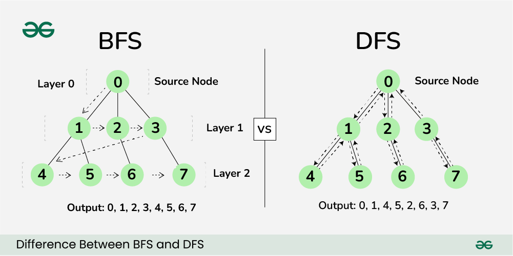

[Volver al Menú](./root.md)

# `Graph Data Structure`

A Graph Data Structure consists of a set of vertices (or nodes) and edges where each edge connects a pair of vertices. It can be visualized as networks consisting of elements in interconnected various relationships. There are two major types of graphs: Directed and Undirected. In a directed graph, all the edges are unidirectional - they only go one way. On the other hand, in an undirected graph, the edges are not directed - they are bidirectional. Another concept important to graphs is the idea of ‘Weighted’ and ‘Unweighted’ graphs. In a weighted graph, each edge is assigned a weight or cost. Unweighted graphs don’t have these extra edge information. Graphs have a diverse set of applications in computer science, from creating connections between web pages to modeling networks and much more.

# `Directed Graph`

A Directed Graph, also known as a DiGraph, is a set of vertices and a collection of directed edges. Each directed edge has an initial vertex, also called the tail, and a terminal vertex, also known as the head. The directed edge is said to point from the tail to the head. To visualize this, think of a graph where the nodes are cities and the edges are one-way roads. Directed graphs are often used to represent relationships between objects where direction does matter, such as a sequence of events in a workflow.

# `Undirected Graph`

An Undirected Graph is a type of graph in which the edges are not directed. That is, they do not point in any specific direction and are not ordered pairs. They cannot be referred to as originating or ending node, instead, they are endpoints of the edges. In this type of graph, the edges essentially represent a two-way relationship, in the sense that, a travel can be made back and forth between the two vertices without any restriction. Every edge of the undirected graph always connects two different vertices or nodes.

---

# `Search Algorithms`

Search algorithms are fundamental techniques used for exploring a graph. Two classical methods are `Depth-First Search (DFS)` and `Breadth-First Search (BFS)`. DFS relies on a stack and the concept of backtracking. Starting from a given node, it explores as far down a path as possible before backtracking. BFS, on the other hand, uses a queue and visits all of a node’s neighbors at one level before moving on to the next. For discovering the shortest path between two nodes, `Dijkstra’s algorithm` and the `A*` search algorithm are often used. `Dijkstra’s algorithm` builds up a table that provides the shortest distances to each reachable node from a selected starting node. A search algorithm\*, a modification of `Dijkstra’s algorithm`, uses a heuristic to provide a best estimate of the path from the current node to the goal, thus often increasing the algorithm’s efficiency.

# `Breadth First Search`

`Breadth-First Search (BFS)` is a searching algorithm used to traverse or search in data structures like a tree or a graph. The algorithm starts with a root node and visits the nodes in a level by level manner (i.e., visiting the ones nearest to the root first). It makes use of a queue data structure to store nodes not yet visited. A check is performed before nodes are put in the queue. This is to ensure same node is not visited twice. BFS can be used in multiple areas like finding shortest paths, serialized tree or in test case scenarios where all vertices are equally important.

# `Depth First Search`

`Depth-First Search (DFS)` is an algorithm used for traversing or searching tree or graph data structures. The process starts at the root node (selecting some arbitrary node as the root in the case of a graph), and explores as far as possible along each branch before backtracking. It uses a last in, first out (LIFO) stack to remember to get the next vertex to start a search when a dead end occurs in any iteration. DFS has been used in a variety of applications including finding connected components, topological sorting, and finding articulation points (or cut vertices) in a graph.

---

# `Shortest Path Algos`

Shortest Path Algorithms are a set of algorithms used in graph theory to find the shortest path between two vertices or nodes. The two most well-known algorithms are `Dijkstra’s Algorithm` and the `Bellman-Ford Algorithm`. `Dijkstra’s Algorithm` operates by visiting neighbors of the starting vertex and keeps a running tally of the shortest distance from the starting vertex to each visited vertex. This is repeated until all vertices have been visited and the shortest distances calculated. `Bellman-Ford Algorithm`, on the other hand, is capable of handling graphs with negative edges. It works by iteratively relaxing the graph edges and thereby finding the shortest paths to all vertices.

# `Dijkstra’s Algorithm`

`Dijkstra’s algorithm` is a popular method used in computing and graph theory for finding the shortest paths between nodes in a graph. Named after Dutch computer scientist Edsger W. Dijkstra, this algorithm works by visiting vertices in the graph starting from the object’s starting point and gradually spreading out until the shortest path to the desired endpoint is known. This algorithm is applicable in such situation where all the edges are non-negative. Linear data structures such as stacks and queues are commonly used in the implementation of this algorithm. Although its worst-case time complexity appears to be high `(O(|V|^2))`, it runs significantly faster in practice.

# `Bellman-Ford`

`The Bellman Ford algorithm` is a method used in graph theory for finding the shortest path between a single source vertex and all other vertices in a weighted graph. This algorithm is significant because it is capable of handling graphs with negative weight edges, unlike `Dijkstra’s algorithm`. It follows a bottom-up approach, filling up the distance table gradually while relaxing edges. The algorithm gets its name from its developers, Richard Bellman and Lester Ford. However, it can lead to an infinite loop if there are negative weight cycles in the graph, which should be addressed separately using another check.

---

# `Minimum Spanning Tree`

A `Minimum Spanning Tree` (MST) is a concept in graph theory where it represents a subset of the edges of a connected, undirected graph. This subset connects all the vertices together, without any cycles and with the minimum possible total edge weight. There are quite a few algorithms that can be used to find the MST of a graph such as Prim’s, Kruskal’s, and Boruvka’s algorithm. The concept is important in network design, where the goal is to minimize the total length of the wires yet still connect all of the points.

# `Prim’s Algorithm`

`Prim’s algorithm` is a greedy algorithm that finds a `minimum spanning tree` for a weighted undirected graph. This means it finds a subset of the edges that forms a tree that includes every vertex, where the total weight of all the edges in the tree is minimized. The algorithm operates by building this tree one vertex at a time, from an arbitrary starting vertex, at each step adding the cheapest possible connection from the tree to another vertex.

# `Kruskal’s Algorithm`

`Kruskal’s algorithm` is a popular procedure in computer science for finding `minimum spanning tree`s in a graph, developed by Joseph Kruskal in 1956. The algorithm operates by sorting the edges of the graph by their weight in ascending order. Then, it loops through each, adding the edge to the spanning tree if it doesn’t form a circuit with the edges already there. This process repeats until all the vertices in the graph are included in the tree. `Kruskal’s algorithm` belongs to the group of Greedy Algorithms as it tries to find the local optimum at each stage with the hope of finding the global optimum. It has an overall time complexity of O(E log E) or O(E log V), where E is the number of edges and V is the number of vertices.

[TOP](#graph-data-structure)
