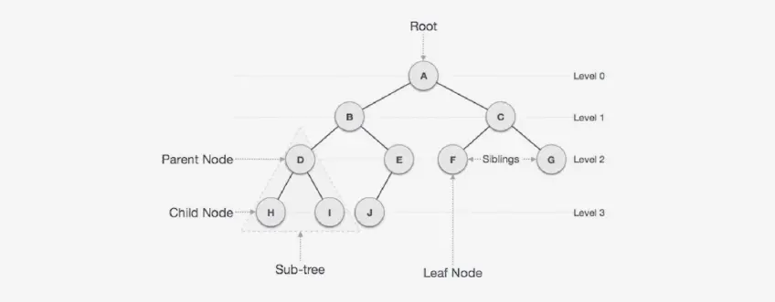
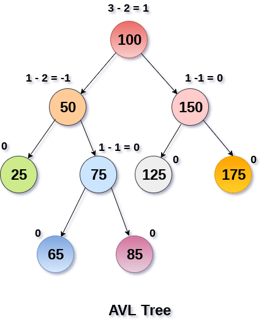
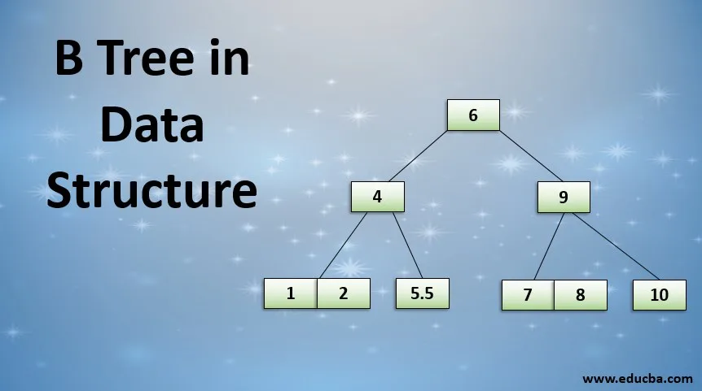

[Volver al Menú](./root.md)

# `Tree Data Structures`

A `Tree data structure` is a type of non-linear, hierarchical data structure that consists of nodes connected by edges. It follows the parent-child relationship, with the top node being called the root. Each node in a tree can have child nodes and each of these child nodes has a single parent node. Nodes with same parents are known as siblings. Nodes without any children are referred to as leaves. Its structure allows the organization of data in a natural hierarchy. The simplification it provides in accessing, managing and manipulating data with complex relationships makes it a vital data structure in computer science. Implementations of the `tree data structure` are seen in databases, file systems, and HTML DOM.

# `Binary Trees`

A `Binary Tree` is a type of tree data structure in which each node has at most two children, referred to as the left child and the right child. This distinguishes it from trees in which nodes can have any number of children. A `binary tree` is further classified as a strictly `binary tree` if every non-leaf node in the tree has non-empty left and right child nodes. A `binary tree` is complete if all levels of the tree, except possibly the last, are fully filled, and all nodes are as left-justified as possible. Multiple algorithms and functions employ `binary trees` due to their suitable properties for mathematical operations and data organization.

# `Binary Search Trees`

A Binary Search Tree (BST) is a type of binary tree data structure where each node carries a unique key (a value), and each key/node has up to two referenced sub-trees, the left and right child. The key feature of a BST is that every node on the right subtree must have a value greater than its parent node, while every node on the left subtree must have a value less than its parent node. This property must be true for all the nodes, not just the root. Due to this property, searching, insertion, and removal of a node in a BST perform quite fast, and the operations can be done in `O(log n)` time complexity, making it suitable for data-intensive operations.

# `AVL Trees`

An AVL tree is a type of binary search tree that is self-balancing, which means the heights of the two child subtrees of any node in the tree differ by at most one. If at any point the difference becomes greater than one, rebalancing is done to restore the property. The tree is named after its inventors, G.M. Adelson-Velsky and E.M. Landis, who introduced it in 1962. Each node in an AVL tree carries extra information (its Balance Factor) which could be either -1, 0, or +1. AVL trees balance themselves by rotating sub-trees in different manners(named as Left-Left rotation, Right-Right rotation, Left-Right rotation, and Right-Left rotation) whenever an insert operation causes the balance factor to go beyond this range.

# `B-Trees`

B-Tree is a self-balanced search tree data structure that maintains sorted data and allows for efficient insertion, deletion, and search operations. It is most commonly used in systems where read and write operations are performed on disk, such as databases and file systems. The main characteristic of a B-Tree is that all leaves are at the same level, and the internal nodes can store more than one key. Each node in a B-Tree contains a certain number of keys and pointers which navigate the tree. The keys act as separation values which divide its subtrees. For example, if a node contains the values `[10,20,30]` it has four children: the first contains values less than 10, the second contains values between 10 and 20, the third contains values between 20 and 30, and the fourth contains values greater than 30.

---

# `Tree Traversal`

`Tree Traversal` is a method of visiting all the nodes in a tree data structure. There are three main types of `tree traversal`, these include `Preorder`, `Inorder`, and `Postorder`. `Preorder` traversal visits the current node before its child nodes, `Inorder` traversal visits the left child, then the parent and right child, and `Postorder` traversal visits the children before their respective parents. There’s also a level order traversal which visits nodes level by level. Depth First Search (DFS) and Breadth First Search (BFS) are two popular algorithms used for `tree traversal`. DFS involves exhaustive searches of nodes by going forward if possible and if it is not possible then by going back. BFS starts traversal from the root node and visits nodes in a level by level manner.

# `In-Order Traversal`

`In order traversal` is a method for traversing binary trees. This method follows a specific order: Left Node, Root Node, then Right Node `(L-N-R)`. Starting from the leftmost node of the tree, you first visit the left subtree, then the root node, and finally the right subtree. If the tree is a binary search tree, `in order traversal` will output the values of the nodes in the tree in ascending order. This traversal method is recursive in nature, as it requires each subtree to be visited in the exact same way.

# `Pre-Order Traversal`

`Pre Order Traversal` is a very specific kind of tree traversal in data structures. In this method of traversal, the process starts from the root node, then proceeds to the left subtree, and finally to the right subtree. To put it concisely, the order of traversal is Root, Left, and Right `(often abbreviated as R-L-R)`. This makes it particularly useful in scenarios where it’s important to duplicate or clone a tree, or to get a prefix expression (Polish notation) of a binary expression tree.

# `Post-Order Traversal`

`Post Order Traversal `is a technique used in Binary Tree structure where each node is processed after its child nodes. As the name suggests, it first traverses the left subtree, then the right subtree, and finally the root node. The process is recursively repeated for each subtree until the entire tree has been traversed. This traversal method is often used for calculations that require that all child nodes be processed before the parent, such as evaluating a mathematical expression represented in a tree structure.

---

# `Search Algorithms`

Search algorithms in context of the tree data structure typically include `breadth-first search (BFS)` and depth-first search (DFS). BFS traverses the tree level by level starting from the root. It visits all nodes at current depth or level before proceeding to nodes at the next level. On the contrary, DFS travels toward the deepest node first, which means it travels as far as it can down one path before backtracking and exploring the next available path. DFS has three types - pre-order (root, left, right), in-order (left, root, right) and post-order (left, right, root).

# `Breadth First Search`

`Breadth-First Search (BFS)` is a searching algorithm that’s used in tree or graph data structures. It starts from the root (the topmost node in the tree) and expands all neighboring nodes at the present depth prior to moving on to nodes at the next depth level. This technique uses a queue data structure to remember to explore the next vertex or node and every edge that leads to a vertex will be explored, which ensures the discovery of every vertex reachable from the source. BFS is complete in nature, which means if the searched node is in the tree, BFS is guaranteed to find it.

# `Depth First Search`

`Depth First Search (DFS)` is an algorithm for traversing or searching tree or graph data structures. The process starts at the root (in the case of a tree) or an arbitrary node (in case of a graph), and explores as far as possible along each branch before retracing steps. Essentially, DFS is about diving deep into the tree/graph from a starting point, and when no more nodes are left to explore, it backtracks, moving up the tree/graph. This repeat until all nodes have been visited. This algorithm is often used in simulation of game states, solving puzzles and finding connected components in a graph.

[TOP](#tree-data-structures)
