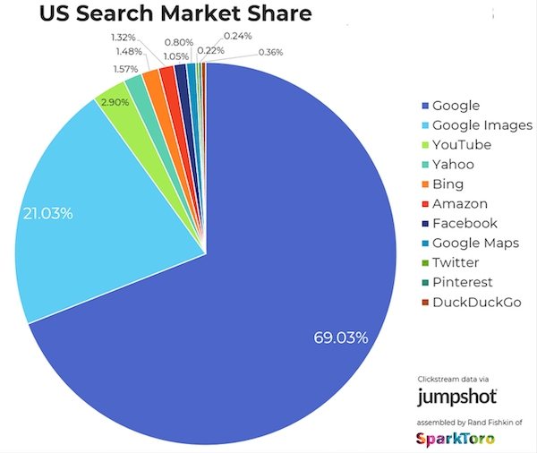

[Volver al Menú](../root.md)

# `SEO (Search Engine Optimization)`

# `What is SEO & why is it important?`

You’ve likely heard of SEO, and if you haven’t already, you could obtain a quick Wikipedia definition of the term, but understanding that SEO is “the process of affecting the visibility of a website or a web page in a search engine’s unpaid results” doesn’t really help you answer important questions for your business and your website, such as:

- How do you, for your site or your company’s site, “optimize” for search engines?
- How do you increase your site’s organic search visibility, so it’s easy for your content to be found?
- How do you know how much time to spend on SEO?
- How can you differentiate “good” SEO advice from “bad” or harmful SEO advice?

# `Why should you care about SEO?`

Lots and lots of people search for things. That traffic can be extremely powerful for a business not only because there is a lot of traffic, but because there is a lot of very specific, high-intent traffic.

If you sell blue widgets, would you rather buy a billboard so anyone with a car in your area sees your ad (whether they will ever have any interest in blue widgets or not), or show up every time anyone in the world types “buy blue widgets” into a search engine? Probably the latter, because those people have commercial intent, meaning they are standing up and saying that they want to buy something you offer.

# `What actually works for driving traffic from search engines?`

First it’s important to note that Google is responsible for most of the search engine traffic in the world (though there is always some flux in the actual numbers). This may vary from niche to niche, but it’s likely that Google is the dominant player in the search results that your business or website would want to show up in, and the best practices outlined in this guide will help position your site and its content to rank in other search engines, as well.

# `Keyword research & keyword targeting best practices`

The first step in search engine optimization is really to determine what it is you’re actually optimizing for. This means identifying the terms people are searching for (also known as “keywords”) that you want your website to rank for in search engines like Google.

Unfortunately it’s not quite that simple. There are a few key factors to take into account when determining the keywords you want to target on your site:

- `Search Volume` – The first factor to consider is how many people (if any) are actually searching for a given keyword. The more people there are searching for a keyword, the bigger the audience you stand to reach. Conversely, if no one is searching for a keyword, there is no audience available to find your content through search.

- `Relevance` – If a term is frequently searched for that’s great: but what if it’s not completely relevant to your prospects? Relevance seems straightforward at first: if you’re selling enterprise email marketing automation software you don’t want to show up for searches that don’t have anything to do with your business, like “pet supplies.” But what about terms like “email marketing software”? This might intuitively seem like a great description of what you do, but if you’re selling to Fortune 100 companies, most of the traffic for this very competitive term will be searchers who don’t have any interest in buying your software (and the folks you do want to reach might never buy your expensive, complex solution based on a simple Google search). Conversely, you might think a tangential keyword like “best enterprise PPC marketing solutions” is totally irrelevant to your business since you don’t sell PPC marketing software. But if your prospect is a CMO or marketing director, getting in front of them with a helpful resource on evaluating pay-per-click tools could be a great “first touch” and an excellent way to start a relationship with a prospective buyer.

- `Competition` – As with any business opportunity, in SEO you want to consider the potential costs and likelihood of success. For SEO, this means understanding the relative competition (and likelihood to rank) for specific terms.

# `On-page optimization`

Once you have your keyword list, the next step is actually implementing your targeted keywords into your site’s content. Each page on your site should be targeting a core term, and a “basket” of related terms.

Let’s look at a few critical, basic on-page elements you’ll want to understand as you think about how to drive search engine traffic to your website:

`Title tags`

While Google is working to better understand the actual meaning of a page and de-emphasizing (and even punishing) aggressive and manipulative use of keywords, including the term (and related terms) that you want to rank for in your pages is still valuable. And the single most impactful place you can put your keyword is your page’s title tag.

`Meta descriptions`

While the title tag is effectively your search listing’s headline, the meta description (another meta HTML element that can be updated in your site’s code, but isn’t seen on your actual page) is effectively your site’s additional ad copy. Google takes some liberties with what they display in search results, so your meta description may not always show, but if you have a compelling description of your page that would make folks searching likely to click, you can greatly increase traffic. (Remember: showing up in search results is just the first step! You still need to get searchers to come to your site, and then actually take the action you want.)

`Body content`

The actual content of your page itself is, of course, very important. Different types of pages will have different “jobs” – your cornerstone content asset that you want lots of folks to link to needs to be very different than your support content that you want to make sure your users find and get an answer from quickly. That said, Google has been increasingly favoring certain types of content, and as you build out any of the pages on your site

`Alt attributes`

How you mark up your images can impact not only the way that search engines perceive your page, but also how much search traffic from image search your site generates. An alt attribute is an HTML element that allows you to provide alternative information for an image if a user can’t view it. Your images may break over time (files get deleted, users have difficulty connecting to your site, etc.) so having a useful description of the image can be helpful from an overall usability perspective. This also gives you another opportunity – outside of your content – to help search engines understand what your page is about.

`URL structure`

Your site’s URL structure can be important both from a tracking perspective (you can more easily segment data in reports using a segmented, logical URL structure), and a shareability standpoint (shorter, descriptive URLs are easier to copy and paste and tend to get mistakenly cut off less frequently). Again: don’t work to cram in as many keywords as possible; create a short, descriptive URL.

Moreover: if you don’t have to, don’t change your URLs. Even if your URLs aren’t “pretty,” if you don’t feel as though they’re negatively impacting users and your business in general, don’t change them to be more keyword focused for “better SEO.” If you do have to change your URL structure, make sure to use the proper (301 permanent) type of redirect. This is a common mistake businesses make when they redesign their websites.

`Schema & markup`

Finally, once you have all of the standard on-page elements taken care of, you can consider going a step further and better helping Google (and other search engines, which also recognize schema) to understand your page.

Schema markup does not make your page show up higher in search results (it’s not a ranking factor, currently). It does give your listing some additional “real estate” in the search results, the way ad extensions do for your Google Ads (formerly known as AdWords) ads.

# `Common technical SEO issues & best practices`

While basics of SEO like the most efficient ways to build links to drive search engine rankings have changed in recent years (and content marketing has become increasingly important) what many people would think of as more “traditional SEO” is still incredibly valuable in generating traffic from search engines. As we’ve already discussed, keyword research is still valuable, and technical SEO issues that keep Google and other search engines from understanding and ranking sites’ content are still prevalent.

Technical SEO for larger, more complicated sites is really its own discipline, but there are some common mistakes and issues that most sites face that even smaller to mid-sized businesses can benefit from being aware of.

`Page speed`

Search engines are placing an increasing emphasis on having fast-loading sites – the good news is this is not only beneficial for search engines, but also for your users and your site’s conversion rates. Google has actually created a useful tool here to give you some specific suggestions on what to change on your site to address page speed issues.

`Header response`

Header response codes are an important technical SEO issue. If you’re not particularly technical, this can be a complex topic (and again more thorough resources are listed below) but you want to make sure that working pages are returning the correct code to search engines (200), and that pages that are not found are also returning a code to represent that they are no longer present (a 404).

`Redirects`

Improperly implementing redirects on your site can have a serious impact on search results. Whenever you can avoid it, you want to keep from moving your site’s content from one URL to another; in other words: if your content is on example.com/page, and that page is getting search engine traffic, you want to avoid moving all of the content to example.com/different-url/newpage.html, unless there is an extremely strong business reason that would outweigh a possible short-term or even long-term loss in search engine traffic.

`Duplicate content`

Thin and duplicated content is another area of emphasis with Google’s recent Panda updates. By duplicating content (putting the same or near-identical content on multiple pages), you’re diluting link equity between two pages instead of concentrating it on one page, giving you less of a chance of ranking for competitive phrases with sites that are consolidating their link equity into a single document. Having large quantities of duplicated content makes your site look like it is cluttered with lower-quality (and possibly manipulative) content in the eyes of search engines.

`XML sitemap`

XML sitemaps can help Google and Bing understand your site and find all of its content. Just be sure not to include pages that aren’t useful, and know that submitting a page to a search engine in a sitemap doesn’t insure that the page will actually rank for anything. There are a number of free tools to generate XML sitemaps.

`Robots.txt, meta noindex, & meta nofollow`

Finally, you can indicate to search engines how you want them to handle certain content on your site (for instance if you’d like them not to crawl a specific section of your site) in a robots.txt file. This file likely already exists for your site at yoursite.com/robots.txt.

You want to make sure this file isn’t currently blocking anything you’d want a search engine to find from being added to their index, and you also can use the robots file to keep things like staging servers or swaths of thin or duplicate content that are valuable for internal use or customers from being indexed by search engines. You can use the meta noindex and meta nofollow tags for similar purposes, though each functions differently from one another.

`Security`

Site security is key for technical SEO. In addition to keeping your site maintained in terms of plugins and comment spam, you’ll also want to make sure your site is served over https, rather than just http. To do this, you need an SSL certificate. There are a number of ways to get one, such as through HubSpot’s SSL certificate.

`How to track & measure SEO results`

So once you start writing your awesome SEO content and putting all of these steps into motion, how do you actually track how well it’s working?

On its face this question has a fairly straightforward answer, with some key SEO metrics to focus on, but with each metric there are some key factors to consider as you measure your site’s SEO performance.

`Keyword rankings`

Looking at where your site ranks for a list of keywords certainly isn’t a final destination – you can’t pay your staff in rankings, things like personalization in search results have made them variable across different locations, and therefore hard to track, and of course all they indicate is where you show up in search results. Some would even go so far as to declare them dead. But getting a rough idea of where your site ranks for core terms can be a useful leading indicator of your site’s health. High rankings across a range of keywords is a strong indicator of organic search visibility.

`Organic traffic`

Organic traffic is a much better leading indicator of the health of your SEO efforts. By looking at the organic traffic to your site, you can get a gauge for the actual volume of visitors coming to your site, and where they’re going.

You can measure your organic traffic easily with most analytics tools – since it’s free and the most-used, we’ll look at how to get this information in Google Analytics.

`Organic leads & sales`

Obviously the primary way to measure your search engine optimization results should be actual leads, sales, revenue and profit. Like with any business activity you need to answer: how does the activity help to move your bottom line?

The simplest path here is to set up goals or e-commerce tracking in a tool like Google Analytics. You can use the above report to look at organic traffic and goals (or different e-commerce metrics) by landing page, which means that you are specifically looking at who converts among the people who are landing on your site from an organic search (versus people who may have come to your site from PPC or another channel within the window that your analytics tracking can track, then searched for you, then converted).

# `Additional SEO considerations`

For many businesses, getting the technical aspects of SEO right, understanding the keywords you want to target, and having a keyword strategy for getting your site’s pages linked to and shared is really all you need to know about SEO. There are, however, some specific cases and business types that need to be concerned with specific types of search. A few types of search environments that require unique approaches include:

- `International SEO` – There are a number of benefits and trade-offs to different approaches to ranking sites in different countries and in different languages. Aleyda Solis has an outstanding guide to international SEO best practices if you’re trying to reach customers in a variety of international markets, and Google also offers some recommendations and best practices in their own guide.

- `Local SEO` – For small businesses and franchisees, getting local rankings for different variations of {your location} + {your service} (e.g. “Boston pizza shops”) is really the most valuable organic search traffic available. While getting links and shares, doing keyword research, and ensuring your site doesn’t have technical issues helps with localized rankings, there is a separate set of ranking factors local businesses should be aware of. Matthew Barby has an excellent guide on the topic.

- `App Store Search Engines` – If you have an app – either as the core product offering for your company, or as a means for enabling mobile users to be able to interact with your business – having your app show up in searches on various app stores can be extremely valuable. Justin Briggs and Stephanie Beadell have written multiple outstanding posts on the topic.

[MORE INFO](https://www.wordstream.com/blog/ws/2015/04/30/seo-basics)

[TOP](#seo-search-engine-optimization)
