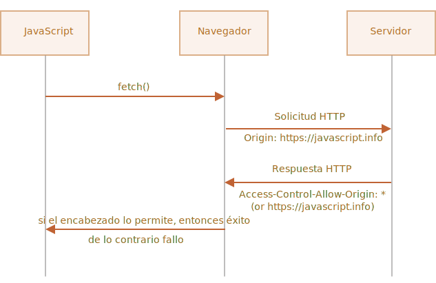

[Volver al Menú](../root.md)

# `Working with APIs`

# `Fetch`

JavaScript puede enviar peticiones de red al servidor y cargar nueva información siempre que se necesite.

Por ejemplo, podemos utilizar una petición de red para:

- Crear una orden,

- Cargar información de usuario,

- Recibir las últimas actualizaciones desde un servidor,

- …etc.

…Y todo esto sin la necesidad de refrescar la página.

Se utiliza el término global “AJAX” (abreviado Asynchronous JavaScript And XML, en español: “JavaScript y XML Asincrónico”) para referirse a las peticiones de red originadas desde JavaScript. Sin embargo, no estamos necesariamente condicionados a utilizar XML dado que el término es antiguo y es por esto que el acrónimo XML se encuentra aquí. Probablemente lo hayáis visto anteriormente.

Existen múltiples maneras de enviar peticiones de red y obtener información de un servidor.

Comenzaremos con el el método fetch() que es moderno y versátil. Este método no es soportado por navegadores antiguos (sin embargo se puede incluir un polyfill), pero es perfectamente soportado por los navegadores actuales y modernos.

La sintaxis básica es la siguiente:

`let promise = fetch(url, [options])`

- `url` – representa la dirección URL a la que deseamos acceder.

- `options` – representa los parámetros opcionales, como puede ser un método o los encabezados de nuestra petición, etc.

Si no especificamos ningún `options`, se ejecutará una simple petición GET, la cual descargará el contenido de lo especificado en el `url`.

El navegador lanzará la petición de inmediato y devolverá una promesa (promise) que luego será utilizada por el código invocado para obtener el resultado.

Por lo general, obtener una respuesta es un proceso de dos pasos.

`Primero, la promesa promise, devuelta por fetch, resuelve la respuesta con un objeto de la clase incorporada Response tan pronto como el servidor responde con los encabezados de la petición.`

En este paso, podemos chequear el status HTTP para poder ver si nuestra petición ha sido exitosa o no, y chequear los encabezados, pero aún no disponemos del cuerpo de la misma.

La promesa es rechazada si el `fetch` no ha podido establecer la petición HTTP, por ejemplo, por problemas de red o si el sitio especificado en la petición no existe. `Estados HTTP anormales, como el 404 o 500 no generan errores.`

Podemos visualizar los estados HTTP en las propiedades de la respuesta:

- `status` – código de estado HTTP, por ejemplo: 200.

- `ok` – booleana, true si el código de estado HTTP es 200 a 299.

Ejemplo:

```
let response = await fetch(url);

if (response.ok) { // si el HTTP-status es 200-299
  // obtener cuerpo de la respuesta (método debajo)
  let json = await response.json();
} else {
  alert("Error-HTTP: " + response.status);
}
```

`Segundo, para obtener el cuerpo de la respuesta, necesitamos utilizar un método adicional.`

`Response` provee múltiples métodos basados en promesas para acceder al cuerpo de la respuesta en distintos formatos:

- `response.text()` – lee y devuelve la respuesta en formato texto,

- `response.json()` – convierte la respuesta como un JSON,

- `response.formData()` – devuelve la respuesta como un objeto FormData,

- `response.blob()` – devuelve la respuesta como Blob (datos binarios tipados),

- `response.arrayBuffer()` – devuelve la respuesta como un objeto ArrayBuffer (representación binaria de datos de bajo nivel),

- Adicionalmente, `response.body `es un objeto ReadableStream, el cual nos permite acceder al cuerpo como si fuera un stream y leerlo por partes.

Por ejemplo, si obtenemos un objeto de tipo JSON con los últimos commits de GitHub:

```
let url = 'https://api.github.com/repos/javascript-tutorial/en.javascript.info/commits';
let response = await fetch(url);

let commits = await response.json(); // leer respuesta del cuerpo y devolver como JSON

alert(commits[0].author.login);
```

O también usando promesas, en lugar de await:

```
fetch('https://api.github.com/repos/javascript-tutorial/en.javascript.info/commits')
.then(response => response.json())
.then(commits => alert(commits[0].author.login));
```

<h2 style="color: red">Importante</h2>

Podemos elegir un solo método de lectura para el cuerpo de la respuesta.

Si ya obtuvimos la respuesta con response.text(), entonces response.json() no funcionará, dado que el contenido del cuerpo ya ha sido procesado.

```
let text = await response.text(); // cuerpo de respuesta obtenido y procesado
let parsed = await response.json(); // fallo (ya fue procesado)
```

## `Encabezados de respuesta`

Los encabezados de respuesta están disponibles como un objeto de tipo Map dentro del `response.headers`.

No es exactamente un Map, pero posee métodos similares para obtener de manera individual encabezados por nombre o si quisiéramos recorrerlos como un objeto:

```
let response = await fetch('https://api.github.com/repos/javascript-tutorial/en.javascript.info/commits');

// obtenemos un encabezado
alert(response.headers.get('Content-Type')); // application/json; charset=utf-8

// iteramos todos los encabezados
for (let [key, value] of response.headers) {
  alert(`${key} = ${value}`);
}
```

## `Encabezados de petición`

Para especificar un encabezado en nuestro fetch, podemos utilizar la opción headers. La misma posee un objeto con los encabezados salientes, como se muestra en el siguiente ejemplo:

```
let response = fetch(protectedUrl, {
  headers: {
    Authentication: 'secret'
  }
});
```

…Pero existe una lista de encabezados que no pueden ser especificados:

- `Accept-Charset, Accept-Encoding`

- `Access-Control-Request-Headers`

- `Access-Control-Request-Method`

- `Connection`

- `Content-Length`

- `Cookie, Cookie2`

- `Date`

- `DNT`

- `Expect`

- `Host`

- `Keep-Alive`

- `Origin`

- `Referer`

- `TE`

- `Trailer`

- `Transfer-Encoding`

- `Upgrade`

- `Via`

- `Proxy-\_`

- `Sec-\_`

Estos encabezados nos aseguran que nuestras peticiones HTTP sean controladas exclusivamente por el navegador, de manera correcta y segura.

## `Peticiones POST`

Para ejecutar una petición `POST`, o cualquier otro método, utilizaremos las opciones de `fetch`:

- `method` – método HTTP, por ej: `POST`,

- `body` – cuerpo de la respuesta, cualquiera de las siguientes:

  - cadena de texto (ej. JSON-encoded),
  - Objeto FormData, para enviar información como multipart/form-data,
  - Blob/BufferSource para enviar información en formato binario,
  - URLSearchParams, para enviar información en cifrado x-www-form-urlencoded (no utilizado frecuentemente).
  - El formato JSON es el más utilizado.

Por ejemplo, el código debajo envía la información user como un objeto JSON:

```
let user = {
  nombre: 'Juan',
  apellido: 'Perez'
};

let response = await fetch('/article/fetch/post/user', {
  method: 'POST',
  headers: {
    'Content-Type': 'application/json;charset=utf-8'
  },
  body: JSON.stringify(user)
});

let result = await response.json();
alert(result.message);
```

Tener en cuenta, si la respuesta del `body` es una cadena de texto, entonces el encabezado `Content-Type` será especificado como `text/plain;charset=UTF-8` por defecto.

Pero, cómo vamos a enviar un objeto JSON, en su lugar utilizaremos la opción `headers` especificada a `application/json`, que es la opción correcta `Content-Type` para información en formato JSON.

## `Enviando una imagen`

También es posible enviar datos binarios con `fetch`, utilizando los objetos `Blob` o `BufferSource`.

En el siguiente ejemplo, utilizaremos un `<canvas>` donde podremos dibujar utilizando nuestro ratón. Haciendo click en el botón “enviar” enviará la imagen al servidor:

```
<body style="margin:0">
  <canvas id="canvasElem" width="100" height="80" style="border:1px solid"></canvas>

  <input type="button" value="Enviar" onclick="submit()">

  <script>
    canvasElem.onmousemove = function(e) {
      let ctx = canvasElem.getContext('2d');
      ctx.lineTo(e.clientX, e.clientY);
      ctx.stroke();
    };

    async function submit() {
      let blob = await new Promise(resolve => canvasElem.toBlob(resolve, 'image/png'));
      let response = await fetch('/article/fetch/post/image', {
        method: 'POST',
        body: blob
      });

      // el servidor responde con una confirmación y el tamaño de nuestra imagen
      let result = await response.json();
      alert(result.message);
    }

  </script>
</body>
```

Una aclaración, aquí no especificamos el `Content-Type` de manera manual, precisamente porque el objeto `Blob` posee un tipo incorporado (en este caso image/png, el cual es generado por la función toBlob). Para objetos Blob ese es el valor por defecto del encabezado `Content-Type`.

Podemos reescribir la función submit() sin utilizar `async/await` de la siguiente manera:

```
function submit() {
  canvasElem.toBlob(function(blob) {
    fetch('/article/fetch/post/image', {
      method: 'POST',
      body: blob
    })
      .then(response => response.json())
      .then(result => alert(JSON.stringify(result, null, 2)))
  }, 'image/png');
}
```

[Mas Informacion](https://developer.mozilla.org/en-US/docs/Web/API/Fetch_API/Using_Fetch)

<h2 style="color: green">Resumen</h2>

Una petición fetch típica está formada por dos llamadas await:

```
let response = await fetch(url, options); // resuelve con los encabezados de respuesta
let result = await response.json(); // accede al cuerpo de respuesta como json
```

También se puede acceder sin utilizar await:

```
fetch(url, options)
  .then(response => response.json())
  .then(result => /* procesa resultado */)
```

Propiedades de respuesta:

- `response.status` – Código HTTP de la respuesta.

- `response.ok` – Devuelve true si el código HTTP es 200-299.

- `response.headers` – Objeto simil-Map que contiene los encabezados HTTP.

Métodos para obtener el cuerpo de la respuesta:

- `response.text()` – lee y devuelve la respuesta en formato texto,

- `response.json()` – convierte la respuesta como un JSON,

- `response.formData()` – devuelve la respuesta como un objeto FormData (codificación multipart/form-data, explicado en el siguiente capítulo),

- `response.blob()` – devuelve la respuesta como Blob (datos binarios tipados),

- `response.arrayBuffer()` – devuelve la respuesta como un objeto ArrayBuffer (datos binarios de bajo nivel)

Opciones de fetch hasta el momento:

- `method` – método HTTP,

- `headers` – un objeto los encabezados de la petición (no todos los encabezados están permitidos),

- `body` – los datos/información a enviar (cuerpo de la petición) como string, FormData, BufferSource, Blob u objeto UrlSearchParams.

# `FormData`

Este capítulo trata sobre el envío de formularios HTML: con o sin archivos, con campos adicionales y cosas similares.

Los objetos FormData pueden ser de ayuda en esta tarea. Tal como habrás supuesto, éste es el objeto encargado de representar los datos de los formularios HTML.

El constructor es:

`let formData = new FormData([form]);`

Si se le brinda un elemento HTML `form`, el objeto automáticamente capturará sus campos.

Lo que hace especial al objeto `FormData` es que los métodos de red, tales como `fetch`, pueden aceptar un objeto `FormData` como el cuerpo. Es codificado y enviado como `Content-Type: multipart/form-data`.

Desde el punto de vista del servidor, se ve como una entrega normal.

## `Enviando un formulario simple`

Enviemos un formulario simple.

Tal como se puede ver, es prácticamente una línea:

```
<form id="formElem">
  <input type="text" name="name" value="John">
  <input type="text" name="surname" value="Smith">
  <input type="submit">
</form>

<script>
  formElem.onsubmit = async (e) => {
    e.preventDefault();

    let response = await fetch('/article/formdata/post/user', {
      method: 'POST',
      body: new FormData(formElem)
    });

    let result = await response.json();

    alert(result.message);
  };
</script>
```

## `Enviando un formulario con datos Blob`

Tal como pudimos ver en el capítulo Fetch, es fácil enviar datos binarios generados dinámicamente (por ejemplo una imagen) como `Blob`. Podemos proporcionarlos directamente en un `fetch` con el parámetro `body`.

De todos modos, en la práctica suele ser conveniente enviar la imagen como parte del formulario junto a otra metadata tal como el nombre y no de forma separada.

Además los servidores suelen ser más propensos a aceptar formularios multipart, en lugar de datos binarios sin procesar.

Este ejemplo envía una imagen desde un `<canvas>` junto con algunos campos más, como un formulario utilizando FormData:

```
<body style="margin:0">
  <canvas id="canvasElem" width="100" height="80" style="border:1px solid"></canvas>

  <input type="button" value="Submit" onclick="submit()">

  <script>
    canvasElem.onmousemove = function(e) {
      let ctx = canvasElem.getContext('2d');
      ctx.lineTo(e.clientX, e.clientY);
      ctx.stroke();
    };

    async function submit() {
      let imageBlob = await new Promise(resolve => canvasElem.toBlob(resolve, 'image/png'));

      let formData = new FormData();
      formData.append("firstName", "John");
      formData.append("image", imageBlob, "image.png");

      let response = await fetch('/article/formdata/post/image-form', {
        method: 'POST',
        body: formData
      });
      let result = await response.json();
      alert(result.message);
    }

  </script>
</body>
```

<h2 style="color: green">Resumen</h2>

Los objetos `FormData` son utilizados para capturar un formulario HTML y enviarlo utilizando `fetch` u otro método de red.

Podemos crear el objeto con `new FormData(form)` desde un formulario HTML, o crear un objeto sin un formulario en absoluto y agregar los campos con los siguientes métodos:

- formData.append(nombre, valor)

- formData.append(nombre, blob, nombreDeArchivo)

- formData.set(nombre, valor)

- formData.set(nombre, blob, nombreDeArchivo)

Nótese aquí dos particularidades:

- El método `set` remueve campos con el mismo nombre, mientras que `append` no. Esta es la única diferencia entre estos dos métodos.

- Para enviar un archivo, se requiere de tres argumentos, el último argumento es el nombre del archivo, el cual normalmente es tomado desde el sistema de archivos del usuario por el `<input type="file">`.

Otros métodos son:

- formData.delete(nombre)

- formData.get(nombre)

- formData.has(nombre)

# `Fetch: Progreso de la descarga`

El método `fetch` permite rastrear el progreso de descarga.

Ten en cuenta: actualmente no hay forma de que `fetch` rastree el progreso de carga. Para ese propósito, utiliza `XMLHttpRequest`.

Para rastrear el progreso de la descarga, podemos usar la propiedad `response.body`. Esta propiedad es un `ReadableStream`, un objeto especial que proporciona la transmisión del cuerpo fragmento a fragmento tal como viene.

A diferencia de `response.text()`, `response.json()` y otros métodos, `response.body` da control total sobre el proceso de lectura, y podemos contar cuánto se consume en cualquier momento.

Aquí está el bosquejo del código que lee la respuesta de `response.body`:

```
// en lugar de response.json() y otros métodos
const reader = response.body.getReader();

// bucle infinito mientras el cuerpo se descarga
while(true) {
// done es true para el último fragmento
// value es Uint8Array de los bytes del fragmento
const {done, value} = await reader.read();

if (done) {
break;
}

console.log(`Recibí ${value.length} bytes`)
}
```

El resultado de la llamada await `reader.read()` es un objeto con dos propiedades:

- `done` – true cuando la lectura está completa, de lo contrario `false`.

- `value` – una matriz de tipo bytes: `Uint8Array`.

Recibimos fragmentos de respuesta en el bucle, hasta que finaliza la carga, es decir: hasta que `done` se convierte en `true`.

Para registrar el progreso, solo necesitamos que cada `value` de fragmento recibido agregue su longitud al contador.

Aquí está el ejemplo funcional completo que obtiene la respuesta y registra el progreso en la consola, seguido de su explicación:

```
// Paso 1: iniciar la búsqueda y obtener un lector
let response = await fetch('https://api.github.com/repos/javascript-tutorial/es.javascript.info/commits?per_page=100');

const reader = response.body.getReader();

// Paso 2: obtener la longitud total
const contentLength = +response.headers.get('Content-Length');

// Paso 3: leer los datos
let receivedLength = 0; // cantidad de bytes recibidos hasta el momento
let chunks = []; // matriz de fragmentos binarios recibidos (comprende el cuerpo)
while(true) {
  const {done, value} = await reader.read();

  if (done) {
    break;
  }

  chunks.push(value);
  receivedLength += value.length;

  console.log(`Recibí ${receivedLength} de ${contentLength}`)
}

// Paso 4: concatenar fragmentos en un solo Uint8Array
let chunksAll = new Uint8Array(receivedLength); // (4.1)
let position = 0;
for(let chunk of chunks) {
  chunksAll.set(chunk, position); // (4.2)
  position += chunk.length;
}

// Paso 5: decodificar en un string
let result = new TextDecoder("utf-8").decode(chunksAll);

// ¡Hemos terminado!
let commits = JSON.parse(result);
alert(commits[0].author.login);
```

Expliquemos esto paso a paso:

- Realizamos `fetch` como de costumbre, pero en lugar de llamar a `response.json()`, obtenemos un lector de transmisión `response.body.getReader()`.

Ten en cuenta que no podemos usar ambos métodos para leer la misma respuesta: usa un lector o un método de respuesta para obtener el resultado.

- Antes de leer, podemos averiguar la longitud completa de la respuesta del encabezado `Content-Length`.

Puede estar ausente para solicitudes cross-origin (consulta el capítulo `Fetch`: Cross-Origin Requests) y, bueno, técnicamente un servidor no tiene que configurarlo. Pero generalmente está en su lugar.

- Llama a `await reader.read()` hasta que esté listo.

Recopilamos fragmentos de respuesta en la matriz `chunks`. Eso es importante, porque después de consumir la respuesta, no podremos “releerla” usando `response.json()` u otra forma (puedes intentarlo, habrá un error).

- Al final, tenemos `chunks` – una matriz de fragmentos de bytes Uint8Array. Necesitamos unirlos en un solo resultado. Desafortunadamente, no hay un método simple que los concatene, por lo que hay un código para hacerlo:

Creamos `chunksAll = new Uint8Array(selectedLength)` – una matriz del mismo tipo con la longitud combinada.
Luego usa el método .set(chunk, position) para copiar cada chunk uno tras otro en él.

- Tenemos el resultado en `chunksAll`. Sin embargo, es una matriz de bytes, no un string.

Para crear un string, necesitamos interpretar estos bytes. El TextDecoder nativo hace exactamente eso. Luego podemos usar el resultado en JSON.parse, si es necesario.

¿Qué pasa si necesitamos contenido binario en lugar de un string? Eso es aún más sencillo. Reemplaza los pasos 4 y 5 con una sola línea que crea un Blob de todos los fragmentos:

`let blob = new Blob(chunks);`

Al final tenemos el resultado (como un string o un blob, lo que sea conveniente) y el seguimiento del progreso en el proceso.

Una vez más, ten en cuenta que eso no es para el progreso de carga (hasta ahora eso no es posible con `fetch`), solo para el progreso de descarga.

Además, si el tamaño es desconocido, deberíamos chequear `receivedLength` en el bucle y cortarlo en cuanto alcance cierto límite, así los `chunks` no agotarán la memoria.

# `Fetch: Abort`

Como sabemos `fetch` devuelve una promesa. Y generalmente JavaScript no tiene un concepto de “abortar” una promesa. Entonces, ¿cómo podemos abortar una llamada al método `fetch`? Por ejemplo si las acciones del usuario en nuestro sitio indican que `fetch` no se necesitará más.

Existe para esto de forma nativa un objeto especial: `AbortController`. Puede ser utilizado para abortar no solo `fetch` sino otras tareas asincrónicas también.

Su uso es muy sencillo:

## `El objeto AbortController`

Crear un controlador:

```
let controller = new AbortController();
```

Este controlador es un objeto extremadamente simple.

- Tiene un único método abort(),

- y una única propiedad signal que permite establecerle escuchadores de eventos.

Cuando abort() es invocado:

- controller.signal emite el evento "abort".

- La propiedad controller.signal.aborted toma el valor true.

Generalmente tenemos dos partes en el proceso:

- El que ejecuta la operación de cancelación, genera un listener que escucha a controller.signal.

- El que cancela: este llama a controller.abort() cuando es necesario.

Tal como se muestra a continuación (por ahora sin fetch):

```
let controller = new AbortController();
let signal = controller.signal;

// La parte que ejecuta la operación de cancelación
// obtiene el objeto "signal"
// y genera un listener que se dispara cuando es llamado controller.abort()
signal.addEventListener('abort', () => alert("abort!"));

// El que cancela (más tarde en cualquier punto):
controller.abort(); // abort!

// El  evento se dispara y signal.aborted se vuelve true
alert(signal.aborted); // true
```

Como podemos ver, `AbortController` es simplemente la via para pasar eventos `abort` cuando `abort()` es llamado sobre él.

Podríamos implementar alguna clase de escucha de evento en nuestro código por nuestra cuenta, sin el objeto `AbortController` en absoluto.

Pero lo valioso es que fetch sabe cómo trabajar con el objeto `AbortController`, está integrado con él.

## `Uso con fetch`

Para posibilitar la cancelación de fetch, pasa la propiedad signal de un `AbortController` como una opción de fetch:

```
let controller = new AbortController();
fetch(url, {
  signal: controller.signal
});
```

El método fetch conoce cómo trabajar con `AbortController`. Este escuchará eventos abort sobre signal.

Ahora, para abortar, llamamos c`ontroller.abort()`:

`controller.abort();`

Terminamos: `fetch` obtiene el evento desde signal y aborta el requerimiento.

Cuando un `fetch` es abortado, su promesa es rechazada con un error AbortError, así podemos manejarlo, por ejemplo en `try..catch`.

Aquí hay un ejemplo completo con `fetch` abortado después de 1 segundo:

```
// Se abortara en un segundo
let controller = new AbortController();
setTimeout(() => controller.abort(), 1000);

try {
  let response = await fetch('/article/fetch-abort/demo/hang', {
    signal: controller.signal
  });
} catch(err) {
  if (err.name == 'AbortError') { // se maneja el abort()
    alert("Aborted!");
  } else {
    throw err;
  }
}
```

## `AbortController es escalable`

`AbortController` es escalable, permite cancelar múltiples fetch de una vez.

Aquí hay un bosquejo de código que de muchos fetch de url en paralelo, y usa un simple controlador para abortarlos a todos:

```
let urls = [...]; // una lista de urls para utilizar fetch en paralelo

let controller = new AbortController();

// un array de promesas fetch
let fetchJobs = urls.map(url => fetch(url, {
  signal: controller.signal
}));

let results = await Promise.all(fetchJobs);

// si controller.abort() es llamado,
// se abortaran todas las solicitudes fetch
```

En el caso de tener nuestras propias tareas asincrónicas aparte de `fetch`, podemos utilizar un único `AbortController` para detenerlas junto con `fetch`.

Solo es necesario escuchar el evento `abort` en nuestras tareas:

```
let urls = [...];
let controller = new AbortController();

let ourJob = new Promise((resolve, reject) => { // nuestra tarea
  ...
  controller.signal.addEventListener('abort', reject);
});

let fetchJobs = urls.map(url => fetch(url, { // varios fetch
  signal: controller.signal
}));

// Se espera por la finalización de los fetch y nuestra tarea
let results = await Promise.all([...fetchJobs, ourJob]);

// en caso de que se llame al método controller.abort() desde algún sitio,
// se abortan todos los fetch y nuestra tarea.
```

<h2 style="color: green">Resumen</h2>

- `AbortController` es un simple objeto que genera un evento abort sobre su propiedad `signal` cuando el método `abort()` es llamado (y también establece `signal`.aborted en true).

- `fetch` está integrado con él: pasamos la propiedad `signal` como opción, y entonces `fetch` la escucha, así se vuelve posible abortar `fetch`.

- Podemos usar `AbortController` en nuestro código. La interacción "llamar `abort()`" → "escuchar evento abort" es simple y universal. Podemos usarla incluso sin `fetch`.

# `Fetch: Cross-Origin Requests`

# `XMLHttpRequest`

Si enviamos una petición `fetch` hacia otro sitio seguramente fallará.

Por ejemplo, probemos una petición a `https://example.com`:

```
try {
  await fetch('https://example.com');
} catch(err) {
  alert(err); // Failed to fetch
}
```

El método `fetch` falla, tal como lo esperábamos.

El concepto clave aquí es el origen (`origin`), triple combinación de dominio/puerto/protocolo.

Las solicitudes de origen cruzado `Cross-origin` requests (aquellas que son enviadas hacia otro dominio --incluso subdominio–, protocolo o puerto), requieren de unas cabeceras especiales desde el sitio remoto.

Esta política es denominada `“CORS”`, por sus siglas en inglés `Cross-Origin` Resource Sharing.

## `¿Por que CORS es necesario?, Una breve historia`

CORS existe para proteger Internet de los hackers malvados.

En verdad… Déjame contarte un breve resumen de esta historia.

Durante muchos años un script de un sitio no podía acceder al contenido de otro sitio.

Esta simple, pero poderosa regla, fue parte fundacional de la seguridad de Internet. Por ejemplo, un script malicioso desde el sitio hacker.com no podía acceder a la casilla de correo en el sitio gmail.com. La gente se podía sentir segura.

Así mismo en ese momento, JavaScript no tenía ningún método especial para realizar solicitudes de red. Simplemente era un lenguaje juguete para decorar páginas web.

Pero los desarrolladores web demandaron más poder. Una variedad de trucos fueron inventados para poder pasar por alto las limitaciones, y realizar solicitudes a otros sitios.

[Mas informacion](https://es.javascript.info/fetch-crossorigin#por-que-cors-es-necesario-una-breve-historia)

## `Solicitudes seguras`

Existen dos tipos de solicitudes de origen cruzado:

- Solicitudes seguras.

- Todas las demás.

Las solicitudes seguras son más fáciles de hacer, comencemos con ellas.

Una solicitud es segura si cumple dos condiciones:

- método seguro: GET, POST o HEAD

- Cabeceras seguras – Las únicas cabeceras permitidas son:

- - Accept,

- - Accept-Language,

- - Content-Language,

- - Content-Type con el valor `application/x-www-form-urlencoded`, `multipart/form-data` o `text/plain`.
    Cualquier otra solicitud es considerada “insegura”. Por lo tanto, una solicitud con el método `PUT` o con una cabecera HTTP` API-Key` no cumple con las limitaciones.

La diferencia esencial es que una solicitud segura puede ser realizada mediante un `<form>` o un `<script>`, sin la necesidad de utilizar un método especial.

Por lo tanto, incluso un servidor obsoleto debería ser capaz de aceptar una solicitud segura.

Contrario a esto, las solicitudes con cabeceras no estándar o métodos como el `DELETE` no pueden ser creados de este modo. Durante mucho tiempo no fue posible para JavaScript realizar este tipo de solicitudes. Por lo que un viejo servidor podía asumir que ese tipo de solicitudes provenía desde una fuente privilegiada, “ya que una página web es incapaz de enviarlas”.

Cuando intentamos realizar una solicitud insegura, el navegador envía una solicitud especial de “pre-vuelo” consultando al servidor: ¿está de acuerdo en aceptar tal solicitud de origen cruzado o no?

Y, salvo que el servidor lo confirme de forma explícita, cualquier solicitud insegura no es enviada.

Vayamos ahora a los detalles.

## `CORS para solicitudes seguras`

Si una solicitud es de origen cruzado, el navegador siempre le agregará una cabecera Origin.

Por ejemplo, si realizamos una solicitud de `https://anywhere.com/reques`t a `https://javascript.info/page`, las cabeceras podrían ser algo así:

```
GET /request
Host: anywhere.com
Origin: https://javascript.info
...
```

Tal como se puede ver, la cabecera `Origin` contiene exactamente el origen (protocolo/dominio/puerto), sin el path.

El servidor puede inspeccionar el origen `Origin` y, si esta de acuerdo en aceptar ese tipo de solicitudes, agrega una cabecera especial `Access-Control-Allow-Origin` a la respuesta. Esta cabecera debe contener el origen permitido (en nuestro caso `https://javascript.info`), o un asterisco \*. En ese caso la respuesta es satisfactoria, de otro modo falla.

El navegador cumple el papel de mediador de confianza:

1. Ante una solicitud de origen cruzado, se asegura de que se envíe el origen correcto.

2. Chequea que la respuesta contenga la cabecera `Access-Control-Allow-Origin`, de ser así JavaScript tiene permitido acceder a la respuesta, de no ser así la solicitud falla con un error.



Aquí tenemos un ejemplo de una respuesta permisiva desde el servidor:

```
200 OK
Content-Type:text/html; charset=UTF-8
Access-Control-Allow-Origin: https://javascript.info
```

## `Cabeceras de respuesta`

Para las respuestas de origen cruzado, por defecto JavaScript sólo puede acceder a las cabeceras llamadas “seguras”:

- Cache-Control

- Content-Language

- Content-Length

- Content-Type

- Expires

- Last-Modified

- Pragma

El acceso a otro tipo de cabeceras de la respuesta generará un error.

Para permitir a JavaScript acceso a cualquier otra cabecera de respuesta, el servidor debe incluir la cabecera `Access-Control-Expose-Headers`. Este campo contiene una lista separada por comas de las cabeceras inseguras que podrán ser accesibles.

Por ejemplo:

```
200 OK
Content-Type:text/html; charset=UTF-8
Content-Length: 12345
Content-Encoding: gzip
API-Key: 2c9de507f2c54aa1
Access-Control-Allow-Origin: https://javascript.info
Access-Control-Expose-Headers: Content-Encoding,API-Key
```

Con tal cabecera, Access-Control-Expose-Headers, el script tendrá permitido acceder a los valores de las cabeceras `Content-Encoding` y `API-Key` de la respuesta.

## `Solicitudes “inseguras”`

[Mas informacion](https://es.javascript.info/fetch-crossorigin#solicitudes-inseguras)

## `Credenciales`

Una solicitud de origen cruzado realizada por código JavaScript, por defecto no provee ningún tipo de credenciales (cookies o autenticación HTTP).

Esto es poco común para solicitudes HTTP. Usualmente una solicitud a un sitio `http://site.com` es acompañada por todas las cookies de ese dominio. Pero una solicitud de origen cruzado realizada por métodos de JavaScript son una excepción.

Por ejemplo, `fetch('http://another.com')` no enviará ninguna cookie, ni siquiera (!) esas que pertenecen al dominio `another.com`.

¿Por qué?

El motivo de esto es que una solicitud con credenciales es mucho más poderosa que sin ellas. Si se permitiera, esto garantizaría a JavaScript el completo poder de actuar en representación del usuario y de acceder a información sensible utilizando sus credenciales.

¿En verdad el servidor confía lo suficiente en el script? En ese caso el servidor debera enviar explicitamente que permite solicitudes con credenciales mediante otra cabecera especial.

Para permitir el envío de credenciales en `fetch`, necesitamos agregar la opción `credentials: "include"`, de este modo:

```
fetch('http://another.com', {
credentials: "include"
});
```

Ahora `fetch` envía cookies originadas desde `another.com` con las solicitudes a ese sitio.

Si el servidor está de acuerdo en aceptar solicitudes con credenciales, debe agregar la cabecera `Access-Control-Allow-Credentials`: true a la respuesta, además de `Access-Control-Allow-Origin.`

Por ejemplo:

```
200 OK
Access-Control-Allow-Origin: https://javascript.info
Access-Control-Allow-Credentials: true
```

Cabe destacar que: `Access-Control-Allow-Origin` no se puede utilizar con un asterisco `*` para solicitudes con credenciales. Tal como se muestra a arriba debe proveer el origen exacto. Esto es una medida adicional de seguridad, para asegurar de que el servidor conozca exactamente en quién confiar para que le envíe este tipo de solicitudes.

<h2 style="color: green">Resumen</h2>

Desde el punto de vista del navegador, existen dos tipos de solicitudes de origen cruzado: solicitudes “seguras” y todas las demás.

Solicitudes seguras deben cumplir las siguientes condiciones:

- Método: GET, POST o HEAD.

- Cabeceras – solo podemos establecer:

- - `Accept`

- - `Accept-Language`

- - `Content-Language`

- - ` Content-Type` con el valor `application/x-www-form-urlencoded`, `multipart/form-data` o `text/plain`.

La diferencia esencial es que las solicitudes seguras eran posibles desde los viejos tiempos utilizando las etiquetas `<form>` o `<script>`, mientras que las solicitudes “inseguras” fueron imposibles para el navegador durante mucho tiempo.

Por lo tanto, en la práctica, la diferencia se encuentra en que las solicitudes seguras son realizadas de forma directa, utilizando la cabecera `Origin`, mientras que para las otras el navegador realiza una solicitud extra de “pre-vuelo” para requerir la autorización.

Para una solicitud segura:

- → El navegador envía una cabecera Origin con el origen.

- ← Para solicitudes sin credenciales (no enviadas por defecto), el servidor debe establecer:

- - Access-Control-Allow-Origin como \* o el mismo valor que en Origin.

- ← Para solicitudes con credenciales, el servidor deberá establecer:

- - Access-Control-Allow-Origin con el mismo valor que en Origin.

- - Access-Control-Allow-Credentials en true

Adicionalmente, para garantizar a JavaScript acceso a cualquier cabecera de la respuesta, con excepción de `Cache-Control`, `Content-Language`, `Content-Type`, `Expires`, `Last-Modified` o `Pragma`, el servidor debe agregarlas como permitidas en la lista de la cabecera `Access-Control-Expose-Headers`.

Para solicitudes inseguras, se utiliza una solicitud preliminar “pre-vuelo” antes de la solicitud principal:

- → El navegador envía una solicitud del tipo OPTIONS a la misma URL, con las cabeceras:

- - Access-Control-Request-Method con el método requerido.

- - Access-Control-Request-Headers listado de las cabeceras inseguras.

- ← El servidor debe responder con el código de estado 200 y las cabeceras:

- - Access-Control-Allow-Methods con la lista de todos los métodos permitidos,

- - Access-Control-Allow-Headers con una lista de cabeceras permitidas,

- - Access-Control-Max-Age con los segundos en los que se podrá almacenar la autorización en caché.

- Tras lo cual la solicitud es enviada, y se aplica el esquema previo “seguro”.

[TOP](#working-with-apis)
