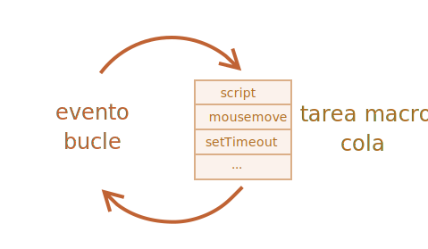

[Volver al Menú](../root.md)

# `Asynchronous JavaScript`

Asynchronous programming is a technique that enables your program to start a potentially long-running task and still be able to be responsive to other events while that task runs, rather than having to wait until that task has finished. Once that task has finished, your program is presented with the result.

`Planificación: setTimeout y setInterval`

Podemos decidir ejecutar una función no ahora, sino un determinado tiempo después. Eso se llama “planificar una llamada”.

Hay dos métodos para ello:

- setTimeout nos permite ejecutar una función una vez, pasado un intervalo de tiempo dado.

- setInterval nos permite ejecutar una función repetidamente, comenzando después del intervalo de tiempo, luego repitiéndose continuamente cada intervalo.
  Estos métodos no son parte de la especificación de JavaScript. Pero la mayoría de los entornos tienen el planificador interno y proporcionan estos métodos. En particular, son soportados por todos los navegadores y por Node.js.

# `setTimeout`

La sintaxis:

```
let timerId = setTimeout(func|código, [retraso], [arg1], [arg2], ...)
```

`Parámetros`

func|código

Una función o un string con código para ejecutar. Lo normal es que sea una función. Por razones históricas es posible pasar una cadena de código, pero no es recomendable.

`retraso`

El retraso o delay antes de la ejecución, en milisegundos `(1000 ms = 1 segundo)`, por defecto 0.
arg1, arg2…

Argumentos para la función (no compatible con IE9-)
Por ejemplo, este código llama a sayHi() después de un segundo:

```
function sayHi() {
  alert('Hola');
}

setTimeout(sayHi, 1000);
```

`Con argumentos:`

```
function sayHi(phrase, who) {
  alert( phrase + ', ' + who );
}

setTimeout(sayHi, 1000, "Hola", "John"); // Hola, John
```

## `Pasa una función, pero no la ejecuta`

Los principiantes a veces cometen un error al agregar paréntesis () después de la función:

```
// ¡mal!
setTimeout(sayHi(), 1000);
```

Eso no funciona, porque `setTimeout` espera una referencia a una función. Y aquí `sayHi()` ejecuta la función, y el resultado de su ejecución se pasa a `setTimeout`. En nuestro caso, el resultado de `sayHi()` es undefined (la función no devuelve nada), por lo que no habrá nada planificado.

## `Cancelando con clearTimeout`

Una llamada a setTimeout devuelve un “identificador de temporizador” timerId que podemos usar para cancelar la ejecución.

La sintaxis para cancelar:

```
let timerId = setTimeout(...);
clearTimeout(timerId);
```

En el siguiente código, planificamos la función y luego la cancelamos (cambiamos de opinión). Como resultado, no pasa nada:

```
let timerId = setTimeout(() => alert("no pasa nada"), 1000);
alert(timerId); // identificador del temporizador

clearTimeout(timerId);
alert(timerId); // mismo identificador (No se vuelve nulo después de cancelar)
```

Como podemos ver en la salida alert, en un navegador el identificador del temporizador es un número. En otros entornos, esto puede ser otra cosa. Por ejemplo, Node.js devuelve un objeto de temporizador con métodos adicionales.

De nuevo: no hay una especificación universal para estos métodos.

Para los navegadores, los temporizadores se describen en la sección timers del estándar HTML.

# `setInterval`

El método setInterval tiene la misma sintaxis que setTimeout:

```
let timerId = setInterval(func|código, [retraso], [arg1], [arg2], ...)
```

Todos los argumentos tienen el mismo significado. Pero a diferencia de setTimeout, ejecuta la función no solo una vez, sino regularmente después del intervalo de tiempo dado.

Para detener las llamadas, debemos llamar a ‘`clearInterval (timerId)`’.

El siguiente ejemplo mostrará el mensaje cada 2 segundos. Después de 5 segundos, la salida se detiene:

```
// repetir con el intervalo de 2 segundos
let timerId = setInterval(() => alert('tick'), 2000);

// después de 5 segundos parar
setTimeout(() => { clearInterval(timerId); alert('stop'); }, 5000);
```

<h2 style='color: red'>El tiempo pasa mientras se muestra ‘alerta’</h2>
En la mayoría de los navegadores, incluidos Chrome y Firefox, el temporizador interno continúa “marcando” mientras muestra “alert/confirm/prompt”.

Entonces, si ejecuta el código anterior y no descarta la ventana de ‘alerta’ por un tiempo, la próxima ‘alerta’ se mostrará de inmediato. El intervalo real entre alertas será más corto que 2 segundos.

# `setTimeout anidado`

Hay dos formas de ejecutar algo regularmente.

Uno es setInterval. El otro es un setTimeout anidado, como este:

```
/** en vez de:
let timerId = setInterval(() => alert('tick'), 2000);
*/

let timerId = setTimeout(function tick() {
  alert('tick');
  timerId = setTimeout(tick, 2000); // (*)
}, 2000);
```

El setTimeout anterior planifica la siguiente llamada justo al final de la actual (\*).

El setTimeout anidado es un método más flexible que setInterval. De esta manera, la próxima llamada se puede planificar de manera diferente, dependiendo de los resultados de la actual.

Ejemplo: necesitamos escribir un servicio que envíe una solicitud al servidor cada 5 segundos solicitando datos, pero en caso de que el servidor esté sobrecargado, deber aumentar el intervalo a 10, 20, 40 segundos…

# `Retraso cero en setTimeout`

Hay un caso de uso especial: setTimeout (func, 0), o simplemente setTimeout (func).

Esto planifica la ejecución de func lo antes posible. Pero el planificador lo invocará solo después de que se complete el script que se está ejecutando actualmente.

Por lo tanto, la función está planificada para ejecutarse “justo después” del script actual.

Por ejemplo, esto genera “Hola”, e inmediatamente después “Mundo”:

```
setTimeout(() => alert("Mundo"));

alert("Hola");
```

La primera línea “pone la llamada en el calendario después de 0 ms”. Pero el planificador solo “verificará el calendario” una vez que se haya completado el script actual, por lo que “Hola” es primero y “Mundo” después.

También hay casos de uso avanzados relacionados con el navegador y el tiempo de espera cero (zero-delay), que discutiremos en el capítulo Loop de eventos: microtareas y macrotareas.

# `Callbacks`

Muchas funciones son proporcionadas por el entorno de host de Javascript que permiten programar acciones asíncronas. En otras palabras, acciones que iniciamos ahora, pero que terminan más tarde.

Por ejemplo, una de esas funciones es la función setTimeout.

Hay otros ejemplos del mundo real de acciones asincrónicas, p. ej.: la carga de scripts y módulos.

A callback function is a function passed into another function as an argument, which is then invoked inside the outer function to complete some kind of routine or action.

# `Callback Hell (Pirámide infernal)`

The callback hell is when we try to write asynchronous JavaScript in a way where execution happens visually from top to bottom, creating a code that has a pyramid shape with many }) at the end.

```
loadScript('1.js', function(error, script) {

  if (error) {
    handleError(error);
  } else {
    // ...
    loadScript('2.js', function(error, script) {
      if (error) {
        handleError(error);
      } else {
        // ...
        loadScript('3.js', function(error, script) {
          if (error) {
            handleError(error);
          } else {
            // ...continua después de que se han cargado todos los script (*)
          }
        });

      }
    });
  }
});
```

# `Promises`

Promises are a much better way to work with asynchronous code in JavaScript than the old and error-prone callback approach. They were introduced into JavaScript with ECMAScript 6. Using promises, we can manage extremely complex asynchronous code with rigorous error-handling setup, write code in a more or less synchronous style, and keep ourselves from running into the so-called callback hell.

### `Create promise`

- La función pasada a new Promise se llama ejecutor. Cuando se crea `new Promise`, el ejecutor corre automáticamente. Este contiene el código productor que a la larga debería producir el resultado. En términos de la analogía anterior: el ejecutor es el “cantante”.

```
let promise = new Promise(function(resolve, reject) {
  // Ejecutor (el código productor, "cantante")
});
```

### `promise finalizada`

`resolve(value)` – si el trabajo finalizó con éxito, con el resultado value.

### `promise rejected`

`reject(error)` – si ocurrió un error, error es el objeto error.

## `Consumidores: then y catch`

Un objeto Promise sirve como enlace entre el ejecutor (el “código productor” o el “cantante”) y las funciones consumidoras (los “fanáticos”), que recibirán un resultado o un error. Las funciones de consumo pueden registrarse (suscribirse) utilizando los métodos .then y .catch.

### `then`

El más importante y fundamental es .then.

La sintaxis es:

```
promise.then(
  function(result) { /* manejar un resultado exitoso */ },
  function(error) { /* manejar un error */ }
);
```

El primer argumento de .then es una función que se ejecuta cuando se resuelve la promesa y recibe el resultado.

El segundo argumento de .then es una función que se ejecuta cuando se rechaza la promesa y recibe el error.

Por ejemplo, aquí hay una reacción a una promesa resuelta con éxito:

```
let promise = new Promise(function(resolve, reject) {
  setTimeout(() => resolve("hecho!"), 1000);
});

// resolve ejecuta la primera función en .then
promise.then(
  result => alert(result), // muestra "hecho!" después de 1 segundo
  error => alert(error) // no se ejecuta
);
```

### `catch`

Si solo nos interesan los errores, entonces podemos usar null como primer argumento: .then(null, errorHandlingFunction). O podemos usar .catch(errorHandlingFunction), que es exactamente lo mismo:

```
let promise = new Promise((resolve, reject) => {
  setTimeout(() => reject(new Error("Vaya!")), 1000);
});

// .catch(f) es lo mismo que promise.then(null, f)
promise.catch(alert); // muestra "Error: ¡Vaya!" después de 1 segundo
```

## `Limpieza: finally`

Al igual que hay una cláusula finally en un try {...} catch {...} normal, hay un finally en las promesas.

La llamada .finally(f) es similar a .then(f, f) en el sentido de que f siempre se ejecuta cuando se resuelve la promesa: ya sea que se resuelva o rechace.

La idea de finally es establecer un manejador para realizar la limpieza y finalización después de que las operaciones se hubieran completado.

Por ejemplo, detener indicadores de carga, cerrar conexiones que ya no son necesarias, etc.

Puedes pensarlo como el finalizador de la fiesta. No importa si la fiesta fue buena o mala ni cuántos invitados hubo, aún necesitamos (o al menos deberíamos) hacer la limpieza después.

El código puede verse como esto:

```
new Promise((resolve, reject) => {
  /* hacer algo para tomar tiempo y luego llamar a resolve o reject */
})
  // se ejecuta cuando se cumple la promesa, no importa con éxito o no
  .finally(() => stop loading indicator)
  // así el indicador de carga siempre es detenido antes de que sigamos adelante
  .then(result => show result, err => show error)
```

# `Encadenamiento de promesas`

Las promesas proporcionan un par de maneras para hacerlo.

En este capítulo cubrimos el encadenamiento de promesas.

Se ve así:

```
new Promise(function(resolve, reject) {

  setTimeout(() => resolve(1), 1000); // (*)

}).then(function(result) { // (**)

  alert(result); // 1
  return result * 2;

}).then(function(result) { // (***)

  alert(result); // 2
  return result * 2;

}).then(function(result) {

  alert(result); // 4
  return result * 2;

});
```

La idea es que el resultado pase a través de la cadena de manejadores .then.

Aquí el flujo es:

- La promesa inicial se resuelve en 1 segundo (\*),
- Entonces se llama el manejador .then (\*\*), que a su vez crea una nueva promesa (resuelta con el valor 2).
- El siguiente .then (\*\*\*) obtiene el resultado del anterior, lo procesa (duplica) y lo pasa al siguiente manejador.
  …y así sucesivamente.
- A medida que el resultado se pasa a lo largo de la cadena de controladores, podemos ver una secuencia de llamadas de alerta: 1 → 2 → 4.

Todo funciona, porque cada llamada a promise.then devuelve una nueva promesa, para que podamos llamar al siguiente .then con ella.

Cuando un controlador devuelve un valor, se convierte en el resultado de esa promesa, por lo que se llama al siguiente .then.

Un error clásico de principiante: técnicamente también podemos agregar muchos ‘.then’ a una sola promesa: eso no es encadenamiento.

## `Devolviendo promesas`

Un controlador (“handler”), utilizado en .then(handler), puede crear y devolver una promesa.

En ese caso, otros manejadores esperan hasta que se estabilice (resuelva o rechace) y luego obtienen su resultado.

Por ejemplo:

```
new Promise(function(resolve, reject) {

  setTimeout(() => resolve(1), 1000);

}).then(function(result) {

  alert(result); // 1

  return new Promise((resolve, reject) => { // (*)
    setTimeout(() => resolve(result * 2), 1000);
  });

}).then(function(result) { // (**)

  alert(result); // 2

  return new Promise((resolve, reject) => {
    setTimeout(() => resolve(result * 2), 1000);
  });

}).then(function(result) {

  alert(result); // 4

});
```

En este código el primer .then muestra 1 y devuelve new Promise(...) en la línea (_). Después de un segundo, se resuelve, y el resultado (el argumento de resolve, aquí es result _ 2) se pasa al controlador del segundo .then. Ese controlador está en la línea (\*\*), muestra 2 y hace lo mismo.

Por lo tanto, la salida es la misma que en el ejemplo anterior: 1 → 2 → 4, pero ahora con 1 segundo de retraso entre las llamadas de alerta.

Devolver las promesas nos permite construir cadenas de acciones asincrónicas.

<h2 style='color: green'>Resumen</h2>

Si un controlador .then (o catch/finally, no importa) devuelve una promesa, el resto de la cadena espera hasta que se asiente. Cuando lo hace, su resultado (o error) se pasa más allá.

Aquí hay una imagen completa:


# `Manejo de errores con promesas`

Las promesas encadenadas son excelentes manejando los errores. Cuando una promesa es rechazada, el control salta al manejador de rechazos más cercano. Esto es muy conveniente en la práctica.

Por ejemplo, en el código de abajo, la URL a la cual se le hace fetch es incorrecta (no existe el sitio) y al ser rechazada.catch maneja el error:

```
fetch('https://no-such-server.blabla') // Promesa rechazada
  .then(response => response.json())
  .catch(err => alert(err)) // TypeError: failed to fetch (El texto puede variar, dependiendo del error)
```

Como puedes ver, el .catch no tiene que escribirse inmediatamente después de la promesa. Este puede aparecer después de uno o quizás varios .then.

O, puede ocurrir, que todo en el sitio se encuentre bien, pero la respuesta no es un JSON válido. La forma más fácil de detectar todos los errores es agregando .catch al final de la cadena de promesas:

```
fetch('/article/promise-chaining/user.json')
  .then(response => response.json())
  .then(user => fetch(`https://api.github.com/users/${user.name}`))
  .then(response => response.json())
  .then(githubUser => new Promise((resolve, reject) => {
    let img = document.createElement('img');
    img.src = githubUser.avatar_url;
    img.className = "promise-avatar-example";
    document.body.append(img);

    setTimeout(() => {
      img.remove();
      resolve(githubUser);
    }, 3000);
  }))
  .catch(error => alert(error.message));
```

Lo normal es que tal .catch no se dispare en absoluto. Pero si alguna de las promesas anteriores es rechazada (por un error de red, un JSON inválido or cualquier otra razón), entonces el error es capturado.

## `try…catch implícito`

El código de un ejecutor de promesas y de manejadores de promesas tiene embebido un " try..catch invisible". Si ocurre una excepción, esta es atrapada y es tratada como un rechazo.

Por ejemplo, este código:

```
new Promise((resolve, reject) => {
  throw new Error("Whoops!");
}).catch(alert); // Error: Whoops!
```

…Hace exactamente lo mismo que este:

```
new Promise((resolve, reject) => {
  reject(new Error("Whoops!"));
}).catch(alert); // Error: Whoops!
```

El "try..catch invisible" embebido en el ejecutor detecta automáticamente el error y lo convierte en una promesa rechazada.

Esto sucede no solo en la función ejecutora, sino también en sus manejadores. Si hacemos throw dentro de una llamada a .then, esto devolverá una promesa rechazada, por lo que el control salta al manejador de errores más cercano.

Por ejemplo:

```
new Promise((resolve, reject) => {
  resolve("ok");
}).then((result) => {
  throw new Error("Whoops!"); // rechaza la promesa
}).catch(alert); // Error: Whoops!
```

Esto sucede con todos los errores, no solo los causados por la sentencia de excepción throw. Por ejemplo, un error de programación:

```
new Promise((resolve, reject) => {
  resolve("ok");
}).then((result) => {
  blabla(); // Función inexistente
}).catch(alert); // ReferenceError: blabla is not defined
```

El .catch del final no solo detecta rechazos explícitos, sino también los errores accidentales en los manejadores anteriores.

## `Rethrowing (relanzamiento de errores)`

Como ya vimos, el .catch del final es similar a try..catch. Podemos tener tantos manejadores .then como queramos, y luego usar un solo .catch al final para manejar los errores en todos ellos.

En un try..catch normal, podemos analizar el error y quizá volver a lanzarlo si no se puede manejar. Lo mismo podemos hacer con las promesas.

Si hacemos throw dentro de .catch, el control pasa a otro manejador de errores más cercano. Y, si manejamos el error y terminamos de forma correcta, entonces se continúa con el siguiente manejador .then exitoso.

En el ejemplo de abajo, el .catch maneja el error de forma exitosa:

```
// Ejecución: catch -> then
new Promise((resolve, reject) => {

  throw new Error("Whoops!");

}).catch(function(error) {

  alert("Error manejado, se continuará con la ejecución del código");

}).then(() => alert("El siguiente manejador exitoso se ejecuta"));
```

Aquí el .catch termina de forma correcta. Entonces se ejecuta el siguiente manejador exitoso .then.

## `Rechazos no manejados`

¿Que sucede cuanto un error no es manejado? Por ejemplo, si olvidamos agregar .catch al final de una cadena de promesas, como aquí:

```
new Promise(function() {
  noSuchFunction(); // Aquí hay un error (no existe la función)
})
  .then(() => {
    // manejador de una o más promesas exitosas
  }); // sin .catch al final!
```

En caso de que se genere un error, la promesa se rechaza y la ejecución salta al manejador de rechazos más cercano. Pero aquí no hay ninguno. Entonces el error se “atasca”, ya que no hay código para manejarlo.

En la práctica, al igual que con los errores comunes no manejados en el código, esto significa que algo ha salido terriblemente mal.

¿Que sucede cuando ocurre un error regular y no es detectado por try..catch? El script muere con un mensaje en la consola. Algo similar sucede con los rechazos de promesas no manejadas.

En este caso, el motor de JavaScript rastrea el rechazo y lo envía al ámbito global. Puedes ver en consola el error generado si ejecutas el ejemplo anterior.

<h2 style='color: green'>Resumen</h2>

- .catch maneja errores de todo tipo: ya sea una llamada a reject(), o un error que arroja un manejador.
- .then también atrapa los errores de la misma manera si se le da el segundo argumento (que es el manejador de error).
- Debemos colocar .catch exactamente en los lugares donde queremos manejar los errores y saber cómo manejarlos. El manejador debe analizar los errores (los errores personalizados ayudan), y relanzar los errores desconocidos (tal vez sean errores de programación).
- Es correcto no usar .catch en absoluto si no hay forma de recuperarse de un error.
- En cualquier caso, deberíamos tener el evento unhandledrejection (para navegadores, o el equivalente en otros entornos) para monitorear errores no manejados e informar al usuario (y probablemente al servidor) para que nuestra aplicación nunca “simplemente muera”.

# `Promise API`

Hay 6 métodos estáticos en la clase Promise. Veremos sus casos de uso aquí.

## `Promise.all`

Digamos que queremos que muchas promesas se ejecuten en paralelo y esperar hasta que todas ellas estén listas.

Por ejemplo, descargar varias URLs en paralelo y procesar su contenido en cuanto todas ellas finalicen.

Para ello es Promise.all.

La sintaxis es:

```
let promise = Promise.all(iterable);
```

Promise.all toma un iterable (usualmente un array de promesas) y devuelve una nueva promesa.

Esta nueva promesa es resuelta en cuanto todas las promesas listadas se resuelven, y el array de aquellos resultados se vuelve su resultado.

Por ejemplo, el Promise.all debajo se resuelve después de 3 segundos, y su resultado es un array [1, 2, 3]:

```
Promise.all([
  new Promise(resolve => setTimeout(() => resolve(1), 3000)), // 1
  new Promise(resolve => setTimeout(() => resolve(2), 2000)), // 2
  new Promise(resolve => setTimeout(() => resolve(3), 1000))  // 3
]).then(alert); // 1,2,3 cuando las promesas están listas: cada promesa constituye un miembro del array
```

Ten en cuenta que el orden de los miembros del array es el mismo que el de las promesas que los originan. Aunque la primera promesa es la que toma más tiempo en resolverse, es aún la primera en el array de resultados.

Un truco común es mapear un array de datos de trabajo dentro de un array de promesas, y entonces envolverlos dentro de un Promise.all.

```
let urls = [
  'https://api.github.com/users/iliakan',
  'https://api.github.com/users/remy',
  'https://api.github.com/users/jeresig'
];

// "mapear" cada url a la promesa de su fetch
let requests = urls.map(url => fetch(url));

// Promise.all espera hasta que todas la tareas estén resueltas
Promise.all(requests)
  .then(responses => responses.forEach(
    response => alert(`${response.url}: ${response.status}`)
  ));
```

Si cualquiera de las promesas es rechazada, la promesa devuelta por Promise.all inmediatamente rechaza: “reject” con ese error.

Si una promesa se rechaza, Promise.all se rechaza inmediatamente, olvidando completamente las otras de la lista. Aquellos resultados son ignorados.

Por ejemplo: si hay múltiples llamados fetch, como en el ejemplo arriba, y uno falla, los demás aún continuarán en ejecución, pero Promise.all no las observará más. Ellas probablemente respondan, pero sus resultados serán ignorados.

## `Promise.allSettled`

<h2 style='color: red'>Esta es una adición reciente al lenguaje. Los navegadores antiguos pueden necesitar polyfills.</h2>

Promise.all rechaza como un todo si cualquiera de sus promesas es rechazada. Esto es bueno para los casos de “todo o nada”, cuando necesitamos que todos los resultados sean exitosos para proceder:

```
Promise.all([
  fetch('/template.html'),
  fetch('/style.css'),
  fetch('/data.json')
]).then(render); // el método render necesita los resultados de todos los fetch
```

Promise.allSettled solo espera que todas las promesas se resuelvan sin importar sus resultados. El array resultante tiene:

- {status:"fulfilled", value:result} para respuestas exitosas,
- {status:"rejected", reason:error} para errores.

## `Promise.race`

Similar a Promise.all, pero espera solamente por la primera respuesta y obtiene su resultado (o error).

Su sintaxis es:

```
let promise = Promise.race(iterable);
```

Por ejemplo, aquí el resultado será 1:

```
Promise.race([
  new Promise((resolve, reject) => setTimeout(() => resolve(1), 1000)),
  new Promise((resolve, reject) => setTimeout(() => reject(new Error("Whoops!")), 2000)),
  new Promise((resolve, reject) => setTimeout(() => resolve(3), 3000))
]).then(alert); // 1
```

La primera promesa fue la más rápida, por lo que se vuelve resultado. En cuanto una promesa responde, “gana la carrera”, y todos los resultados o errores posteriores son ignorados.

## `Promise.any`

Es similar a Promise.race, pero espera solamente por la primera promesa cumplida y obtiene su resultado. Si todas la promesas fueron rechazadas, entonces la promesa que devuelve es rechazada con AggregateError, un error especial que almacena los errores de todas las promesas en su propiedad errors.

La sintaxis es:

```
let promise = Promise.any(iterable);
```

Por ejemplo, aquí el resultado será 1:

```
Promise.any([
  new Promise((resolve, reject) => setTimeout(() => reject(new Error("Whoops!")), 1000)),
  new Promise((resolve, reject) => setTimeout(() => resolve(1), 2000)),
  new Promise((resolve, reject) => setTimeout(() => resolve(3), 3000))
]).then(alert); // 1
```

## `Promise.resolve/reject`

Los métodos Promise.resolve y Promise.reject son raramente necesitados en código moderno porque la sintaxis async/await (que veremos luego) las hace algo obsoletas.

Las tratamos aquí para completar la cobertura y por aquellos casos que por algún motivo no puedan usar async/await.

### `Promise.resolve`

Promise.resolve(value) crea una promesa resuelta con el resultado value.

Tal como:

```
let promise = new Promise(resolve => resolve(value));
```

El método es usado por compatibilidad, cuando se espera que una función devuelva una promesa.

Por ejemplo, la función loadCached abajo busca una URL y recuerda (en caché) su contenido. Futuros llamados con la misma URL devolverá el contenido de caché, pero usa Promise.resolve para hacer una promesa de él y así el valor devuelto es siempre una promesa:

```
let cache = new Map();

function loadCached(url) {
  if (cache.has(url)) {
    return Promise.resolve(cache.get(url)); // (*)
  }

  return fetch(url)
    .then(response => response.text())
    .then(text => {
      cache.set(url,text);
      return text;
    });
}
```

### `Promise.reject`

Promise.reject(error) crea una promesa rechazada con error.

Tal como:

```
let promise = new Promise((resolve, reject) => reject(error));
```

En la práctica este método casi nunca es usado.

<h2 style='color: green'>Resumen</h2>

Existen 6 métodos estáticos de la clase Promise:

- Promise.all(promises) – espera que todas las promesas se resuelvan y devuelve un array de sus resultados. Si cualquiera es rechazada se vuelve el error de Promise.all y los demás resultados son ignorados.

- Promise.allSettled(promises) (método recientemente añadido) – espera que toda las promesas respondan y devuelve sus resultados como un array de objetos con:

status: "fulfilled" o "rejected"

value (si fulfilled) o reason (si rejected).

- Promise.race(promises) – espera a la primera promesa que responda y aquel resultado o error se vuelve su resultado o error.

- Promise.any(promises) (método recientemente añadido) – espera por la primera promesa que se cumpla y devuelve su resultado. Si todas las promesas son rechazadas, AggregateError se vuelve el error de Promise.any.

- Promise.resolve(value) – crea una promesa resuelta con el “value” dado.

- Promise.reject(error) – crea una promesa rechazada con el “error” dado.

- Promise.all es probablemente el más común en la práctica.

# `Promisificación`

“Promisificación” es una simple transformación. Es la conversión de una función que acepta un callback a una función que devuelve una promesa.

A menudo estas transformaciones son necesarias en la vida real ya que muchas funciones y librerías están basadas en callbacks, pero las promesas son más convenientes así que tiene sentido promisificarlas.

Veamos un ejemplo.

```
function loadScript(src, callback) {
  let script = document.createElement('script');
  script.src = src;

  script.onload = () => callback(null, script);
  script.onerror = () => callback(new Error(`Error de carga de script ${src}`));

  document.head.append(script);
}

// uso:
// loadScript('path/script.js', (err, script) => {...})
```

<a href='https://es.javascript.info/promisify'>Mas Informacion</a>

# `Microtareas (Microtasks)`

Los manejadores o controladores (en adelante controladores) de promesas .then/.catch/.finally son siempre asincrónicos.

Incluso cuando una promesa es inmediatamente resuelta, el código en las líneas debajo de .then/.catch/.finally se ejecutará antes que estos controladores.

Veamos una demostración:

```
let promise = Promise.resolve();

promise.then(() => alert("¡Promesa realizada!"));

alert("código finalizado"); // esta alerta se muestra primero
```

## `Cola de microtareas (Microtasks queue)`

Las tareas asincrónicas necesitan una gestión adecuada. Para ello, el estándar ECMA especifica una cola interna PromiseJobs, en ocasiones más conocida como “cola de microtareas” (término de V8).

Como se indica en la especificación:

- La cola es first-in-first-out (FIFO), es decir, primero en entrar primero en salir: la tarea que entró primero en la cola, será la primera en ejecutarse.
- La ejecución de una tarea se inicia sólo cuando no se está ejecutando nada más.

O, en palabras más simples, cuando una promesa está lista, sus controladores .then/catch/finally se ponen en la cola; ellos aún no se ejecutan. Cuando el motor de Javascript se libera del código actual, toma una tarea de la cola y la ejecuta.

Los controladores de promesas siempre pasan por esta cola interna.

Si hay una cadena con múltiples .then/catch/finally, entonces cada uno de ellos se ejecuta de forma asincrónica. Es decir, primero se pone en la cola, luego se ejecuta cuando se completa el código actual y se finalizan los controladores previamente en la cola.

## `Rechazo no controlado`

Se produce un “rechazo no controlado” cuando no se maneja un error de promesa al final de la cola de microtareas.

<h2 style='color: green'>Resumen</h2>

El control de promesas siempre es asíncrono, ya que todas las acciones de promesa pasan por la cola interna de “PromiseJobs”, también llamada “cola de microtareas” (término de V8).

Entonces, los controladores .then/catch/finally siempre se llaman después de que el código actual ha finalizado.

Si necesitamos garantizar que un código se ejecute después de .then/catch/finally, podemos agregarlo a una llamada encadenada .then.

En la mayoría de los motores de Javascript, incluidos los navegadores y Node.js, el concepto de microtareas está estrechamente relacionado con el “bucle de eventos” o “event loop” y “macrotareas” o “macrotasks”. Como estos no tienen relación directa con las promesas, están cubiertos en otra parte del tutorial, en el artículo Loop de eventos: microtareas y macrotareas.

# `Async/await`

Existe una sintaxis especial para trabajar con promesas de una forma más confortable, llamada “async/await”. Es sorprendentemente fácil de entender y usar.

## `async`

La palabra `async` ante una función significa solamente una cosa: que la función siempre devolverá una promesa. Otros valores serán envueltos y resueltos en una promesa automáticamente.

```
async function f() {
  return 1;
}
```

Entonces, `async` se asegura de que la función devuelva una promesa, o envuelve las no promesas y las transforma en una.

## `await`

la palabra `await` solo trabaja dentro de funciones `async` y es muy interesante.

`await` hace que JavaScript espere hasta que la promesa responda y devuelve su resultado.

Aquí hay un ejemplo con una promesa que resuelve en 1 segundo:

```
async function f() {

  let promise = new Promise((resolve, reject) => {
    setTimeout(() => resolve("¡Hecho!"), 1000)
  });

  let result = await promise; // espera hasta que la promesa se resuelva (*)

  alert(result); // "¡Hecho!"
}

f();
```

La ejecución de la función es pausada en la línea (\*) y se reanuda cuando la promesa responde, con result volviéndose su resultado. Entonces el código arriba muestra “¡Hecho!” en un segundo.

Enfaticemos: `await` literalmente suspende la ejecución de la función hasta que se establezca la promesa, y luego la reanuda con el resultado de la promesa. Eso no cuesta ningún recurso de CPU, porque el motor de JavaScript puede hacer otros trabajos mientras tanto: ejecutar otros scripts, manejar eventos, etc.

Es simplemente una sintaxis más elegante para tener el resultado de una promesa que promise.then, es más fácil de leer y de escribir.

<h2 style='color: red'>No se puede usar `await` en funciones comunes</h2>

Si tratamos de usar `await` en una función no `async`, tendremos un error de sintaxis:

```
function f() {
  let promise = Promise.resolve(1);
  let result = await promise; // Syntax error
}
```

## `Manejo de Error`

Si una promesa se resuelve normalmente, entonces `await` promise devuelve el resultado. Pero en caso de rechazo, dispara un error, tal como si hubiera una instrucción throw en aquella línea.

Este código:

```
async function f() {
  await Promise.reject(new Error("Whoops!"));
}
```

…es lo mismo que esto:

```
async function f() {
  throw new Error("Whoops!");
}
```

En situaciones reales, la promesa tomará algún tiempo antes del rechazo. En tal caso habrá un retardo antes de que `await` dispare un error.

Podemos atrapar tal error usando try..catch, de la misma manera que con un throw normal:

```
async function f() {

  try {
    let response = await fetch('http://no-such-url');
  } catch(err) {
    alert(err); // TypeError: failed to fetch
  }
}

f();
```

<h2 style='color: green'>async/await y promise.then/catch</h2>

Cuando usamos `async`/`await`, raramente necesitamos .then, porque `await` maneja la espera por nosotros. Y podemos usar un try..catch normal en lugar de .catch. Esto usualmente (no siempre) es más conveniente.

Pero en el nivel superior del código, cuando estamos fuera de cualquier función `async`, no estamos sintácticamente habilitados para usar `await`, entonces es práctica común agregar .then/catch para manejar el resultado final o errores que caigan a través, como en la línea (\*) del ejemplo arriba.

<h2 style='color: green'>Resumen</h2>

El comando `async` antes de una función tiene dos efectos:

Hace que siempre devuelva una promesa.
Permite que sea usado `await` dentro de ella.
El comando `await` antes de una promesa hace que JavaScript espere hasta que la promesa responda. Entonces:

Si es un error, la excepción es generada — lo mismo que si throw error fuera llamado en ese mismo lugar.
De otro modo, devuelve el resultado.
Juntos proveen un excelente marco para escribir código asincrónico que es fácil de leer y escribir.

Con `async`/`await` raramente necesitamos escribir promise.then/catch, pero aún no deberíamos olvidar que están basados en promesas porque a veces (ej. como en el nivel superior de código) tenemos que usar esos métodos. También Promise.all es adecuado cuando esperamos por varias tareas simultáneas.

# `Loop de eventos: microtareas y macrotareas`

El flujo de ejecución de JavaScript en el navegador, así como en Node.js, está basado en un event loop (loop de eventos).

Entender como este loop de eventos funciona es importante para optimizaciones y en algunos casos para utilizar la arquitectura correcta.

## `Loop de eventos`

El concepto de loop de eventos es muy simple. Existe un ciclo infinito en el que el motor de JavaScript espera por una tarea, luego ejecuta la tarea requerida y finalmente vuelve a dormir esperando por una nueva tarea.

EL algoritmo general del motor:

1- Mientras haya tareas:
ejecutarlas comenzando por la más antigua.

2- Dormir hasta que aparezca una tarea, luego volver a 1.

Eso es una formalización de lo que vemos cuando navegamos por una página. El motor JavaScript no hace nada la mayoría del tiempo y solo corre cuando un script/controlador/evento se activa.

Ejemplos de tareas:

- Cuando un script externo `<script src="...">` se carga, la tarea es ejecutarlo.

- Cuando un usuario mueve el mouse, la tarea es enviar el evento mousemove y ejecutar el controlador.

- Cuando llega el momento de un setTimeout programado, la tarea es ejecutar su callback.
  … y así sucesivamente.

- Las tareas son programadas --> el motor las ejecuta --> espera por más tareas (mientras duerme y prácticamente no consume CPU).

Puede ocurrir que una tarea llegue mientras el motor está ocupado, entonces es puesta en cola.

Las tareas forman una cola, también llamada “Cola de macrotarea” (Término de v8):



Por ejemplo, mientras el motor está ocupado ejecutando un script, un usuario podría mover su mouse causando mousemove o también podría ser setTimeout, etc. Todas estas tareas forman una cola como se observa en la imagen arriba.

Las tareas de la cola son ejecutadas según la base “El que primero llega primero se atiende”. Cuando el motor del navegador termina con el script, se encarga del evento mousemove, continúa con setTimeout, etc.

Hasta ahora bastante simple, ¿no?

`Dos detalles más:`

`1-` El renderizado nunca ocurre mientras el motor ejecuta una tarea. No importa si la tarea ocupa mucho tiempo. Solo se realizan cambios a DOM una vez que la tarea finaliza.

`2-` Si una tarea consume demasiado tiempo, el navegador no puede hacer otras tareas, procesos o eventos por lo que después de un tiempo muestra una alerta “La página no responde” sugiriendo detener la tarea con la página completa. Esto ocurre cuando hay muchos cálculos complejos o un error en la programación que lleva a un bucle infinito.

`Esa fue la teoría. Ahora veamos como podemos aplicar ese conocimiento.`

## `Caso de uso 1: dividiendo tareas que demandan alto consumo de CPU`

## `Caso de uso 2: indicación de progreso`

## `Caso de uso 3: hacer algo después del evento`

## `Macrotareas y Microtareas`

Junto con las macrotareas descritas en este capítulo, existen microtareas mencionadas en el capítulo Microtareas (Microtasks).

Las microtareas provienen únicamente de nuestro código. Por lo general, se crean mediante promesas: una ejecución del controlador .then / catch / finally se convierte en una microtarea. Las microtareas también se utilizan “bajo la cubierta” de “await”, ya que es otra forma de manejo de promesas.

Existe también una función especial `queueMicrotask(func)` que pone a func en la cola de microtareas.

Inmediatamente después de cada macrotarea, el motor ejecuta todas las tareas desde la cola de microtareas, antes de ejecutar cualquier otra macrotarea o renderización o cualquier otra cosa.

Por ejemplo:

```
setTimeout(() => alert("timeout"));

Promise.resolve()
  .then(() => alert("promise"));

alert("code");
```

¿Cuál será el orden en este caso?

`1-` code se muestra primero porque es una llamada sincrónica regular.

`2-` promise aparece segundo, porque .then pasa a través de la cola de microtareas y se ejecuta después del código actual.

`3-` timeout aparece última, porque es una macrotarea.

Todas las microtareas se completan antes de que se lleve a cabo cualquier otro manejo o renderizado o cualquier otra macrotarea.

Eso es importante, ya que garantiza que el entorno de la aplicación es básicamente el mismo (sin cambios de coordenadas del mouse, sin nuevos datos de red, etc.) entre las microtareas.

Si quisiéramos ejecutar una función de forma asíncrónica (después del código actual), pero antes de que se procesen los cambios o se manejen nuevos eventos, podemos programarla con queueMicrotask.

Aquí hay un ejemplo con la “barra de progreso de conteo”, similar al que se mostró anteriormente, pero se usa queueMicrotask en lugar desetTimeout. Puedes ver que se renderiza al final. Al igual que el código sincrónico:

<h2 style='color: green'>Resumen</h2>

El algoritmo más detallado del loop de eventos:

`-` Retirar de la cola y ejecutar la tarea más antigua de la cola macrotareas (por ejemplo, “script”).

`-` Ejecutar todas las microtareas:

`.` Mientras la cola de microtareas no esté vacía:

`.` Retirar de la cola y ejecutar la microtarea más antigua.

`-` Renderizar los cambios si los hubiera.

`-` Si la cola de macrotareas está vacía, esperar hasta que aparezca una macrotarea.

`-` Ejecutar el paso 1.

Para programar una nueva macrotarea:

Usar setTimeout(f) con un retraso de cero.
Eso puede usarse para dividir una gran tarea de cálculo en partes, para que el navegador pueda reaccionar a los eventos del usuario y mostrar el progreso entre ellos.

Además, se utiliza en los controladores de eventos para programar una acción después de que el evento se haya manejado por completo.

Para programar una nueva microtarea

Usar queueMicrotask(f).
También se usan promesas para que los controladores pasen por la cola de microtareas.
No hay gestión de eventos de red o de UI entre las microtareas: se ejecutan inmediatamente una tras otra.

Por lo tanto, es posible que desee queueMicrotask para ejecutar una función de forma asincrónica, pero dentro del estado del entorno.

[TOP](#settimeout)