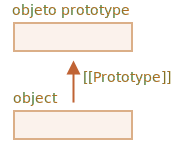

[Volver al Menú](../object.md)

# `Prototipos y herencia (delegacion de objeto)`

# `Herencia prototípica`

En programación, a menudo queremos tomar algo y extenderlo.

Por ejemplo: tenemos un objeto `user` con sus propiedades y métodos, y queremos hacer que `admin` y `guest` sean variantes ligeramente modificadas del mismo. Nos gustaría reutilizar lo que tenemos en `user`; no queremos copiar ni reimplementar sus métodos, sino solamente construir un nuevo objeto encima del existente.

`La herencia de prototipos es una característica del lenguaje que ayuda en eso.`

## `[[Prototype]]`

En JavaScript, los objetos tienen una propiedad oculta especial `[[Prototype]]` (como se menciona en la especificación); que puede ser `null`, o hacer referencia a otro objeto llamado `“prototipo”`:



Cuando leemos una propiedad de `object`, si JavaScript no la encuentra allí la toma automáticamente del prototipo. En programación esto se llama “`herencia prototípica`”.

La propiedad `[[Prototype]]` es interna y está oculta, pero hay muchas formas de configurarla.

Una de ellas es usar el nombre especial `__proto__`, así:

```
let animal = {
  eats: true
};
let rabbit = {
  jumps: true
};

rabbit.__proto__ = animal; // establece rabbit.[[Prototype]] = animal
```

Si buscamos una propiedad en `rabbit` y no se encuentra, JavaScript la toma automáticamente de `animal`.

Por ejemplo:

```
let animal = {
  eats: true
};
let rabbit = {
  jumps: true
};

rabbit.__proto__ = animal; // (*)

// Ahora podemos encontrar ambas propiedades en conejo:
alert( rabbit.eats ); // verdadero (**)
alert( rabbit.jumps ); // verdadero
```

Aquí, la línea `(*)` establece que `animal` es el prototipo de `rabbit`.

<h2 style='color: green'>Resumen</h2>

- En JavaScript, todos los objetos tienen una propiedad oculta `[[Prototype]]` que es: otro objeto, o null.
- Podemos usar obj.`__proto__` para acceder a ella (un getter/setter histórico, también hay otras formas que se cubrirán pronto).
- El objeto al que hace referencia `[[Prototype]]` se denomina “prototipo”.
- Si en obj queremos leer una propiedad o llamar a un método que no existen, entonces JavaScript intenta encontrarlos en el prototipo.
- Las operaciones de escritura/eliminación actúan directamente sobre el objeto, no usan el prototipo (suponiendo que sea una propiedad de datos, no un setter).
- Si llamamos a obj.method(), y method se toma del prototipo, this todavía hace referencia a obj. Por lo tanto, los métodos siempre funcionan con el objeto actual, incluso si se heredan.
- El bucle for..in itera sobre las propiedades propias y heredadas. Todos los demás métodos de obtención de valor/clave solo operan en el objeto mismo.

## `La escritura no usa prototipo`

El prototipo solo se usa para leer propiedades.

Las operaciones de escritura/eliminación funcionan directamente con el objeto.

## `El valor de “this”`

Puede surgir una pregunta interesante en el ejemplo anterior: ¿cuál es el valor de this dentro de set `fullName(value)`? ¿Dónde están escritas las propiedades `this.name` y `this.surname`: en `user` o en `admin`?

La respuesta es simple: `“this”` no se ve afectado por los prototipos en absoluto.

`No importa dónde se encuentre el método: en un objeto o su prototipo. En una llamada al método, this es siempre el objeto antes del punto.`

Eso es realmente algo muy importante, porque podemos tener un gran objeto con muchos métodos y tener objetos que hereden de él. Y cuando los objetos heredados ejecutan los métodos heredados, modificarán solo sus propios estados, no el estado del gran objeto.

## `Bucle for…in`

El bucle `for..in` también itera sobre las propiedades heredadas.

Si no queremos eso, y quisiéramos excluir las propiedades heredadas, hay un método incorporado `obj.hasOwnProperty(key)` (“Own” significa “Propia”): devuelve `true` si `obj` tiene la propiedad interna (no heredada) llamada `key`.

Entonces podemos filtrar las propiedades heredadas (o hacer algo más con ellas):
```
let animal = {
  eats: true
};

let rabbit = {
  jumps: true,
  __proto__: animal
};

for(let prop in rabbit) {
  let isOwn = rabbit.hasOwnProperty(prop);

  if (isOwn) {
    alert(`Es nuestro: ${prop}`); // Es nuestro: jumps
  } else {
    alert(`Es heredado: ${prop}`); // Es heredado: eats
  }
}
```

<h2 style="color: green">Resumen</h2>

- En JavaScript, todos los objetos tienen una propiedad oculta `[[Prototype]]` que es: otro objeto, o `null`.
- Podemos usar `obj.__proto__` para acceder a ella (un getter/setter histórico, también hay otras formas que se cubrirán pronto).
- El objeto al que hace referencia `[[Prototype]]` se denomina “prototipo”.
- Si en `obj` queremos leer una propiedad o llamar a un método que no existen, entonces JavaScript intenta encontrarlos en el prototipo.
- Las operaciones de escritura/eliminación actúan directamente sobre el objeto, no usan el prototipo (suponiendo que sea una propiedad de datos, no un setter).
- Si llamamos a `obj.method()`, y `method` se toma del prototipo, `this` todavía hace referencia a `obj`. Por lo tanto, los métodos siempre funcionan con el objeto actual, incluso si se heredan.
- El bucle `for..in` itera sobre las propiedades propias y heredadas. Todos los demás métodos de obtención de valor/clave solo operan en el objeto mismo.

# `F.prototype`

Recuerde: se pueden crear nuevos objetos con una función constructora, como new F().

Si F.prototype es un objeto, entonces el operador new lo usa para establecerlo como `[[Prototype]]` en el nuevo objeto.

<h2 style="color: red">Por favor tome nota:</h2>

JavaScript tiene herencia prototípica desde sus comienzos. Era una de las características principales del lenguaje.

Pero en los viejos tiempos no había acceso directo a ella. Lo único que funcionaba de manera confiable era una propiedad "`prototype`" de la función constructora, la que describimos en este capítulo. Por ello hay muchos scripts que todavía lo usan.


[mas informacion](https://es.javascript.info/function-prototype)

<h2 style="color: green">Resumen</h2>

En este capítulo describimos brevemente la forma de establecer un `[[Prototype]]` para los objetos creados a través de una función de constructor. Más adelante veremos patrones de programación más avanzados que dependen de él.

Todo es bastante simple, solo algunas notas para aclarar las cosas:

- La propiedad F.prototype (no la confunda con `[[Prototype]]`) establece `[[Prototype]]` de objetos nuevos cuando se llama a new F().
- El valor de F.prototype debe ser: un objeto, o null. Otros valores no funcionarán.
- La propiedad "prototype" solo tiene este efecto especial cuando se establece en una función de constructor y se invoca con new.

En los objetos normales, el prototype no es nada especial:
```
let user = {
  name: "John",
  prototype: "Bla-bla" // sin magia en absoluto
};
```
Por defecto, todas las funciones tienen F.prototype = {constructor: F}, por lo que podemos obtener el constructor de un objeto accediendo a su propiedad "constructor".

# `Prototipos nativos`

La propiedad "prototype" es ampliamente utilizada por el núcleo de JavaScript mismo. Todas las funciones de constructor integradas lo usan.

## `Otros prototipos integrados`

Otros objetos integrados como `Array`, `Date` , `Function` y otros también mantienen métodos en prototipos.

Por ejemplo, cuando creamos una matriz [1, 2, 3], el constructor predeterminado new `Array()` se usa internamente. Entonces `Array.prototype` se convierte en su prototipo y proporciona sus métodos. Eso es muy eficiente en memoria.

Por especificación, todos los prototipos integrados tienen Object.prototype en la parte superior. Es por eso que algunos dicen “todo hereda de los objetos”.

Aquí está la imagen general de 3 objetos integrados (3 para que quepan):


## `Primitivos`

Lo más intrincado sucede con cadenas, números y booleanos.

Como recordamos, no son objetos. Pero si tratamos de acceder a sus propiedades, se crean los objetos contenedores temporales utilizando los constructores integrados `String`, `Number` y `Boolean`, estos proporcionan los métodos y luego desaparecen.

Estos objetos se crean de manera invisible para nosotros y la mayoría de los motores los optimizan, pero la especificación lo describe exactamente de esta manera. Los métodos de estos objetos también residen en prototipos, disponibles como `String.prototype`, `Number.prototype` y `Boolean.prototype`.

<h2 style="color: red">Los valores null y undefined no tienen objetos contenedores</h2>

Los valores especiales `null` y `undefined` se distinguen. No tienen objetos contenedores, por lo que los métodos y propiedades no están disponibles para ellos. Y tampoco tienen los prototipos correspondientes.

## `Cambiando prototipos nativos`

Los prototipos nativos pueden ser modificados. Por ejemplo, si agregamos un método a String.prototype, estará disponible para todas las cadenas:
```
String.prototype.show = function() {
  alert(this);
};

"BOOM!".show(); // BOOM!
```
Durante el proceso de desarrollo, podemos tener ideas para nuevos métodos integrados que nos gustaría tener, y podemos sentir la tentación de agregarlos a los prototipos nativos. Pero eso es generalmente una mala idea.

<h2 style='color: green'>Resumen</h2>

- Todos los objetos integrados siguen el mismo patrón:
    - Los métodos se almacenan en el prototipo (`Array.prototype`, `Object.prototype`, `Date.prototype`, etc.)
    - El objeto en sí solo almacena los datos (elementos de arreglo, propiedades de objeto, la fecha)
- Los primitivos también almacenan métodos en prototipos de objetos contenedores: `Number.prototype`, `String.prototype` y `Boolean.prototype`. Solo undefined y null no tienen objetos contenedores.
- Los prototipos integrados se pueden modificar o completar con nuevos métodos. Pero no se recomienda cambiarlos. El único caso permitido es probablemente cuando agregamos un nuevo estándar que aún no es soportado por el motor de JavaScript.

# `Métodos prototipo, objetos sin __proto__`

Leer y escribir en `__proto__` se considera desactualizado y algo obsoleto (fue movido al llamado “Anexo B” del estándar JavaScript, dedicado únicamente a navegadores).

Los métodos modernos para obtener y establecer (get/set) un prototipo son:

- `Object.getPrototypeOf(obj)` – devuelve el `[[Prototype]]` de obj.
- `Object.setPrototypeOf(obj, proto)` – establece el `[[Prototype]]` de obj a proto.

El único uso de `__proto__` que no está mal visto, es como una propiedad cuando se crea un nuevo objeto: `{ __proto__: ... }`.

Aunque hay un método especial para esto también:

`Object.create(proto, [descriptors])` – crea un objeto vacío con el “proto” dado como `[[Prototype]]` y descriptores de propiedad opcionales.

[Mas Información](https://es.javascript.info/prototype-methods)

<h2 style="color: green">Resumen</h2>

- Para crear un objeto con un prototipo dado, use:

    - sintaxis literal: `{ __proto__: ... }`, permite especificar multiples propiedades
    - o `Object.create(proto, [descriptors])`, permite especificar descriptores de propiedad.

    El `Object.create` brinda una forma fácil de hacer la copia superficial de un objeto con todos sus descriptores:
    ```
    let clone = Object.create(Object.getPrototypeOf(obj), Object.getOwnPropertyDescriptors(obj));
    ```

- Los métodos modernos para obtener y establecer el prototipo son:

    - `Object.getPrototypeOf(obj)` – devuelve el `[[Prototype]]` de obj (igual que el getter de `__proto__`).
    - `Object.setPrototypeOf(obj, proto)` – establece el `[[Prototype]]` de obj en proto (igual que el setter de `__proto__`).

- No está recomendado obtener y establecer el prototipo usando los getter/setter nativos de `__proto__`. Ahora están en el Anexo B de la especificación.

- También hemos cubierto objetos sin prototipo, creados con Object.create(null) o {`__proto__`: null}.

Estos objetos son usados como diccionarios, para almacenar cualquier (posiblemente generadas por el usuario) clave.

Normalmente, los objetos heredan métodos nativos y getter/setter de `__proto__` desde `Object.prototype`, haciendo sus claves correspondientes “ocupadas” y potencialmente causar efectos secundarios. Con el prototipo null, los objetos están verdaderamente vacíos.