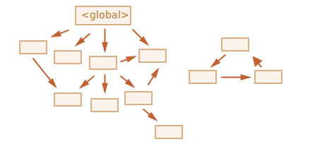

[Volver al Menú](../root.md)

# `Memory Management`

# `Memory lifecycle`

Regardless of the programming language, the memory life cycle is pretty much always the same, The memory lifecycle has three steps, common across most programming languages:

- Allocate the memory you need
- Use the allocated memory (read, write)
- Release the allocated memory when it is not needed anymore

The second part is explicit in all languages. The first and last parts are explicit in low-level languages but are mostly implicit in high-level languages like JavaScript.

In order to understand how much memory your program is using at any given time, you need to understand how it is being deallocated. When a variable is no longer needed in your program but is still present in memory, this is called a ‘memory leak’. With enough memory leaks, your program could in theory exceed the available memory and crash. In low level languages where you must manage your own memory, this occurs whenever you forget to free your memory. In JavaScript the garbage collector evaluates and removes unneeded variables from memory for you, and whilst this is more secure than relying on the developer to deallocate memory, there are still some circumstances in JavaScript where the garbage collector can fail and memory leaks can occur.

## `Allocation in JavaScript`

### `Value initialization`

In order to not bother the programmer with allocations, JavaScript will automatically allocate memory when values are initially declared.

### `Allocation via function calls`
Some function calls result in object allocation.

```
const d = new Date(); // allocates a Date object

const e = document.createElement("div"); // allocates a DOM element

```

### `Using values`

Using values basically means reading and writing in allocated memory. This can be done by reading or writing the value of a variable or an object property or even passing an argument to a function.

### `Release when the memory is not needed anymore`

The majority of memory management issues occur at this phase. The most difficult aspect of this stage is determining when the allocated memory is no longer needed.

Low-level languages require the developer to manually determine at which point in the program the allocated memory is no longer needed and to release it.

Some high-level languages, such as JavaScript, utilize a form of automatic memory management known as garbage collection (GC). The purpose of a garbage collector is to monitor memory allocation and determine when a block of allocated memory is no longer needed and reclaim it. This automatic process is an approximation since the general problem of determining whether or not a specific piece of memory is still needed is undecidable.

# `Recolección de basura`

La gestión de la memoria en JavaScript se realiza de forma automática e invisible para nosotros. Creamos datos primitivos, objetos, funciones… Todo ello requiere memoria.

## `Alcance`

El concepto principal del manejo de memoria en JavaScript es `alcance`.

Puesto simple, los valores “alcanzables” son aquellos que se pueden acceder o utilizar de alguna manera: Se garantiza que serán conservados en la memoria.

- Hay un conjunto base de valores inherentemente accesibles, que no se pueden eliminar por razones obvias.

Por ejemplo:

- La función ejecutándose actualmente, sus variables locales y parámetros.
- Otras funciones en la cadena actual de llamadas anidadas, sus variables y parámetros.
- Variables Globales
- (Hay algunos otros internos también)

Estos valores se llaman raíces.

- Cualquier otro valor se considera accesible si se lo puede alcanzar desde una raíz por una referencia o por una cadena de referencias.

  Por ejemplo, si hay un objeto en una variable global, y ese objeto tiene una propiedad que hace referencia a otro objeto, este objeto también se considera accesible. Y aquellos a los que este objeto hace referencia también son accesibles. Ejemplos detallados a continuación.

Hay un proceso en segundo plano en el motor de JavaScript que se llama recolector de basura. Este proceso monitorea todos los objetos y elimina aquellos que se han vuelto inalcanzables.

## `Algoritmos internos`

### `Marcar y barrer (Mark-and-sweep)`

El algoritmo básico de recolección de basura se llama “`marcar y barrer`”.

Los siguientes pasos de “recolección de basura” se realizan regularmente:

- El recolector de basura busca las raíces y las “marca” (recuerda).
- Luego visita y “marca” todos los objetos referenciados por ellas.
- Luego visita los objetos marcados y marca sus referencias. Todos los objetos visitados son recordados, para no visitar el mismo objeto dos veces en el futuro.
- …Y así sucesivamente hasta que cada referencia alcanzable (desde las raíces) sean visitadas.
- Todos los objetos que no fueron marcados se eliminan.


Por ejemplo, si nuestra estructura de objeto se ve así:



Podemos ver claramente una “isla inalcanzable” al lado derecho. Ahora veamos cómo el recolector de basura maneja “marcar y barrer”.

Podemos imaginar el proceso como derramar un enorme cubo de pintura desde las raíces, que fluye a través de todas las referencias y marca todos los objetos alcanzables. Los elementos que no queden marcados son entonces eliminados.

Ese es el concepto de cómo funciona la recolección de basura. El motor de JavaScript aplica muchas optimizaciones para que se ejecute más rápido y no introduzca retrasos en la ejecución de código.

### `Reference-counting garbage collection`

This is the most naïve garbage collection algorithm. This algorithm reduces the problem from determining whether or not an object is still needed to determining if an object still has any other objects referencing it. An object is said to be "garbage", or collectible if there are zero references pointing to it.

Hay otras optimizaciones y tipos de algoritmos de recolección de basura. Por mucho que quiera describirlos aquí, tengo que evitarlo porque diferentes motores implementan diferentes ajustes y técnicas. Y, lo que es aún más importante, las cosas cambian a medida que se desarrollan los motores, por lo que probablemente no vale la pena profundizar sin una necesidad real. Por supuesto, si tienes verdadero interés, a continuación hay algunos enlaces para ti.

[Mas Información](https://es.javascript.info/garbage-collection)

[TOP](#memory-management)