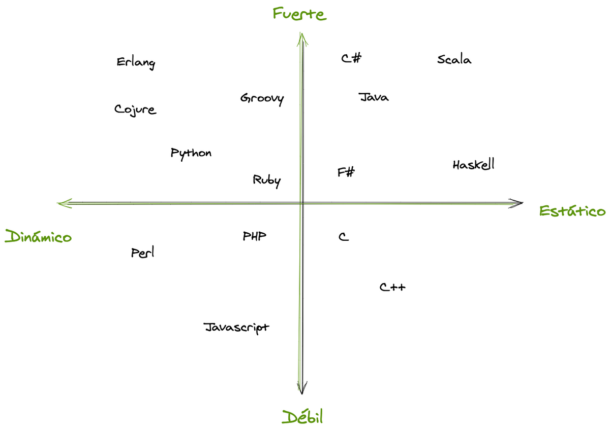

[Volver al Menú](../root.md)

# `Notas Generales`

- Lenguaje dinamico es cuando cambias el tipo de variable en tiempo de ejecucion. Js lo es y typeScrip no.

- Tambien Js es de tipado debil. Es cuando no indicamos el tipo de variable.



- El script para codigo externo e interno se usan por separado es decir un script con src y contenido adentro no funciona.

- En general, un salto de línea también se trata como un delimitador, por lo que también funciona:

  ```
  alert('Hola')
  alert('Mundo')
  ```

  Esto se llama “inserción automática de punto y coma”. A veces no funciona.

- Los puntos y comas no son necesarios después de los bloques de código {...} y los constructores de sintaxis como los bucles. Pero incluso si colocásemos un punto y coma “extra” en alguna parte, eso no sería un error. Solo sería ignorado.

- En el alert se lee de izquierda a derecha de resto de derecha a izquierda y se toma en cuanta la precedencia del operador pero si hay parentesis se anula la precedencia.

- Deberías imaginar a las variables como tentáculos, en lugar de cajas. Ellas no contienen valores; ellas los agarran—dos vinculaciones pueden referirse al mismo valor.

- El operador + es el unico que funciona con strings y los concatena y el valor resultante siempre es string.

- Al usar cualquier otro operador con strings el valor resultante es siempre entero.

- Si es 2+2+'2' primero se tratan los enteros normal y luego se concatena el resultado seria "42" si es al reves '2'+2+2 se concatena primero y el resultado es "222".

- La diferencia con ++valor y valor++ es que cuando se llama si es ++valor devuelve el valor incrementado si no lo devuelve sin el incremento pero en realidad los dos suman solo que si se llaman en ese momento se ve la diferencia.

- El incremento/decremento solo funciona con las variables numericas, usarlos con enteros o tros valores da syntax error.

- Cuando esta la coma (,) se ignora todo lo que esta a su izquierda ejemplo: a=(1+2,3+4) = 3+4 = 7.

- Number(undefined) = NaN, Number(null) = 0.

- El + al lado de true es 1 y de false es 0. Tambien es +'4' es 4 y +'0' 0

- typeof(NaN) = number

- El valor undefined NO debe compararse con otros valores.

- Undefined == null = true es la unica forma de que al comprar undefined de true el resto es false undefined === null = false.

- Octal numbers

  Son numeros en base 8 es decir 0,1,2,3,4,5,6,7 = 8 entonces 010 seria 8 ya que 07 = 07 y 08 y 09 no estan entonces se pasa al 010.

- Solo hay un valor en JavaScript que no es igual a si mismo, y este es NaN(“no es un número”).

Se supone que NaN denota el resultado de una computación sin sentido, y como tal, no es igual al resultado de ninguna otra computación sin sentido.

```
console.log(NaN == NaN)// → false
```

- Cuando null o undefined ocurren en cualquiera de los lados del operador, este produce verdadero solo si ambos lados son valores o null o undefined.

```
console.log(null == undefined); // → true
console.log(null == 0); // → false
```

# `Transpiladores`

Un transpilador es un software que traduce un código fuente a otro código fuente.
Puede analizar (“leer y entender”) código moderno y rescribirlo usando sintaxis y construcciones más viejas para que también funcione en intérpretes antiguos.

Acerca de nombres, Babel es uno de los más prominentes transpiladores circulando.

Sistemas de desarrollo de proyectos modernos, tales como webpack, brindan los medios
para ejecutar la transpilación automática en cada cambio de código, haciendo muy fácil la integración al proceso de desarrollo.

```
// antes de ejecutar el transpilador
height = height ?? 100;

// después de ejecutar el transpilador
height = (height !== undefined && height !== null) ? height : 100;
```

# `Polyfills`

Nuevas características en el lenguaje pueden incluir no solo construcciones sintácticas y operadores, sino también funciones integradas.

Aquí estamos hablando de nuevas funciones, no de cambios de sintaxis. No hay necesidad de transpilar nada. Solo necesitamos declarar la función faltante.

```
if (!Math.trunc) { // no existe tal función
  // implementarla
  Math.trunc = function(number) {
    // Math.ceil y Math.floor existen incluso en los intérpretes antiguos
    // los cubriremos luego en el tutorial
    return number < 0 ? Math.ceil(number) : Math.floor(number);
  };
}
```

`La única diferencia de sintaxis entre call y apply es que call espera una lista de argumentos, mientras que apply lleva consigo un objeto tipo matriz.`

# `Recomendaciones`

- Do NOT create global variables unless you intend to.
  Your global variables (or functions) can overwrite window variables (or functions).
  Any function, including the window object, can overwrite your global variables and functions.

- Recomiendo usar el operador de comparación de tres caracteres de una manera defensiva para prevenir que conversiones de tipo inesperadas te estorben. (===)

NO ES RECOMENDABLE USAR != Y ==, ES MEJOR USAR !== Y ===

- Usar continue en alguna parte de un ciclo que no se haga nada mas, ejemplo:

```
if(var == true){
  continue;
}else{
  return false;
}
```
