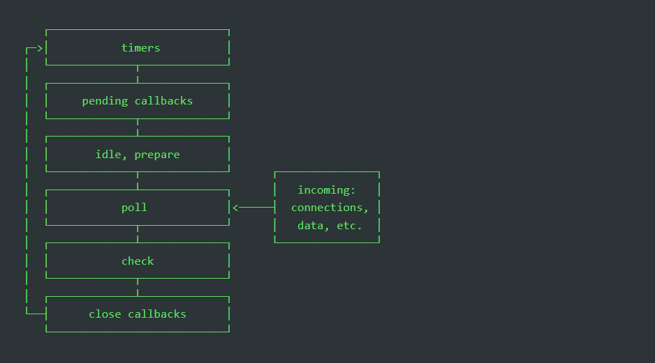

[Volver al Menú](../root.md)

# `Nodejs async programming`

Asynchronous code means that things can happen independently of the main program flow, async functions in JavaScript are processed in the background without blocking other requests. It ensures non-blocking code execution. Asynchronous code executes without having any dependency and no order. This improves the system efficiency and throughput. Making web apps requires knowledge of asynchronous concepts since we will be dealing with actions that require some time to get processed.

- `Promises`
- `Async/Await`
- `Callbacks`
- `setTimeout`
- `setInterval`
- `setImmediate`

The `setImmediate` function delays the execution of a function to be called after the current event loops finish all their execution. It’s very similar to calling `setTimeout` with 0 ms delay.

- `process.nextTick()`

Every time the event loop takes a full trip, we call it a tick. When we pass a function to `process.nextTick()`, we instruct the engine to invoke this function at the end of the current operation before the next event loop tick starts.

The event loop is busy processing the current function code. When this operation ends, the JS engine runs all the functions passed to `nextTick` calls during that operation.

# `Event Loop`

The Event Loop is one of the most critical aspects of Node.js. Why is this so important? Because it explains how Node.js can be asynchronous and have non-blocking I/O, it explains the “killer feature” of Node.js, which made it this successful.

When Node.js starts, it initializes the event loop, processes the provided input script (or drops into the REPL, `Read-Eval-Print-Loop`, which is not covered in this document) which may make async API calls, schedule timers, or call process.nextTick(), then begins processing the event loop.

The following diagram shows a simplified overview of the event loop's order of operations.



### `Phases Overview`

- `timers`: this phase executes callbacks scheduled by `setTimeout()` and `setInterval()`.
- `pending callbacks`: executes I/O callbacks deferred to the next loop iteration.
- `idle`, prepare: only used internally.
- `poll`: retrieve new I/O events; execute I/O related callbacks (almost all with the exception of close callbacks, the ones scheduled by timers, and `setImmediate()`); node will block here when appropriate.
- `check`: `setImmediate()` callbacks are invoked here.
- `close callbacks`: some close callbacks, e.g. socket.on('close', ...).


# `Event Emitter`

In Node.js, an event can be described simply as a string with a corresponding callback. An event can be “emitted” (or, in other words, the corresponding callback be called) multiple times or you can choose to only listen for the first time it is emitted.

If you worked with JavaScript in the browser, you know how much of the interaction of the user is handled through events: mouse clicks, keyboard button presses, reacting to mouse movements, and so on.

On the backend side, Node.js offers us the option to build a similar system using the events module.

This module, in particular, offers the EventEmitter class, which we'll use to handle our events.

```
const EventEmitter = require('events');

const eventEmitter = new EventEmitter();
```

This object exposes, among many others, the on and emit methods.

- `emit` is used to trigger an event
- `on` is used to add a callback function that's going to be executed when the event is triggered

For example, let's create a start event, and as a matter of providing a sample, we react to that by just logging to the console:

```
eventEmitter.on('start', () => {
  console.log('started');
});
```

When we run

```
eventEmitter.emit('start');
```

the event handler function is triggered, and we get the console log.

You can pass arguments to the event handler by passing them as additional arguments to `emit()`:

```
eventEmitter.on('start', number => {
  console.log(`started ${number}`);
});

eventEmitter.emit('start', 23);
```

Multiple arguments:

```
eventEmitter.on('start', (start, end) => {
  console.log(`started from ${start} to ${end}`);
});

eventEmitter.emit('start', 1, 100);
```

The EventEmitter object also exposes several other methods to interact with events, like

- `once()`: add a one-time listener
- `removeListener()` / `off()`: remove an event listener from an event
- `removeAllListeners()`: remove all listeners for an event


[TOP](#nodejs-async-programming)