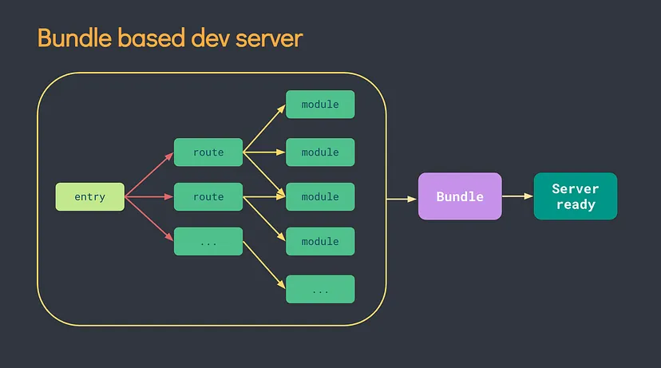
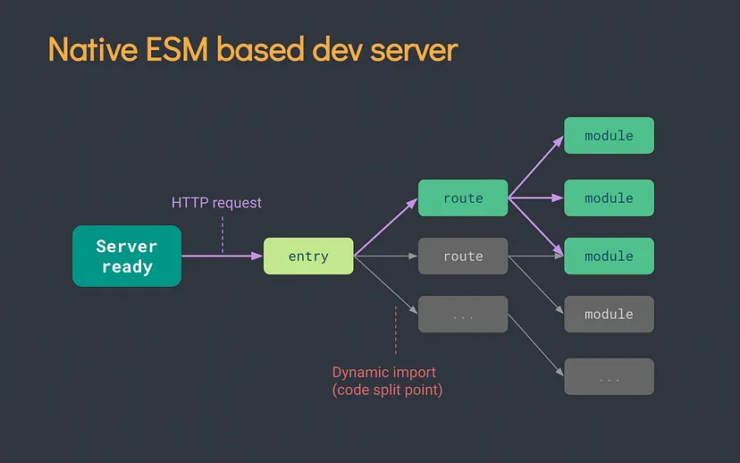

[Volver al Menú](../root.md)

# `Vite`

`Vite` (French word for "quick", pronounced /vit/, like "`veet`") is a build tool that aims to provide a faster and leaner development experience for modern web projects. It consists of two major parts:

- A dev server that provides rich feature enhancements over native ES modules, for example extremely `fast Hot Module Replacement (HMR)`.

- A build command that bundles your code with `Rollup`, pre-configured to output highly optimized static assets for production.

`Vite` is opinionated and comes with sensible defaults out of the box, but is also highly extensible via its Plugin API and JavaScript API with full typing support.

## `Hot Module Replacement (HMR)`

Hot module replacement appears to be a feature in tools like Webpack and `Vite` that allows modules to be updated at runtime without the need for a full application reload. This can speed up the development process by allowing developers to see code changes in the browser as they make them , without having to manually refresh the page.

With hot module replacement, when changes are made to a module, the updated module is sent to the browser and replaces the existing module, without affecting the rest of the application. This allows developers to see their changes immediately and speeds up the development process. The feature can be especially helpful for large applications with complex and time-consuming builds.

Hot module replacement typically relies on a combination of server-side and client-side code, and enables the use of appropriate libraries and tools to make it work effectively.

## `Rollup`

Rollup is a JavaScript module bundler that allows you to compile small pieces of code into more complex applications or libraries . It is similar to other bundlers like Webpack and Browserify, but aims to be more efficient and lightweight.

Rollup works by analyzing your code and outputting a smaller bundle that only includes the pieces of your code that are actually used. This can lead to faster load times and better performance for your applications.

Rollup is highly configurable and supports a variety of different module formats, including CommonJS, AMD, ES2015 modules, and more. It also has a powerful plugin system that allows you to extend its functionality and customize the way your code is bundled.

Overall, Rollup is a useful tool for any JavaScript developer looking to create efficient, high-performance applications or libraries.

# `Scaffolding Your First Vite Project`

With NPM:
```
$ npm create vite@latest
```

With Yarn:
```
$ yarn create vite
```

Then follow the prompts!

You can also directly specify the project name and the template you want to use via additional command line options. For example, to scaffold a Vite + Vue project, run:

```
# npm 6.x
npm create vite@latest my-vue-app --template vue

# npm 7+, extra double-dash is needed:
npm create vite@latest my-vue-app -- --template vue

# yarn
yarn create vite my-vue-app --template vue

# pnpm
pnpm create vite my-vue-app --template vue
```

# `index.html and Project Root`

One thing you may have noticed is that in a Vite project, index.html is front-and-central instead of being tucked away inside public. This is intentional: during development Vite is a server, and index.html is the entry point to your application.

Vite treats index.html as source code and part of the module graph. It resolves `<script type="module" src="...">` that references your JavaScript source code. Even inline` <script type="module">` and CSS referenced via `<link href>` also enjoy Vite-specific features. In addition, URLs inside index.html are automatically rebased so there's no need for special %PUBLIC_URL% placeholders.

Similar to static http servers, Vite has the concept of a "root directory" which your files are served from. You will see it referenced as `<root>` throughout the rest of the docs. Absolute URLs in your source code will be resolved using the project root as base, so you can write code as if you are working with a normal static file server (except way more powerful!). Vite is also capable of handling dependencies that resolve to out-of-root file system locations, which makes it usable even in a monorepo-based setup.

# `Command Line Interface`

In a project where Vite is installed, you can use the vite binary in your npm scripts, or run it directly with npx vite. Here are the default npm scripts in a scaffolded Vite project:

```
{
  "scripts": {
    "dev": "vite", // start dev server, aliases: `vite dev`, `vite serve`
    "build": "vite build", // build for production
    "preview": "vite preview" // locally preview production build
  }
}
```

# `Why Vite`

## `The Problems`

Before ES modules were available in browsers, developers had no native mechanism for authoring JavaScript in a modularized fashion. This is why we are all familiar with the concept of "bundling": using tools that crawl, process and concatenate our source modules into files that can run in the browser.

Over time we have seen tools like `webpack`, `Rollup` and `Parcel`, which greatly improved the development experience for frontend developers.

However, as we build more and more ambitious applications, the amount of JavaScript we are dealing with is also increasing dramatically. It is not uncommon for large scale projects to contain thousands of modules. We are starting to hit a performance bottleneck for JavaScript based tooling: it can often take an unreasonably long wait (sometimes up to minutes!) to spin up a dev server, and even with Hot Module Replacement (HMR), file edits can take a couple of seconds to be reflected in the browser. The slow feedback loop can greatly affect developers' productivity and happiness.

Vite aims to address these issues by leveraging new advancements in the ecosystem: the availability of native ES modules in the browser, and the rise of JavaScript tools written in compile-to-native languages.

## `Slow Server Start`

Vite improves the dev server start time by first dividing the modules in an application into two categories: `dependencies` and `source code`.

- `Dependencies` are mostly plain JavaScript that do not change often during development. Some large `dependencies` (e.g. component libraries with hundreds of modules) are also quite expensive to process. `Dependencies` may also be shipped in various module formats (e.g. ESM or CommonJS).

Vite pre-bundles `dependencies` using `esbuild`. `esbuild` is written in Go and pre-bundles `dependencies` 10-100x faster than JavaScript-based bundlers.

- `Source code` often contains non-plain JavaScript that needs transforming (e.g. JSX, CSS or Vue/Svelte components), and will be edited very often. Also, not all `source code` needs to be loaded at the same time (e.g. with route-based code-splitting).

Vite serves `source code` over native ESM. This is essentially letting the browser take over part of the job of a bundler: Vite only needs to transform and serve `source code` on demand, as the browser requests it. Code behind conditional dynamic imports is only processed if actually used on the current screen.





## `Slow Updates`

When a file is edited in a bundler-based build setup, it is inefficient to rebuild the whole bundle for an obvious reason: the update speed will degrade linearly with the size of the app.

In some bundlers, the dev server runs the bundling in memory so that it only needs to invalidate part of its module graph when a file changes, but it still needs to re-construct the entire bundle and reload the web page. Reconstructing the bundle can be expensive, and reloading the page blows away the current state of the application. This is why some bundlers support `Hot Module Replacement (HMR)`: allowing a module to "hot replace" itself without affecting the rest of the page. This greatly improves DX - however, in practice we've found that even `HMR` update speed deteriorates significantly as the size of the application grows.

In Vite, `HMR` is performed over native ESM. When a file is edited, Vite only needs to precisely invalidate the chain between the edited module and its closest `HMR` boundary (most of the time only the module itself), making `HMR` updates consistently fast regardless of the size of your application.

Vite also leverages HTTP headers to speed up full page reloads (again, let the browser do more work for us): source code module requests are made conditional via 304 Not Modified, and dependency module requests are strongly cached via Cache-Control: max-age=31536000,immutable so they don't hit the server again once cached.

Once you experience how fast Vite is, we highly doubt you'd be willing to put up with bundled development again.

## `Why Bundle for Production`

Even though native ESM is now widely supported, shipping unbundled ESM in production is still inefficient (even with HTTP/2) due to the additional network round trips caused by nested imports. To get the optimal loading performance in production, it is still better to bundle your code with tree-shaking, lazy-loading and common chunk splitting (for better caching).

Ensuring optimal output and behavioral consistency between the dev server and the production build isn't easy. This is why Vite ships with a pre-configured build command that bakes in many performance optimizations out of the box.


## `Why Not Bundle with esbuild?`

Vite's current plugin API isn't compatible with using `esbuild` as a bundler. In spite of `esbuild` being faster, Vite's adoption of Rollup's flexible plugin API and infrastructure heavily contributed to its success in the ecosystem. For the time being, we believe that Rollup offers a better performance-vs-flexibility tradeoff.

That said, `esbuild` has progressed a lot in the past years, and we won't rule out the possibility of using `esbuild` for production builds in the future. We will keep taking advantage of new capabilities as they are released, as we have done with JS and CSS minification where `esbuild` allowed Vite to get a performance boost while avoiding disruption for its ecosystem

[Mas Informacion](https://vitejs.dev/guide/)

# `Create React App`

`create-react-app` is a command line interface tool built by Facebook for creating new React projects with a modern build setup and pre-configured packages. It allows developers to quickly set up a new React project without having to worry about configuration or webpack setup. To use create-react-app, you'll first need to have Node.js installed on your machine.

Create React App is the CLI based tool and is the best way to start building a new single-page application in React.

It sets up your development environment so that you can use the latest JavaScript features, provides a nice developer experience, and optimizes your app for production. You’ll need to have Node >= 14.0.0 and npm >= 5.6 on your machine.

## `Folder Structure`

```
my-app/
  README.md
  node_modules/
  package.json
  public/
    index.html
    favicon.ico
  src/
    App.css
    App.js
    App.test.js
    index.css
    index.js
    logo.svg
```

For the project to build, these files must exist with exact filenames:

- public/index.html is the page template;

- src/index.js is the JavaScript entry point.

You can delete or rename the other files.

You may create subdirectories inside src. For faster rebuilds, only files inside src are processed by webpack. You need to put any JS and CSS files inside src, otherwise webpack won’t see them.

Only files inside public can be used from public/index.html. Read instructions below for using assets from JavaScript and HTML.

You can, however, create more top-level directories. They will not be included in the production build so you can use them for things like documentation.

If you have Git installed and your project is not part of a larger repository, then a new repository will be initialized resulting in an additional top-level .git directory.


## `Available Scripts`

In the project directory, you can run:

`npm start`

Runs the app in the development mode. Open http://localhost:3000 to view it in the browser.

The page will reload if you make edits. You will also see any lint errors in the console.

`npm test`

Launches the test runner in the interactive watch mode. See the section about running tests for more information.

`npm run build`

Builds the app for production to the build folder. It correctly bundles React in production mode and optimizes the build for the best performance.

The build is minified and the filenames include the hashes. If necessary, classnames and function names can be enabled for profiling purposes. See the production build section for more information.

Your app is ready to be deployed! See the section about deployment for more information about deploying your application to popular hosting providers.

`npm run eject`

Note: this is a one-way operation. Once you eject, you can’t go back!

If you aren’t satisfied with the build tool and configuration choices, you can eject at any time. This command will remove the single build dependency from your project.