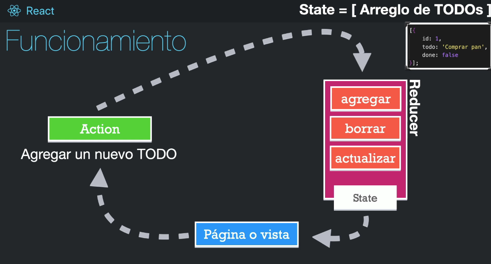

[Volver al Menú](../root.md)

# `Hooks`

`Un Hook no es mas que una funcion que retorna algo.`

# `useState`

`useState` hook is used to manage the state of a component in functional components. Calling `useState` returns an array with two elements: the current state value and a function to update the state.

`Example`

```
import React, { useState } from 'react';

function Example() {
  // Declare a new state variable, which we'll call "count"
  const [count, setCount] = useState(0);

  // Function to modify the count value
  const handleButtonClick = () => {
    // Modifying the count value
    setCount(count + 1);
  };

  return (
    <div>
      <p>You clicked {count} times</p>
      <button onClick={handleButtonClick}>Click me</button>
    </div>
  );
}

```

`Con Objetos`

```
import { useState } from "react"

export const CounterApp = () => {

    const [state, setcounter] = useState({
        counter1: 10,
        counter2: 20,
        counter3: 30
    });

    const { counter1, counter2, counter3 } = state;

    const counterAdd = () => {
        setcounter({
            ...state,
            counter1: counter1 + 1
        });
        console.log(counter1);
    }

    return (
        <>
            <h1>Counter: {counter1} </h1>
            <h1>Counter: {counter2} </h1>
            <h1>Counter: {counter3} </h1>
            <hr />

            <button className="btn" onClick={counterAdd}>+1</button>
        </>
    )
}

```

# `useEffect`

`useEffect` is a special hook that lets you run side effects in React. It is similar to componentDidMount and componentDidUpdate, but it only runs when the component (or some of its props) changes and during the initial mount.

`useEffect` is a React Hook that lets you synchronize a component with an external system.

`Example`

```
import React, { useState, useEffect } from 'react';

function Example() {
  const [count, setCount] = useState(0);

  // useEffect to update the document title
  useEffect(() => {
    document.title = `You clicked ${count} times`;
  }, [count]); // Dependency array to run the effect only when count changes

  return (
    <div>
      <p>You clicked {count} times</p>
      <button onClick={() => setCount(count + 1)}>Click me</button>
    </div>
  );
}

```

If you want to run React's useEffect Hook only on the first render of a component (also called only on mount), then you can pass in a second argument to useEffect:

```
const Toggler = ({ toggle, onToggle }) => {
  React.useEffect(() => {
    console.log('I run only on the first render: mount.');
  }, []);

  return (
    <div>
      <button type="button" onClick={onToggle}>
        Toggle
      </button>

      {toggle && <div>Hello React</div>}
    </div>
  );
};
```

# `useRef`

`useRef` is a hook in React that allows you to create a reference to a DOM element or a mutable value that persists across renders without causing re-renders when updated. It returns an object with a current property, which can be used to access or update the referenced value.

When we initialize `useRef`, we set the initial value, and we can access the value by using ref.current. This can be particularly useful for accessing DOM elements directly, persisting values between renders, and storing mutable values without causing re-renders.

```
import React, { useRef } from 'react';

const MyComponent = () => {
  const inputRef = useRef(null);

  const handleButtonClick = () => {
    inputRef.current.focus();
  };

  return (
    <div>
      <input ref={inputRef} type="text" />
      <button onClick={handleButtonClick}>Focus Input</button>
    </div>
  );
};

```

By using useRef, we can create a reference to the input element and then use it to focus on the input without causing re-renders.

Overall, useRef is a valuable tool in React for accessing DOM elements and persisting values between renders without triggering unnecessary re-renders, providing more control and efficiency in managing component state and behavior .

# `useLayoutEffect`

`useLayoutEffect` can hurt performance. Prefer useEffect when possible.

`useLayoutEffect` is a version of useEffect that fires before the browser repaints the screen.

```
import { useState, useRef, useLayoutEffect } from 'react';

function Tooltip() {
  const ref = useRef(null);
  const [tooltipHeight, setTooltipHeight] = useState(0);

  useLayoutEffect(() => {
    const { height } = ref.current.getBoundingClientRect();
    setTooltipHeight(height);
  }, []);
```

Call useLayoutEffect to perform the layout measurements before the browser repaints the screen.

# `useCallback`

`useCallback` is a React Hook that lets you cache a function definition between re-renders.

import React, { useState, useCallback } from 'react';

```
function Example() {
  const [count, setCount] = useState(0);

  // Define a memoized callback function using useCallback
  const handleIncrement = useCallback(() => {
    setCount(count + 1);
  }, [count]); // Dependency array to run the callback only when count changes

  return (
    <div>
      <p>Count: {count}</p>
      <button onClick={handleIncrement}>Increment Count</button>
    </div>
  );
}
```

In this example, the useCallback hook is used to create a memoized callback function handleIncrement that increments the count state. The dependency array [count] ensures that the callback is only recreated when the count state changes, optimizing performance by preventing unnecessary re-renders.

The useCallback hook is particularly useful when passing callbacks to optimized child components that rely on reference equality to prevent unnecessary renders.

# `useContext`

`useContext` is a React Hook that lets you read and subscribe to context from your component.

```
import React, { createContext, useContext } from 'react';

// Create a context
const ThemeContext = createContext('light');

// Component that uses the context
function ThemedComponent() {
  const theme = useContext(ThemeContext);
  return <div>Current theme: {theme}</div>;
}

// Component that provides the context value
function App() {
  return (
    <ThemeContext.Provider value="dark">
      <ThemedComponent />
    </ThemeContext.Provider>
  );
}
```

In this example, the `useContext` hook is used to consume the ThemeContext within the ThemedComponent. The ThemeContext.Provider component provides the context value "dark" to all the components within its tree, allowing ThemedComponent to access and use the theme value.

The `useContext` hook is a powerful tool for consuming context in functional components, providing a straightforward way to access context values without nesting multiple components.

# `useMemo `

React's useMemo Hook can be used to optimize the computation costs of your React function components.

```
import React, { useState, useMemo } from 'react';

function Example({ todos, tab }) {
  // Memoized calculation of visible todos based on dependencies (todos, tab)
  const visibleTodos = useMemo(() => filterTodos(todos, tab), [todos, tab]);

  return (
    <div>
      <h2>Todo List</h2>
      {visibleTodos.map((todo) => (
        <div key={todo.id}>{todo.title}</div>
      ))}
    </div>
  );
}
```

In this example, the useMemo hook is used to memoize the calculation of visibleTodos based on the dependencies todos and tab. This ensures that the calculation is only re-executed when the dependencies change, optimizing performance by preventing unnecessary recalculations.

The useMemo hook is particularly useful for optimizing performance by caching the result of expensive computations in functional components.

# `useSelector`

Allows you to extract data from the Redux store state for use in this component, using a selector function.

The selector will be called with the entire Redux store state as its only argument. The selector may return any value as a result, including directly returning a value that was nested inside state, or deriving new values. The return value of the selector will be used as the return value of the useSelector() hook.

```
import React from 'react'
import { useSelector } from 'react-redux'

export const CounterComponent = () => {
  const counter = useSelector((state) => state.counter)
  return <div>{counter}</div>
}
```

# `useReducer`

- Es una funcón común y corriente
- Debe ser una funcion pura
- Debe de retornar un nuevo estado
- Usualmente solo recibe dos argmentos
  - El valor inicial
  - La acción a ejcutar



```
import React, { useReducer } from 'react';

// Initial state for the todos
const initialTodos = [
  { id: 1, title: "Todo 1", complete: false },
  { id: 2, title: "Todo 2", complete: false }
];

// Reducer function to manage state transitions
const reducer = (state, action) => {
  switch (action.type) {
    case "TOGGLE_COMPLETE":
      return state.map((todo) =>
        todo.id === action.id ? { ...todo, complete: !todo.complete } : todo
      );
    default:
      return state;
  }
};

function TodoList() {
  const [todos, dispatch] = useReducer(reducer, initialTodos);

  const handleToggleComplete = (id) => {
    dispatch({ type: "TOGGLE_COMPLETE", id });
  };

  return (
    <div>
      <h2>Todo List</h2>
      {todos.map((todo) => (
        <div key={todo.id}>
          <input
            type="checkbox"
            checked={todo.complete}
            onChange={() => handleToggleComplete(todo.id)}
          />
          <span>{todo.title}</span>
        </div>
      ))}
    </div>
  );
}

```

`An alternative to useState`

In this example, the useReducer hook is used to manage the state of a todo list. The reducer function handles state transitions based on dispatched actions, such as toggling the completion status of a todo item. The useReducer hook returns the current state (todos) and a dispatch function to trigger state transitions.

The useReducer hook is particularly useful for managing complex state logic and transitions in functional components.

# `Writing Custom Hooks`

Building your own Hooks lets you extract component logic into reusable functions.

React comes with several built-in Hooks like useState, useContext, and useEffect. Sometimes, you’ll wish that there was a Hook for some more specific purpose: for example, to fetch data, to keep track of whether the user is online, or to connect to a chat room. You might not find these Hooks in React, but you can create your own Hooks for your application’s needs.

- `Custom Hooks let you share logic between components.`
- `Custom Hooks must be named starting with use followed by a capital letter.`
- `Custom Hooks only share stateful logic, not state itself.`
- `You can pass reactive values from one Hook to another, and they stay up-to-date.`
- `All Hooks re-run every time your component re-renders.`
- `The code of your custom Hooks should be pure, like your component’s code.`
- `Wrap event handlers received by custom Hooks into Effect Events.`
- `Don’t create custom Hooks like useMount. Keep their purpose specific.`
- `It’s up to you how and where to choose the boundaries of your code.`

## `When to use custom Hooks`

You don’t need to extract a custom Hook for every little duplicated bit of code. Some duplication is fine. For example, extracting a useFormInput Hook to wrap a single useState call like earlier is probably unnecessary.

However, whenever you write an Effect, consider whether it would be clearer to also wrap it in a custom Hook. `You shouldn’t need Effects very often`, so if you’re writing one, it means that you need to “step outside React” to synchronize with some external system or to do something that React doesn’t have a built-in API for. Wrapping it into a custom Hook lets you precisely communicate your intent and how the data flows through it.

[More Info](https://react.dev/learn/reusing-logic-with-custom-hooks)

[TOP](#hooks)
