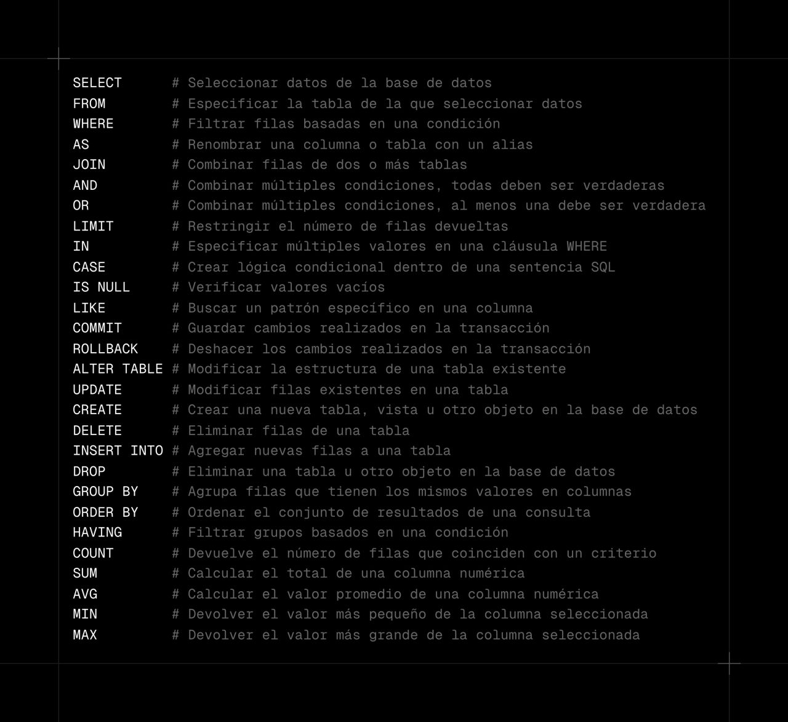
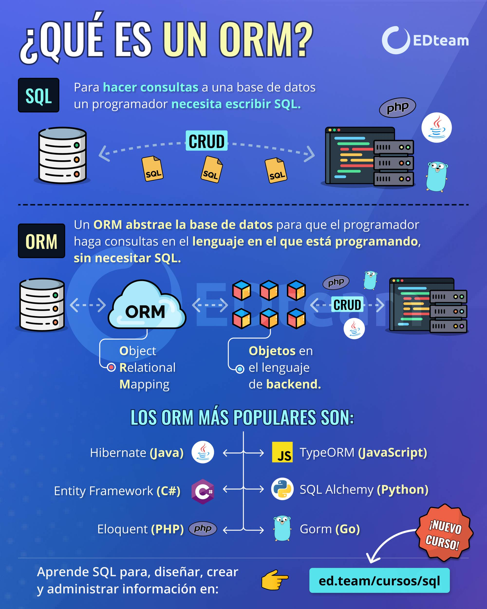

[Volver al Menú](/readme.md)

# `SQL`

- [Introduction](sql/intro.md)

- [What is SQL?](sql/sql.md)

- [Practicas](sql/practicas.md)

- [Basic SQL Syntax](sql/syntax.md)

- [Data Definition Language (DDL)](sql/ddl.md)

- [Data Manipulation Language (DML)](sql/dml.md)

- [Aggregate Queries](sql/queries.md)

---

- [Data Constraints](sql/constraints.md)

- [JOIN Queries](sql/joins.md)

- [Sub Queries](sql/sub-queries.md)

- [Advanced SQL Functions](sql/advanced.md)

- [Indexes](sql/indexes.md)

- [Transactions](sql/transactions.md)

# `PostgreSQL   `

- [PostgreSQL](postgre/postgre.md)

# `Resumen`

# `ORMS`

Un ORM (Object Relational Mapping o Mapeo Objeto-Relacional en castellano) es una herramienta que nos permite mapear, o lo que es lo mismo, convertir los objetos de tu aplicación a un formato adecuado para ser almacenados en cualquier base de datos, creándo para ello una base de datos virtual donde los datos disponibles en nuestra aplicación quedan vinculados con la base de datos final.

Lo que podemos obtener de la definición anterior, es que además de convertir, los ORM nos ayudan a eliminar todo el lenguaje tedioso de sentencias SQL necesario para realizar las acciones CRUD (Create, Read, Update, Delete) en nuestro código, ya que es el propio ORM quien se encarga de ello.

