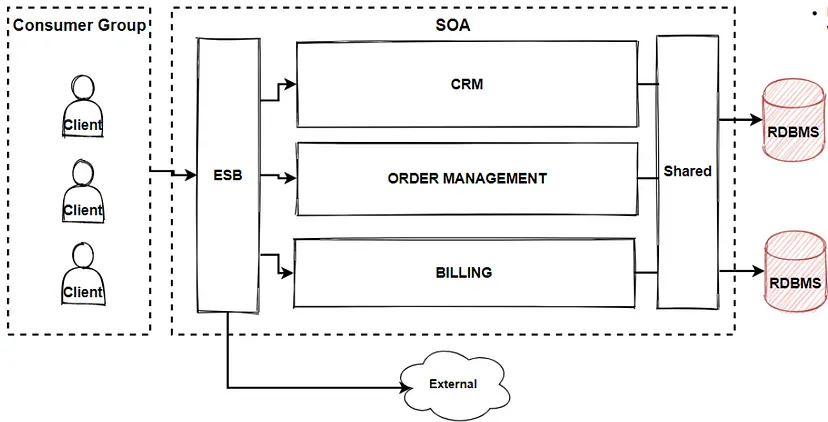

[Volver al Menú](root.md)

# `Architectural Patterns`

Architectural patterns are a set of solutions that have been proven to work well for specific types of software systems. They provide a common vocabulary and set of best practices for designing and building software systems, and can help developers make better design decisions

# `SOA`

SOA (Service-Oriented Architecture) is an architectural pattern that is used to design and organize software systems as a collection of services that can be accessed over a network, these services are autonomous, self-contained units of functionality that can be reused and combined to create new functionality. SOA services are designed to be loosely coupled, meaning that they do not depend on the implementation details of other services, they communicate with each other through well-defined interfaces, usually using a protocol such as HTTP or SOAP. SOA provides several advantages over other architectural patterns, such as reusability, modularity, interoperability, and scalability. It can be implemented using a variety of technologies, such as Web Services, REST, and microservices.

# `CQRS`

CQRS (Command Query Responsibility Segregation) is an architectural pattern that is used to separate the responsibilities of reading and writing data in a software system. In a CQRS architecture, the system is divided into two separate parts: the command side and the query side.

The command side is responsible for processing commands and updating the system’s state, while the query side is responsible for reading the current state of the system and returning the results to the client. The command and query sides can use different data models, storage mechanisms, and even different technologies.

### `Context and problem`

In traditional architectures, the same data model is used to query and update a database. That's simple and works well for basic CRUD operations. In more complex applications, however, this approach can become unwieldy. For example, on the read side, the application may perform many different queries, returning data transfer objects (DTOs) with different shapes. Object mapping can become complicated. On the write side, the model may implement complex validation and business logic. As a result, you can end up with an overly complex model that does too much.

# `Domain Driven Design`

Domain-Driven Design (DDD) is an architectural pattern that is used to design software systems based on the core business domain and business entities, it’s focused on creating a clear and accurate representation of the business domain within the software system, and on aligning the software system with the business goals and objectives. DDD provides several advantages over other architectural patterns, such as alignment with business goals and objectives, improved communication between domain experts and developers, a clear and expressive model of the business domain and improved scalability and maintainability. It’s implemented using a set of principles and patterns such as strategic design, subdomains, bounded context, entities, value objects, aggregate, and repository.

# `Model View Controller`

Model-View-Controller (MVC) is an architectural pattern that separates the concerns of a software system into three distinct components: the model, the view, and the controller, where the model represents the data and the business logic of the system, the view represents the user interface of the system and the controller acts as an intermediary between the model and the view. The main goal of MVC is to separate the concerns of the system, making it easier to understand, maintain and evolve, it’s widely used in web development.

# `Microservices`

Microservices is an architectural pattern that is used to design software systems as a collection of small, independent, and loosely-coupled services. Each service is responsible for a specific functionality and can be developed, deployed, and scaled independently. The main advantage of a microservices architecture is that it allows for a more flexible and scalable system, it also improves fault isolation and enables faster deployment. It’s often used in combination with other architectural patterns and styles such as event-driven architecture, CQRS, and service-oriented architecture.

# `Blackboard Pattern`

The Blackboard architectural pattern is a software design pattern that allows for the creation of a centralized repository of information that can be accessed and modified by multiple independent modules or subsystems. The blackboard serves as a communication and coordination mechanism between these modules, allowing them to share information and collaborate to achieve a common goal. This pattern is often used in artificial intelligence and decision-making systems, where multiple processes or agents need to share and reason over complex data.

# `Microkernel`

A microkernel is an architectural pattern in operating system design that aims to minimize the amount of code running in kernel mode (i.e., privileged mode with direct access to hardware resources) and instead move as much functionality as possible into user mode. This is done by providing a small, minimalistic core kernel that only handles basic tasks such as memory management, process scheduling, and inter-process communication (IPC), and leaving all other functionality to be implemented in user-mode processes.

# `Serverless Architecture`

Serverless architecture is a design pattern that allows developers to build and run applications and services without having to provision and manage servers. Instead, these applications and services are executed in a fully managed environment, such as AWS Lambda, Azure Functions, or Google Cloud Functions, where the infrastructure and scaling are handled automatically by the cloud provider.

This architecture pattern mainly focuses on the business logic and event-driven execution, rather than on server management. It allows developers to write and deploy code in small, single-purpose functions that are triggered by specific events, such as changes in a database or the arrival of new data in a stream.

# `Message Queues Streams`

Message queues and streams are architectural patterns that are used to decouple different components of a system and enable asynchronous communication between them.

Message Queues: A message queue is a software component that allows multiple systems or applications to communicate with each other by passing messages between them. Messages are stored in a queue, and each message is processed by a single consumer. This pattern is useful for systems where there is a high degree of variability in the rate of message production and consumption, and where the sender and receiver do not need to be active at the same time. Examples of message queue systems are Apache Kafka, RabbitMQ, and Amazon SQS.

# `Event Sourcing`

Event sourcing is an architectural pattern that is used to build systems that need to maintain a history of all the changes that have occurred over time. This pattern stores all changes to the system’s state as a sequence of events, rather than just the current state.

In Event sourcing, all changes to the state of the system are treated as events, and these events are stored in an append-only log, also known as an event store. The current state of the system can be reconstructed from the event log at any given point in time by replaying the events from the log.

[TOP](#architectural-patterns)
