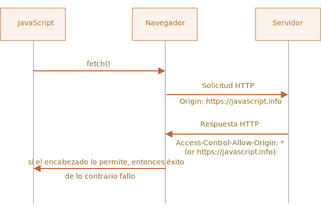

[Volver al Menú](root.md)

# `Cross-Origin Resource Sharing (CORS)`

Hay una regla: los scripts de un sitio no pueden acceder al contenido de otro sitio. Por ejemplo: un script de `https://facebook.com` no puede leer la bandeja de correos del usuario en `https://gmail.com`.
`
O para ser más precisos, un origen (el trío dominio/puerto/protocolo) no puede acceder al contenido de otro. Entonces, incluso si tenemos un sub-dominio o solo un puerto distinto, son considerados orígenes diferentes sin acceso al otro.

Esta regla también afecta a recursos de otros dominios.

Si usamos un script de otro dominio y tiene un error, no podemos obtener detalles del error.

`Para permitir el acceso de origen cruzado, la etiqueta <script> necesita tener el atributo crossorigin, además el servidor remoto debe proporcionar cabeceras especiales.`

Hay 3 niveles de acceso de origen cruzado:

- Sin el atributo `crossorigin` – acceso prohibido.
- `crossorigin="anonymous"` – acceso permitido si el servidor responde con la cabecera `Access-Control-Allow-Origin` con `*` o nuestro origen. El navegador no envía la información de la autorización y cookies al servidor remoto.
- `crossorigin="use-credentials"` – acceso permitido si el servidor envia de vuelta la cabecera `Access-Control-Allow-Origin` con nuestro origen y `Access-Control-Allow-Credentials: true`. El navegador envía la información de la autorización y las cookies al servidor remoto.

Si enviamos una petición `fetch` hacia otro sitio seguramente fallará.

Por ejemplo, probemos una petición a `https://example.com`:

```
try {
  await fetch('https://example.com');
} catch(err) {
  alert(err); // Failed to fetch
}
```

El método `fetch` falla, tal como lo esperábamos.

El concepto clave aquí es el origen (`origin`), triple combinación de dominio/puerto/protocolo.

Las solicitudes de origen cruzado `Cross-origin` requests (aquellas que son enviadas hacia otro dominio --incluso subdominio–, protocolo o puerto), requieren de unas cabeceras especiales desde el sitio remoto.

Esta política es denominada `“CORS”`, por sus siglas en inglés `Cross-Origin Resource Sharing`.

## `¿Por que CORS es necesario?, Una breve historia`

CORS existe para proteger Internet de los hackers malvados.

En verdad… Déjame contarte un breve resumen de esta historia.

Durante muchos años un script de un sitio no podía acceder al contenido de otro sitio.

Esta simple, pero poderosa regla, fue parte fundacional de la seguridad de Internet. Por ejemplo, un script malicioso desde el sitio hacker.com no podía acceder a la casilla de correo en el sitio gmail.com. La gente se podía sentir segura.

Así mismo en ese momento, JavaScript no tenía ningún método especial para realizar solicitudes de red. Simplemente era un lenguaje juguete para decorar páginas web.

Pero los desarrolladores web demandaron más poder. Una variedad de trucos fueron inventados para poder pasar por alto las limitaciones, y realizar solicitudes a otros sitios.

[Mas informacion](https://es.javascript.info/fetch-crossorigin#por-que-cors-es-necesario-una-breve-historia)

## `Solicitudes seguras`

Existen dos tipos de solicitudes de origen cruzado:

- Solicitudes seguras.

- Todas las demás.

Las solicitudes seguras son más fáciles de hacer, comencemos con ellas.

Una solicitud es segura si cumple dos condiciones:

- método seguro: GET, POST o HEAD

- Cabeceras seguras – Las únicas cabeceras permitidas son:

  - Accept,

  - Accept-Language,

  - Content-Language,

  - Content-Type con el valor `application/x-www-form-urlencoded`, `multipart/form-data` o `text/plain`.
    Cualquier otra solicitud es considerada “insegura”. Por lo tanto, una solicitud con el método `PUT` o con una cabecera HTTP` API-Key` no cumple con las limitaciones.

La diferencia esencial es que una solicitud segura puede ser realizada mediante un `<form>` o un `<script>`, sin la necesidad de utilizar un método especial.

Por lo tanto, incluso un servidor obsoleto debería ser capaz de aceptar una solicitud segura.

Contrario a esto, las solicitudes con cabeceras no estándar o métodos como el `DELETE` no pueden ser creados de este modo. Durante mucho tiempo no fue posible para JavaScript realizar este tipo de solicitudes. Por lo que un viejo servidor podía asumir que ese tipo de solicitudes provenía desde una fuente privilegiada, “ya que una página web es incapaz de enviarlas”.

Cuando intentamos realizar una solicitud insegura, el navegador envía una solicitud especial de “pre-vuelo” consultando al servidor: ¿está de acuerdo en aceptar tal solicitud de origen cruzado o no?

Y, salvo que el servidor lo confirme de forma explícita, cualquier solicitud insegura no es enviada.

Vayamos ahora a los detalles.

## `CORS para solicitudes seguras`

Si una solicitud es de origen cruzado, el navegador siempre le agregará una cabecera Origin.

Por ejemplo, si realizamos una solicitud de `https://anywhere.com/request` a `https://javascript.info/page`, las cabeceras podrían ser algo así:

```
GET /request
Host: anywhere.com
Origin: https://javascript.info
...
```

Tal como se puede ver, la cabecera `Origin` contiene exactamente el origen (protocolo/dominio/puerto), sin el path.

El servidor puede inspeccionar el origen `Origin` y, si esta de acuerdo en aceptar ese tipo de solicitudes, agrega una cabecera especial `Access-Control-Allow-Origin` a la respuesta. Esta cabecera debe contener el origen permitido (en nuestro caso `https://javascript.info`), o un asterisco \*. En ese caso la respuesta es satisfactoria, de otro modo falla.

El navegador cumple el papel de mediador de confianza:

1. Ante una solicitud de origen cruzado, se asegura de que se envíe el origen correcto.

2. Chequea que la respuesta contenga la cabecera `Access-Control-Allow-Origin`, de ser así JavaScript tiene permitido acceder a la respuesta, de no ser así la solicitud falla con un error.



Aquí tenemos un ejemplo de una respuesta permisiva desde el servidor:

```
200 OK
Content-Type:text/html; charset=UTF-8
Access-Control-Allow-Origin: https://javascript.info
```

## `Cabeceras de respuesta`

Para las respuestas de origen cruzado, por defecto JavaScript sólo puede acceder a las cabeceras llamadas “seguras”:

- Cache-Control

- Content-Language

- Content-Length

- Content-Type

- Expires

- Last-Modified

- Pragma

El acceso a otro tipo de cabeceras de la respuesta generará un error.

Para permitir a JavaScript acceso a cualquier otra cabecera de respuesta, el servidor debe incluir la cabecera `Access-Control-Expose-Headers`. Este campo contiene una lista separada por comas de las cabeceras inseguras que podrán ser accesibles.

Por ejemplo:

```
200 OK
Content-Type:text/html; charset=UTF-8
Content-Length: 12345
Content-Encoding: gzip
API-Key: 2c9de507f2c54aa1
Access-Control-Allow-Origin: https://javascript.info
Access-Control-Expose-Headers: Content-Encoding,API-Key
```

Con tal cabecera, Access-Control-Expose-Headers, el script tendrá permitido acceder a los valores de las cabeceras `Content-Encoding` y `API-Key` de la respuesta.

## `Solicitudes “inseguras”`

[Mas informacion](https://es.javascript.info/fetch-crossorigin#solicitudes-inseguras)

## `Credenciales`

Una solicitud de origen cruzado realizada por código JavaScript, por defecto no provee ningún tipo de credenciales (cookies o autenticación HTTP).

Esto es poco común para solicitudes HTTP. Usualmente una solicitud a un sitio `http://site.com` es acompañada por todas las cookies de ese dominio. Pero una solicitud de origen cruzado realizada por métodos de JavaScript son una excepción.

Por ejemplo, `fetch('http://another.com')` no enviará ninguna cookie, ni siquiera (!) esas que pertenecen al dominio `another.com`.

¿Por qué?

El motivo de esto es que una solicitud con credenciales es mucho más poderosa que sin ellas. Si se permitiera, esto garantizaría a JavaScript el completo poder de actuar en representación del usuario y de acceder a información sensible utilizando sus credenciales.

¿En verdad el servidor confía lo suficiente en el script? En ese caso el servidor debera enviar explicitamente que permite solicitudes con credenciales mediante otra cabecera especial.

Para permitir el envío de credenciales en `fetch`, necesitamos agregar la opción `credentials: "include"`, de este modo:

```
fetch('http://another.com', {
credentials: "include"
});
```

Ahora `fetch` envía cookies originadas desde `another.com` con las solicitudes a ese sitio.

Si el servidor está de acuerdo en aceptar solicitudes con credenciales, debe agregar la cabecera `Access-Control-Allow-Credentials`: true a la respuesta, además de `Access-Control-Allow-Origin.`

Por ejemplo:

```
200 OK
Access-Control-Allow-Origin: https://javascript.info
Access-Control-Allow-Credentials: true
```

Cabe destacar que: `Access-Control-Allow-Origin` no se puede utilizar con un asterisco `*` para solicitudes con credenciales. Tal como se muestra a arriba debe proveer el origen exacto. Esto es una medida adicional de seguridad, para asegurar de que el servidor conozca exactamente en quién confiar para que le envíe este tipo de solicitudes.

[TOP](#cross-origin-resource-sharing-cors)
