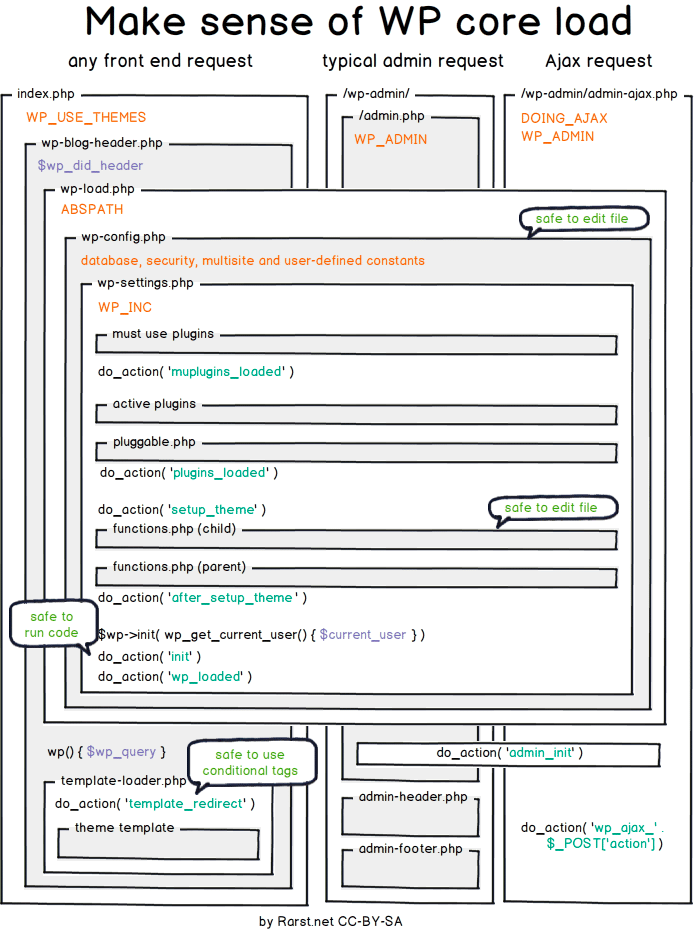

[Volver al Menú](../root.md)

# `WordPress - Estructura`

# `Ciclo de Carga`

## `El listado completo de hooks y su orden de carga en una típica petición es el siguiente:`

- `muplugins_loaded`

  Es la carga de los must use plugins, es decir el nivel superior de plugins que podemos utilizar para darles prioridad.

- `registered_taxonomy`

  El momento en el que se registran las taxonomías como categorías o etiquetas.

- `registered_post_type`

  El momento en el que se registran los tipos de contenido de páginas o entradas.

- `plugins_loaded`

  Cuando se cargan los plugins activos en la instalación.

- `sanitize_comment_cookies`

  El momento en el que se sanitizan las cookies relativas a los comentarios.

- `setup_theme`

  Este hook comienza antes de la carga del tema activo.

- `load_textdomain`

  Carga el sistema de localización de idiomas.

- `after_setup_theme`

  Se utiliza generalmente para inicializar las opciones y ajustes del tema activo. Se utiliza para hacer llamadas inmediatamente después de la carga del archivo functions.php del tema.

- `auth_cookie_malformed`

  Lanzado si no existe una cookie de identificación correctamente creada.

- `auth_cookie_valid`

  Validación de las cookies de autenticación.

- `set_current_user`

  Carga de datos referentes al usuario autenticado.

- `init`

  Se utiliza generalmente para inicializar funciones por parte de los plugins. En este momento el usuario ya se encuentra identificado.

- `widgets_init`

  Utilizado generalmente para registrar nuevas barras laterales.

- `register_sidebar`

  Registro de barras laterales en las diferentes secciones de la web.

- `wp_register_sidebar_widget`

  Registro de cada uno de los widgets incluidos en las barras laterales.

- `wp_default_scripts`

  Lanzamiento de los scripts JS por defecto en el ciclo de carga.

- `wp_default_styles`

  Lanzamiento de los estilos CSS por defecto en el ciclo de carga.

- `admin_bar_init`

  Inicio de la barra de administración.

- `add_admin_bar_menus`

  Carga de los elementos de la barra de administración.

- `wp_loaded`

  Finalizada la carga completa de todos los elementos del núcleo de WordPress.

- `parse_request`

  Petición que afecta a la query principal de WordPress.

- `send_headers`

  Utilizado para añadir nuevas cabeceras a la salida de HTTP.

- `parse_query`

  Se ejecuta después de que las variables de la query principal han sido parseadas.

- `pre_get_posts`

  Se ejecuta después de que se crea el objeto de la variable de la consulta pero antes de ejecutar la propia consulta.

- `posts_selection`

  Utilizada principalmente para plugins de almacenamiento en caché.

- `wp`

  Cargado una vez que el entorno de WordPress se ha desplegado.

- `template_redirect`

  Se utiliza antes de determinar qué tipo de plantilla cargar.

- `get_header`

  Carga de la plantilla de la cabecera.

- `wp_enqueue_scripts`

  Se utiliza para encolar los scripts y estilos.

- `wp_head`

  Imprime los scripts y contenidos para la etiqueta head.

- `wp_print_styles`

  Se ejecuta antes de la impresión de estilos.

- `wp_print_scripts`

  Se ejecuta antes de la impresión de scripts.

- `get_search_form`

  Obtiene el formulario de búsqueda.

- `loop_start`

  Inicio del loop de WordPress.

- `the_post`

  Se inicia una vez que la información del post ha sido instalada.

- `get_template_part_content`

  Plantilla para el contenido.

- `loop_end`

  Se activa una vez finalizado el bucle.

- `get_sidebar`

  Consulta de la existencia de barras laterales o sidebar, definidas en la instalación.

- `dynamic_sidebar`

  Comienzo de la ejecución de elementos de la barra lateral.

- `get_search_form`

  Carga del formulario de búsqueda.

- `pre_get_comments`

  Array de referencia de los comentarios.

- `wp_meta`

  Utilizado como lanzador de contenido en la barra lateral.

- `get_footer`

  Inicio carga del contenido del pie de página.

- `wp_footer`

  Carga de la barra lateral en el pie de página.

- `wp_print_footer_scripts`

  Impresión de los scripts del pie de página.

- `admin_bar_menu`

  Array de referencia de la barra de administración

- `wp_before_admin_bar_render`

  Antes del renderizado de la barra de administración

- `wp_after_admin_bar_render`

  Después del renderizado de la barra de administración

- `shutdown`

  El momento en el cual la ejecución de PHP llega a su final.

# `Base de Datos`

- `wp_commentmeta`

  Almacena metadatos adicionales para los comentarios. Cada fila contiene información adicional asociada a un comentario específico, como datos personalizados o plugins que extienden la funcionalidad de los comentarios.

- `wp_comments`

  Contiene todos los comentarios realizados en el sitio. Incluye detalles como el autor del comentario, su correo electrónico, la fecha, el contenido del comentario y el post al que está asociado.

- `wp_links`

  Esta tabla era utilizada en versiones antiguas de WordPress para gestionar enlaces (blogroll). Actualmente, no se usa comúnmente, ya que la funcionalidad de enlaces fue eliminada del núcleo de WordPress.

- `wp_options`

  Almacena la configuración del sitio, como ajustes generales, opciones de plugins y temas. Es una de las tablas más importantes, ya que contiene información crítica para el funcionamiento del sitio.

- `wp_postmeta`

  Almacena metadatos adicionales para los posts. Cada fila contiene información adicional asociada a un post, página o tipo de contenido personalizado, como campos personalizados o datos de plugins.

- `wp_posts`

  Contiene todos los contenidos del sitio, como posts, páginas, revisiones, tipos de contenido personalizados y entradas de menú. Es una de las tablas más importantes, ya que almacena el contenido principal del sitio.

- `wp_terms`

  Almacena los términos de las taxonomías, como categorías, etiquetas y términos personalizados. Cada fila representa un término individual.

- `wp_termmeta`

  Almacena metadatos adicionales para los términos de las taxonomías. Permite a los desarrolladores agregar información adicional a los términos, como campos personalizados.

- `wp_term_relationships`

  Establece la relación entre los posts y los términos (categorías, etiquetas, etc.). Esta tabla vincula los posts con las taxonomías correspondientes.

- `wp_term_taxonomy`

  Define la taxonomía a la que pertenece cada término. Por ejemplo, si un término es una categoría, una etiqueta o un tipo de taxonomía personalizada.

- `wp_usermeta`

  Almacena metadatos adicionales para los usuarios. Cada fila contiene información adicional asociada a un usuario, como preferencias, configuraciones personalizadas o datos de plugins.

- `wp_users`

  Contiene la información básica de los usuarios registrados en el sitio, como nombre de usuario, contraseña (encriptada), correo electrónico y fecha de registro.

# `Funciones Esenciales (Núcleo de WordPress)`

## `Hooks (Acciones y Filtros):`

- `add_action( $tag, $function_to_add, $priority, $accepted_args )`: Engancha una función a una acción específica.

- `add_filter( $tag, $function_to_add, $priority, $accepted_args )`: Engancha una función a un filtro específico para modificar datos.

## `El Loop (The Loop):`

- `have_posts()`: Verifica si hay publicaciones disponibles.
- `the_post()`: Itera a través de las publicaciones.

## `get_queried_object()`

## `WP_Query:`

- `WP_Query( $args )`: Realiza consultas personalizadas a la base de datos de WordPress.

  `Importancia`: Permite recuperar contenido específico según criterios personalizados (CPTs, taxonomías, etc.).
  Funciones de Usuario:

## `register_taxonomy() y register_taxonomy_for_object_type()`

## `wp_insert_term(), wp_update_term() y wp_delete_term(), get_terms()`

## `register_post_type()`

## `add_post_meta(), get_post_meta(), update_post_meta() y delete_post_meta()`

## `wp_insert_user(), wp_update_user() y wp_delete_user(), get_users()`

## `add_option(), get_option(), update_option() y delete_option()`

## `set_transient(), get_transient() y delete_transient()`

## `Shortcodes`

## `set_query_var`

## `get_query_var`

## `get_template_part`

## `AJAX`

# `Template Files`

## `Page Templates`

When a person browses to your website, WordPress selects which template to use for rendering that page. As we learned earlier in the Template Hierarchy, WordPress looks for template files in the following order:

- `Page Template` — If the page has a custom template assigned, WordPress looks for that file and, if found, uses it.
- `page-{slug}.php` — If no custom template has been assigned, WordPress looks for and uses a specialized template that contains the page’s slug.
- `page-{id}.php` — If a specialized template that includes the page’s slug is not found, WordPress looks for and uses a specialized template named with the page’s ID.
- `page.php` — If a specialized template that includes the page’s ID is not found, WordPress looks for and uses the theme’s default page template.
- `singular.php` — If page.php is not found, WordPress looks for and uses the theme’s template used for a single post, irregardless of post type.
- `index.php` — If no specific page templates are assigned or found, WordPress defaults back to using the theme’s index file to render pages.

## `Post Template Files`

- `Index.php`
- `Home.php`
- `Single.php`
- `Singular.php`
- `Archive.php`
- `Author.php and Date.php`
- `Category.php, Tag.php, and Taxonomy.php`
- `Search.php`

## `Template Hierarchy`

## `The Template Hierarchy In Detail`

### `Home Page display`

- ` home.php`

- `index.php`

If `front-page.php` exists, it will override the home.php template.

### `Front Page display`

The front-page.php template file is used to render your site’s front page, whether the front page displays the blog posts index (mentioned above) or a static page. If the front-page.php file does not exist, WordPress will either use the home.php or page.php files depending on the setup in Settings → Reading. If neither of those files exist, it will use the index.php file.

- `front-page.php`– Used for both “your latest posts” or “a static page” as set in the front page displays section of Settings → Reading.
- `home.php`– If WordPress cannot find front-page.php and “your latest posts” is set in the front page displays section, it will look for home.php. Additionally, WordPress will look for this file when the posts page is set in the front page displays section.
- `page.php` – When “front page” is set in the front page displays section.
- `index.php` – When “your latest posts” is set in the front page displays section but home.php does not exist or when front page is set but page.php does not exist.

### `Privacy Policy Page display`

The privacy-policy.php template file is used to render your site’s Privacy Policy page. The Privacy Policy page template takes precedence over the static page (page.php) template. If the privacy-policy.php file does not exist, WordPress will either use the page.php or singular.php files depending on the available templates

### `Single Post`

The single post template file is used to render a single post. WordPress uses the following path:

- `single-{post-type}-{slug}.php` – (Since 4.4) First, WordPress looks for a template for the specific post. For example, if post type is product and the post slug is dmc-12, WordPress would look for single-product-dmc-12.php.
- `single-{post-type}.php` – If the post type is product, WordPress would look for single-product.php.
- `single.php`– WordPress then falls back to single.php.
- `singular.php` – Then it falls back to singular.php.
- `index.php` – Finally, as mentioned above, WordPress ultimately falls back to index.php.

[Mas Información](https://developer.wordpress.org/themes/basics/template-hierarchy/)

# `Carpetas Principales en la raíz de WordPress`

- ## `wp-admin`

Esta es la carpeta que contiene los archivos y carpetas necesarios para el backend de WordPress, es por eso que cuando ingresas al backend usas la urls https://tudominio/wp-admin, es decir, esta haciendo referencia a esa carpeta.

Algunos de los archivos que componen la carpeta wp-admin son:

- /css
- /imágenes
- /incluye
- /js
- /about.php
- /admin-header.php
- /admin.php

- ## `wp-content`

Si bien es cierto que el contenido de texto de WordPress se almacena en la Base de Datos, hay contenido que son archivos físicos, por ejemplo: imágenes, videos u otros recursos de tu sitio web, terminarán almacenados en esta carpeta.

Además los plugins y temas que instales también se almacenan dentro de esta carpeta.

- ## `wp-includes`

Este directorio contiene los archivos y carpetas que dan la funcionalidad al core de WordPress, como por ejemplo proveer de una API que hace extensible la funcionalidad a través de Hooks. Nunca deberías modificar los archivos de esta carpeta.

---

# `Principales subcarpetas de WordPress`

Existen algunas subcarpetas con las que frecuentemente trabajarás o al menos necesitaras conocer en donde están ubicadas y para que sirven, estas carpetas son carpetas de contenido, es decir están dentro de la carpeta wp-content.

- ## `Plugins`

Aquí se almacenan los plugins que has instalado en tu WordPress, los plugins usualmente se organizan en carpetas, si eliminas la carpeta de un plugin es similar a desinstalar el plugin, esta es la última opción en caso no puedas desinstalarlo desde el backend de tu sitio.

- ## `Themes`

Esta carpeta contiene los temas de WordPress, tanto los que vienen por defecto como los que hayas instalado, en esta carpeta igualmente se encuentran los temas hijo que se crean en base a un tema existente.

- ## `Uploads`

En esta carpeta se almacenan todos los recursos que usará tu sitio web, tal como imágenes, videos, archivos pdf, etc.

Por defecto WordPress organiza los recursos en carpetas por año y subcapetas por el número de mes, sin embargo si vas a empezar recién a trabajar con tu sitio puedes cambiar esta configuración desde: Ajustes > Medios > Subir archivos.

Es posible además que algunos plugins coloquen sus archivos de recursos dentro de esta carpeta.

[MAS INFORMACIÓN](https://kinsta.com/es/base-de-conocimiento/archivos-wordpress/)

---

# `Archivos principales en la raíz de WordPress`

- ## `wp-config.php`

Este es uno de los principales archivos de tu sitio web, si te descargas WordPress verás que este archivo no viene incluido ya que se crea dinámicamente tras una instalación.

Dentro de este archivo verás la configuración de conexión con la base de datos, además puedes definir constantes que será útiles en la administración de tu sitio.

El archivo `wp-config.php` es esencial y muy útil para todos los usuarios de WordPress, ya que contiene todos los ajustes básicos de WordPress. Esto significa que el archivo `wp-config.php` te permite editar varias áreas de tu sitio de WordPress, desde la base de datos hasta hacer posible la actualización automática de tu versión de WordPress. Otra razón por la que `wp-config.php` es tan importante es porque ofrece opciones para activar una función de depuración de WordPress, lo que la hace vital para la resolución de problemas en el futuro.

- ## `wp-login.php`
  Anteriormente vimos que para conectarse al backend del sitio debemos usar la carpeta wp-admin.

Sin embargo es este archivo el que controla el acceso a la administración del sitio, podemos igualmente conectarnos al backend del sitio usando: `https://tudominio.com/wp-login.php`

- ## `.htaccess`

Este es un archivos que se crea cuando habilitas las urls amigables de tu WordPress, además es un archivo importante para realizar redirecciones u otras tareas de seguridad.

El punto delante del nombre del archivo en los sistemas Linux indica que este archivo esta oculto, por lo que es posible que tengas que configurar tu Administrador de Archivos de tu cuenta de hosting o tu cliente FTP para poder verlo.

---

# `Taxonomía`

Es una de esas palabras que la mayoría de la gente nunca escucha o usa. Básicamente, una taxonomía es una forma de agrupar cosas juntas.

## `Categoría`

La taxonomía 'category' (tal es su nombre interno en WordPress y por eso la nombraremos así) te permite agrupar entradas ordenándolas en varias categorías. Estas categorías pueden luego ser vistas en el sitio usando URLs del tipo /category/nombre. Las categorías tienden a ser predefinidas y abarcar un amplio rango.

## `Etiqueta`

La taxonomía 'post_tag' es similar a la de las categorías pero más abierta. Las etiquetas pueden ser creadas en el momento, simplemente tipeando su nombre. Pueden ser vistas en el sitio con URLs del tipo /tag/nombre. Las entradas tienden a tener muchas etiquetas, y generalmente se muestran cerca de las entradas o en forma de nubes de etiquetas.

## `Categorías de links`

La taxonomía 'link_category' te permite categorizar tus enlaces. Tienden a ser usados sólo internamente, razones organizacionales, y no son usualmente expuestos en el sitio. Son convenientes para definir grupos de enlaces a mostrar en las barras laterales o el pié de sitio.

## `Taxonomías Personalizadas`

Ya desde la WordPress 2.3, puedes crear tus propias taxonomías pero éstas han sido una característica de WordPress raramente usada hasta la versión 2.9. En verdad, son una forma extremadamente poderosa de agrupar varios items en diversas formas.

---

# `Custom Post Type`

Cuando WordPress empezó, sólo existían los "posts". Nada más. No había páginas, sólo posts, porque WordPress sólo servía para hacer blogs.

Pero con el tiempo sus desarrolladores vieron clarísimo que necesitábamos ir más allá. Y crearon las "Páginas", que son una "especie de post", o por decirlo de otra forma, un "tipo de post". De ahí le viene lo de "Post Type". Seguramente hubiera tenido más sentido llamarle "Content Type", o sea, "Tipo de contenido", pero así quedó.

Así pues, ya teníamos Posts y Páginas (tipo de post). Pero la verdadera revolución llegó con WordPress 3.5, que trajo los "Custom Post Types". ¿Y de que se trata? Pues ni más ni menos que de la posibilidad de crear tus propios tipos de post. Con otras palabras, "Tipos de Posts Personalizados".

Un ejemplo de CPT serían los "Productos" de un eCommerce. Si usáis WooCommerce, veréis el menú de "Productos" en el panel de control. Eso es un CPT. Pero podríamos poner cualquier otro tipo de contenido: Servicios, personas, películas, contactos, animales...

## `Cómo crear un Custom Post Type`

- `A través de un plugin de creación de CPTs`

- `A través de código`

---

# `Paginas`

Las páginas pues, son como posts, con algunas diferencias. Por ejemplo, no tienen fecha, ni categorías ni etiquetas.

---

# `Metabox `

Un Metabox es una interfaz que permite agregar campos adicionales a la página de edición de entradas o páginas en WordPress. Estos campos adicionales pueden contener información personalizada, como datos, imágenes, enlaces o cualquier otro tipo de contenido que desees asociar con una entrada específica.

---

# `Term meta`

El term meta de WordPress es la información adicional que se puede agregar a un término. Se puede usar para guardar valores meta para términos de manera similar a la meta de las publicaciones.

Qué es un término en WordPress
Un término es una clasificación, un grupo o un subconjunto de una Taxonomía. Una Taxonomía puede ser una Categoría, una Etiqueta o una Taxonomía Personalizada.
Qué es el meta de WordPress

El meta de WordPress es una función que permite incluir información adicional sobre una publicación o página. Por ejemplo, el nombre del autor, categorías, etiquetas, fecha, etc.

# `Diferencias entre Meta Box y Term Meta`

- Objeto de los metadatos:
  - Meta Box: Metadatos para entradas, páginas y tipos de publicaciones personalizadas.
  - Term Meta: Metadatos para términos de taxonomía (categorías, etiquetas, etc.).
- Ubicación de uso:
  - Meta Box: Páginas de edición de entradas/páginas.
  - Term Meta: Páginas de edición de términos de taxonomía.
- Finalidad:
  - Meta Box: Agregar información adicional a las publicaciones individuales.
  - Term Meta: Agregar información adicional a las clasificaciones de contenido.

[TOP](#wordpress---estructura)
