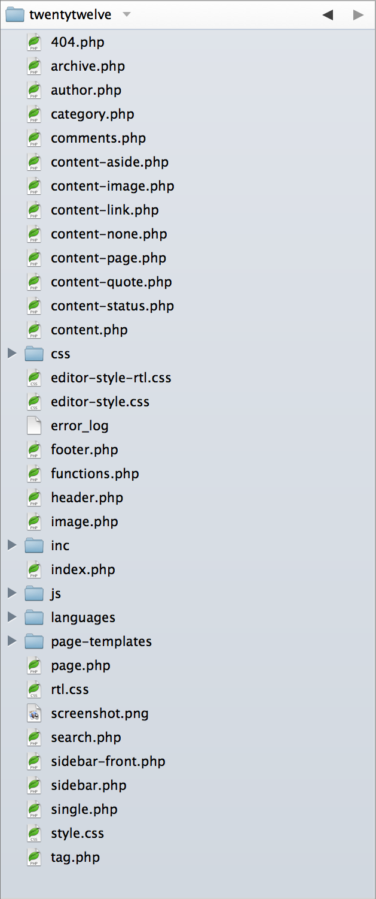

[Volver al Menú](../root.md)

# `Organizing Theme Files`



# `Theme folder and file structure`

```JSON
.
├── assets (dir)/
│   ├── css (dir)
│   ├── images (dir)
│   └── js (dir)
├── inc (dir)
├── template-parts (dir)/
│   ├── footer (dir)
│   ├── header (dir)
│   ├── navigation (dir)
│   ├── page (dir)
│   └── post (dir)
├── 404.php
├── archive.php
├── comments.php
├── footer.php
├── front-page.php
├── functions.php
├── header.php
├── index.php
├── page.php
├── README.txt
├── rtl.css
├── screenshot.png
├── search.php
├── searchform.php
├── sidebar.php
├── single.php
└── style.css
```

## `Page templates folder`

The custom page templates, named page-templates (since: 3.4.0) allows for better organization of template files. Custom page template files placed in this folder are automatically recognized by WordPress.

## `Languages folder`

It’s best practice to internationalize your theme so it can be translated into other languages. Default themes include the languages folder, which contains a .pot file for translation and any translated .mo files. While languages is the default name of this folder, you can change the name. If you do so, you must update load_theme_textdomain().

[TOP](#organizing-theme-files)
