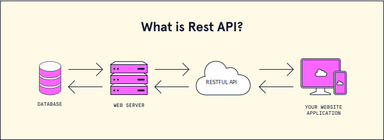

[Volver al Menú](../root.md)

# `APIs`

API is the acronym for Application Programming Interface, which is a software intermediary that allows two applications to talk to each other.



# `REST`

REST, or REpresentational State Transfer, is an architectural style for providing standards between computer systems on the web, making it easier for systems to communicate with each other.

REST-compliant systems, often called RESTful systems, are characterized by how they are stateless and separate the concerns of client and server. We will go into what these terms mean and why they are beneficial characteristics for services on the Web. Pay close attention: If you’re looking for a career in tech, you may be asked to define rest during an interview.

## `Separation of Client and Server`

In the REST architectural style, the implementation of the client and the implementation of the server can be done independently without each knowing about the other. This means that the code on the client side can be changed at any time without affecting the operation of the server, and the code on the server side can be changed without affecting the operation of the client.

As long as each side knows what format of messages to send to the other, they can be kept modular and separate. Separating the user interface concerns from the data storage concerns, we improve the flexibility of the interface across platforms and improve scalability by simplifying the server components. Additionally, the separation allows each component the ability to evolve independently.

## `Statelessness`

Systems that follow the REST paradigm are stateless, meaning that the server does not need to know anything about what state the client is in and vice versa. In this way, both the server and the client can understand any message received, even without seeing previous messages. This constraint of statelessness is enforced through the use of resources, rather than commands. Resources are the nouns of the Web - they describe any object, document, or thing that you may need to store or send to other services.

## `Communication between Client and Server`

In the REST architecture, clients send requests to retrieve or modify resources, and servers send responses to these requests.

## `Making Requests`

REST requires that a client make a request to the server in order to retrieve or modify data on the server. A request generally consists of:

- an HTTP verb, which defines what kind of operation to perform
- a header, which allows the client to pass along information about the request
- a path to a resource
- an optional message body containing data

## `HTTP Verbs`

There are 4 basic HTTP verbs we use in requests to interact with resources in a REST system:

- `GET` — retrieve a specific resource (by id) or a collection of resources
- `POST` — create a new resource
- `PUT` — update a specific resource (by id)
- `DELETE` — remove a specific resource by id

## `Headers and Accept parameters`

In the header of the request, the client sends the type of content that it is able to receive from the server. This is called the Accept field, and it ensures that the server does not send data that cannot be understood or processed by the client. The options for types of content are MIME Types (or Multipurpose Internet Mail Extensions).

`Structure of a MIME type`

A `MIME` type most commonly consists of just two parts: a type and a subtype, separated by a slash (/) — with no whitespace between:

`MIME` Types, used to specify the content types in the Accept field, consist of a type and a subtype. They are separated by a slash (/).

For example, a text file containing HTML would be specified with the type text/html. If this text file contained CSS instead, it would be specified as text/css. A generic text file would be denoted as text/plain. This default value, text/plain, is not a catch-all, however. If a client is expecting text/css and receives text/plain, it will not be able to recognize the content.

`Other types and commonly used subtypes:`

`image` — `image/png`, `image/jpeg`, `image/gif`
`audio` — `audio/wav`, `audio/mpeg`
`video` — `video/mp4`, `video/ogg`
`application` — `application/json`, `application/pdf`, `application/xml`, `application/octet-stream`

For example, a client accessing a resource with id 23 in an articles resource on a server might send a GET request like this:

```
GET /articles/23
Accept: text/html, application/xhtml
```

The Accept header field in this case is saying that the client will accept the content in `text/html` or `application/xhtml`.

## `Paths`

Requests must contain a path to a resource that the operation should be performed on. In RESTful APIs, paths should be designed to help the client know what is going on.

A path like `fashionboutique.com/customers/223/orders/12` is clear in what it points to, even if you’ve never seen this specific path before, because it is hierarchical and descriptive. We can see that we are accessing the order with `id` 12 for the customer with `id` 223.

Paths should contain the information necessary to locate a resource with the degree of specificity needed. When referring to a list or collection of resources, it is not always necessary to add an id. For example, a POST request to the `fashionboutique.com/customers` path would not need an extra identifier, as the server will generate an id for the new object.

If we are trying to access a single resource, we would need to append an `id` to the path. For example: `GET fashionboutique.com/customers/:id` — retrieves the item in the `customers` resource with the `id` specified. `DELETE fashionboutique.com/customers/:id` — deletes the item in the customers resource with the id specified.

## `Sending Responses`

### `Content Types`

In cases where the server is sending a data payload to the client, the server must include a `content-type` in the header of the response. This `content-type` header field alerts the client to the type of data it is sending in the response body. These content types are MIME Types, just as they are in the accept field of the request header. The `content-type` that the server sends back in the response should be one of the options that the client specified in the `accept` field of the request.

For example, when a client is accessing a resource with id 23 in an articles resource with this GET Request:

```
GET /articles/23 HTTP/1.1
Accept: text/html, application/xhtml
```

The server might send back the content with the response header:

```
HTTP/1.1 200 (OK)
Content-Type: text/html
```

This would signify that the content requested is being returned in the response body with a content-type of text/html, which the client said it would be able to accept.

### `Response Codes`

Responses from the server contain status codes to alert the client to information about the success of the operation. As a developer, you do not need to know every status code (there are many of them), but you should know the most common ones and how they are used:

<table>
<thead>
<tr>
<th>Status code</th>
<th>Meaning</th>
</tr>
</thead>
<tbody><tr>
<td>200 (OK)</td>
<td>This is the standard response for successful HTTP requests.</td>
</tr>
<tr>
<td>201 (CREATED)</td>
<td>This is the standard response for an HTTP request that resulted in an item being successfully created.</td>
</tr>
<tr>
<td>204 (NO CONTENT)</td>
<td>This is the standard response for successful HTTP requests, where nothing is being returned in the response body.</td>
</tr>
<tr>
<td>400 (BAD REQUEST)</td>
<td>The request cannot be processed because of bad request syntax, excessive size, or another client error.</td>
</tr>
<tr>
<td>403 (FORBIDDEN)</td>
<td>The client does not have permission to access this resource.</td>
</tr>
<tr>
<td>404 (NOT FOUND)</td>
<td>The resource could not be found at this time. It is possible it was deleted, or does not exist yet.</td>
</tr>
<tr>
<td>500 (INTERNAL SERVER ERROR)</td>
<td>The generic answer for an unexpected failure if there is no more specific information available.</td>
</tr>
</tbody></table>

`1xx informational response `– the request was received, continuing process

`2xx successful` – the request was successfully received, understood, and accepted

`3xx redirection` – further action needs to be taken in order to complete the request

`4xx client error `– the request contains bad syntax or cannot be fulfilled

`5xx server error` – the server failed to fulfil an apparently valid request

For each HTTP verb, there are expected status codes a server should return upon success:

- `GET` — return 200 (OK)
- `POST` — return 201 (CREATED)
- `PUT` — return 200 (OK)
- `DELETE` — return 204 (NO CONTENT) If the operation fails, return the most specific status code possible corresponding to the problem that was encountered.

# `JSON APIs`

`JSON` or `JavaScript Object Notation` is an encoding scheme that is designed to eliminate the need for an ad-hoc code for each application to communicate with servers that communicate in a defined way. `JSON API` module exposes an implementation for data stores and data structures, such as entity types, bundles, and fields.

# `SOAP`

Simple Object Access Protocol (SOAP) is a message protocol for exchanging information between systems and applications. When it comes to application programming interfaces (APIs), a SOAP API is developed in a more structured and formalized way. SOAP messages can be carried over a variety of lower-level protocols, including the web-related Hypertext Transfer Protocol (HTTP).

# `gRPC`

gRPC is a high-performance, open source universal RPC framework

RPC stands for Remote Procedure Call, there’s an ongoing debate on what the g stands for. RPC is a protocol that allows a program to execute a procedure of another program located on another computer. The great advantage is that the developer doesn’t need to code the details of the remote interaction. The remote procedure is called like any other function. But the client and the server can be coded in different languages.

# `GraphQL`

GraphQL is a query language and runtime system for APIs (application programming interfaces). It is designed to provide a flexible and efficient way for clients to request data from servers, and it is often used as an alternative to REST (representational state transfer) APIs.

One of the main features of GraphQL is its ability to specify exactly the data that is needed, rather than receiving a fixed set of data from an endpoint. This allows clients to request only the data that they need, and it reduces the amount of data that needs to be transferred over the network.

GraphQL also provides a way to define the structure of the data that is returned from the server, allowing clients to request data in a predictable and flexible way. This makes it easier to build and maintain client applications that depend on data from the server.

GraphQL is widely used in modern web and mobile applications, and it is supported by a large and active developer community.

# `Hateoas`

HATEOAS is an acronym for Hypermedia As The Engine Of Application State, it’s the concept that when sending information over a RESTful API the document received should contain everything the client needs in order to parse and use the data i.e they don’t have to contact any other endpoint not explicitly mentioned within the Document.

# `Open api spec`

The OpenAPI Specification (OAS) defines a standard, language-agnostic interface to RESTful APIs which allows both humans and computers to discover and understand the capabilities of the service without access to source code, documentation, or through network traffic inspection. When properly defined, a consumer can understand and interact with the remote service with a minimal amount of implementation logic.

An OpenAPI definition can then be used by documentation generation tools to display the API, code generation tools to generate servers and clients in various programming languages, testing tools, and many other use cases.

`OpenAPI Specification` (formerly Swagger Specification) is an API description format for REST APIs. An OpenAPI file allows you to describe your entire API, including:

- Available endpoints (/users) and operations on each endpoint (GET /users, POST /users)
- Operation parameters Input and output for each operation
- Authentication methods
- Contact information, license, terms of use and other information.

API specifications can be written in YAML or JSON. The format is easy to learn and readable to both humans and machines. The complete OpenAPI Specification can be found on GitHub: OpenAPI 3.0 Specification

[TOP](#apis)