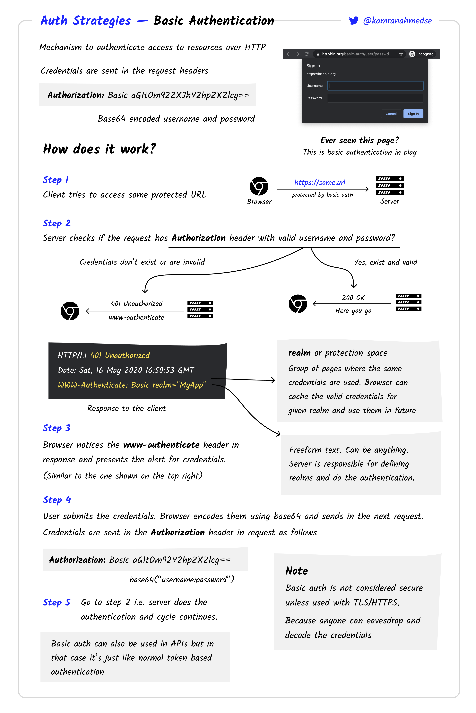

[Volver al Menú](./root.md)

# `Basic authentication`

Given the name “Basic Authentication”, you should not confuse Basic Authentication with the standard username and password authentication. Basic authentication is a part of the HTTP specification, and the details can be found in the RFC7617.

Because it is a part of the HTTP specifications, all the browsers have native support for “HTTP Basic Authentication”.

[TOP](#basic-authentication)