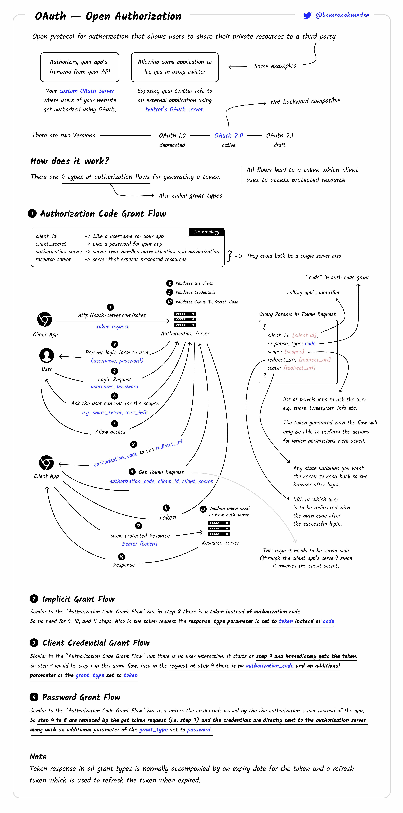

[Volver al Menú](./root.md)

# `OAuth`

OAuth stands for Open Authorization and is an open standard for authorization. It works to authorize devices, APIs, servers and applications using access tokens rather than user credentials, known as “secure delegated access”.

In its most simplest form, OAuth delegates authentication to services like Facebook, Amazon, Twitter and authorizes third-party applications to access the user account without having to enter their login and password.

It is mostly utilized for REST/APIs and only provides a limited scope of a user’s data.

[Top](#oauth)