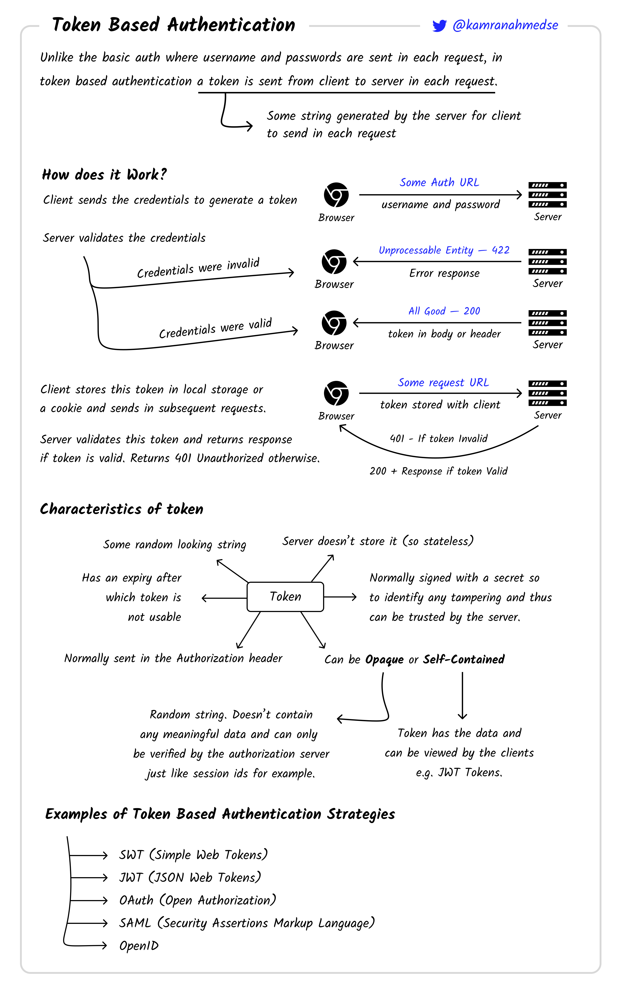

[Volver al Menú](./root.md)

# `Token Based Authentication`

Token-based authentication is a protocol which allows users to verify their identity, and in return receive a unique access token. During the life of the token, users then access the website or app that the token has been issued for, rather than having to re-enter credentials each time they go back to the same webpage, app, or any resource protected with that same token.

Auth tokens work like a stamped ticket. The user retains access as long as the token remains valid. Once the user logs out or quits an app, the token is invalidated.

Token-based authentication is different from traditional password-based or server-based authentication techniques. Tokens offer a second layer of security, and administrators have detailed control over each action and transaction.

But using tokens requires a bit of coding know-how. Most developers pick up the techniques quickly, but there is a learning curve.

---

Use a token-based authentication system, and visitors will verify credentials just once. In return, they'll get a token that allows access for a time period you define.

The process works like this:

- `Request`: The person asks for access to a server or protected resource. That could involve a login with a password, or it could involve some other process you specify.
- `Verification`: The server determines that the person should have access. That could involve checking the password against the username, or it could involve another process you specify.
- `Tokens`: The server communicates with the authentication device, like a ring, key, phone, or similar device. After verification, the server issues a token and passes it to the user.
- `Storage`: The token sits within the user's browser while work continues.

If the user attempts to visit a different part of the server, the token communicates with the server again. Access is granted or denied based on the token.

Administrators set limits on tokens. You could allow a one-use token that is immediately destroyed when the person logs out. Or you could set the token to self-destruct at the end of a specified time period.

## `JSON Web Tokens (JWT)`

JWT is a different approach which uses encryption and hashing techniques to validate the token instead of database checks. It starts the same as token auth, by sending the username and password and validating it against the database.

Once validated, the server generates a token based on a secret key which only the server knows. The client can then include this token in the HTTP headers of subsequent requests, and the server can validate it using the secret key without hitting the database.

[TOP](#token-based-authentication)