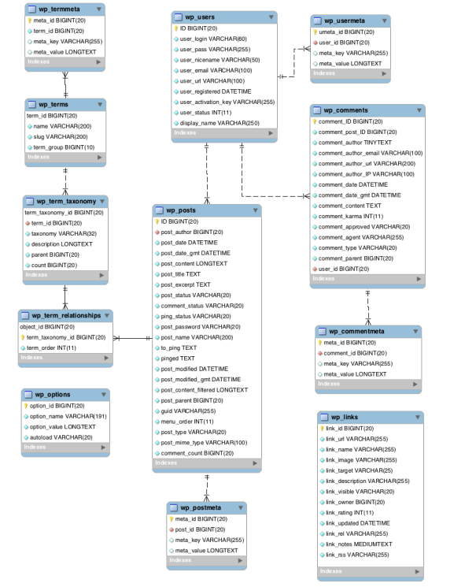

[Volver al Menú](../root.md)

# `Base de Datos`

- `wp_commentmeta`

  Almacena metadatos adicionales para los comentarios. Cada fila contiene información adicional asociada a un comentario específico, como datos personalizados o plugins que extienden la funcionalidad de los comentarios.

- `wp_comments`

  Contiene todos los comentarios realizados en el sitio. Incluye detalles como el autor del comentario, su correo electrónico, la fecha, el contenido del comentario y el post al que está asociado.

- `wp_links`

  Esta tabla era utilizada en versiones antiguas de WordPress para gestionar enlaces (blogroll). Actualmente, no se usa comúnmente, ya que la funcionalidad de enlaces fue eliminada del núcleo de WordPress.

- `wp_options`

  Almacena la configuración del sitio, como ajustes generales, opciones de plugins y temas. Es una de las tablas más importantes, ya que contiene información crítica para el funcionamiento del sitio.

- `wp_postmeta`

  Almacena metadatos adicionales para los posts. Cada fila contiene información adicional asociada a un post, página o tipo de contenido personalizado, como campos personalizados o datos de plugins.

- `wp_posts`

  Contiene todos los contenidos del sitio, como posts, páginas, revisiones, tipos de contenido personalizados y entradas de menú. Es una de las tablas más importantes, ya que almacena el contenido principal del sitio.

- `wp_terms`

  Almacena los términos de las taxonomías, como categorías, etiquetas y términos personalizados. Cada fila representa un término individual.

- `wp_termmeta`

  Almacena metadatos adicionales para los términos de las taxonomías. Permite a los desarrolladores agregar información adicional a los términos, como campos personalizados.

- `wp_term_relationships`

  Establece la relación entre los posts y los términos (categorías, etiquetas, etc.). Esta tabla vincula los posts con las taxonomías correspondientes.

- `wp_term_taxonomy`

  Define la taxonomía a la que pertenece cada término. Por ejemplo, si un término es una categoría, una etiqueta o un tipo de taxonomía personalizada.

- `wp_usermeta`

  Almacena metadatos adicionales para los usuarios. Cada fila contiene información adicional asociada a un usuario, como preferencias, configuraciones personalizadas o datos de plugins.

- `wp_users`

  Contiene la información básica de los usuarios registrados en el sitio, como nombre de usuario, contraseña (encriptada), correo electrónico y fecha de registro.

[TOP](#base-de-datos)
