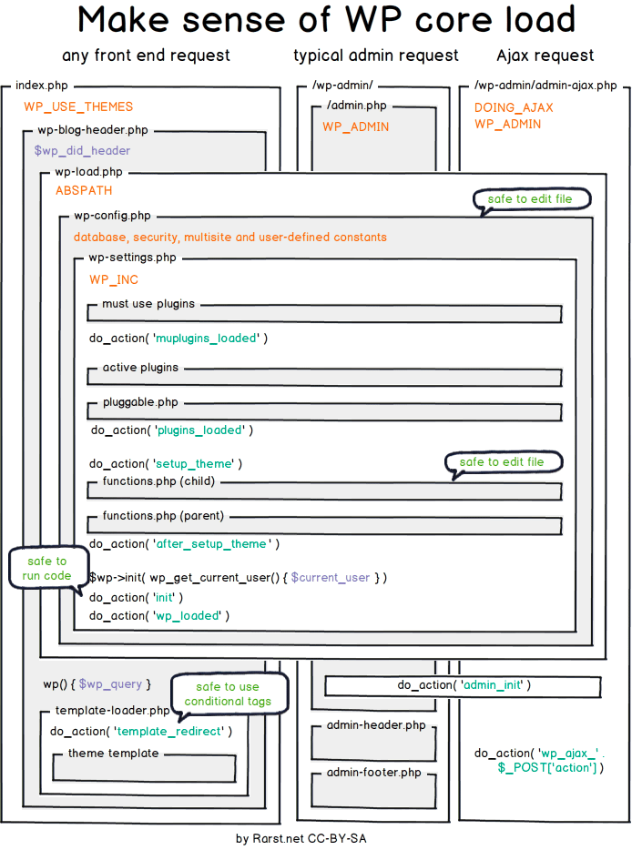

[Volver al Menú](../root.md)

# `Hooks`

## `Hooks (Acciones y Filtros):`

- `add_action( $tag, $function_to_add, $priority, $accepted_args )`: Engancha una función a una acción específica.

- `add_filter( $tag, $function_to_add, $priority, $accepted_args )`: Engancha una función a un filtro específico para modificar datos.

Technically, hooks are a part of the Plugin API, and you can read the documentation on them in the Plugin Handbook.

Despite being in the Plugin API, hooks are also extremely useful in the context of themes. Like plugins, you should always run your code on a hook so that it performs its functionality at the appropriate point in the load process.

# `Ciclo de Carga`

## `El listado completo de hooks y su orden de carga en una típica petición es el siguiente:`

- `muplugins_loaded`

  Es la carga de los must use plugins, es decir el nivel superior de plugins que podemos utilizar para darles prioridad.

- `registered_taxonomy`

  El momento en el que se registran las taxonomías como categorías o etiquetas.

- `registered_post_type`

  El momento en el que se registran los tipos de contenido de páginas o entradas.

- `plugins_loaded`

  Cuando se cargan los plugins activos en la instalación.

- `sanitize_comment_cookies`

  El momento en el que se sanitizan las cookies relativas a los comentarios.

- `setup_theme`

  Este hook comienza antes de la carga del tema activo.

- `load_textdomain`

  Carga el sistema de localización de idiomas.

- `after_setup_theme`

  Se utiliza generalmente para inicializar las opciones y ajustes del tema activo. Se utiliza para hacer llamadas inmediatamente después de la carga del archivo functions.php del tema.

- `auth_cookie_malformed`

  Lanzado si no existe una cookie de identificación correctamente creada.

- `auth_cookie_valid`

  Validación de las cookies de autenticación.

- `set_current_user`

  Carga de datos referentes al usuario autenticado.

- `init`

  Se utiliza generalmente para inicializar funciones por parte de los plugins. En este momento el usuario ya se encuentra identificado.

- `widgets_init`

  Utilizado generalmente para registrar nuevas barras laterales.

- `register_sidebar`

  Registro de barras laterales en las diferentes secciones de la web.

- `wp_register_sidebar_widget`

  Registro de cada uno de los widgets incluidos en las barras laterales.

- `wp_default_scripts`

  Lanzamiento de los scripts JS por defecto en el ciclo de carga.

- `wp_default_styles`

  Lanzamiento de los estilos CSS por defecto en el ciclo de carga.

- `admin_bar_init`

  Inicio de la barra de administración.

- `add_admin_bar_menus`

  Carga de los elementos de la barra de administración.

- `wp_loaded`

  Finalizada la carga completa de todos los elementos del núcleo de WordPress.

- `parse_request`

  Petición que afecta a la query principal de WordPress.

- `send_headers`

  Utilizado para añadir nuevas cabeceras a la salida de HTTP.

- `parse_query`

  Se ejecuta después de que las variables de la query principal han sido parseadas.

- `pre_get_posts`

  Se ejecuta después de que se crea el objeto de la variable de la consulta pero antes de ejecutar la propia consulta.

- `posts_selection`

  Utilizada principalmente para plugins de almacenamiento en caché.

- `wp`

  Cargado una vez que el entorno de WordPress se ha desplegado.

- `template_redirect`

  Se utiliza antes de determinar qué tipo de plantilla cargar.

- `get_header`

  Carga de la plantilla de la cabecera.

- `wp_enqueue_scripts`

  Se utiliza para encolar los scripts y estilos.

- `wp_head`

  Imprime los scripts y contenidos para la etiqueta head.

- `wp_print_styles`

  Se ejecuta antes de la impresión de estilos.

- `wp_print_scripts`

  Se ejecuta antes de la impresión de scripts.

- `get_search_form`

  Obtiene el formulario de búsqueda.

- `loop_start`

  Inicio del loop de WordPress.

- `the_post`

  Se inicia una vez que la información del post ha sido instalada.

- `get_template_part_content`

  Plantilla para el contenido.

- `loop_end`

  Se activa una vez finalizado el bucle.

- `get_sidebar`

  Consulta de la existencia de barras laterales o sidebar, definidas en la instalación.

- `dynamic_sidebar`

  Comienzo de la ejecución de elementos de la barra lateral.

- `get_search_form`

  Carga del formulario de búsqueda.

- `pre_get_comments`

  Array de referencia de los comentarios.

- `wp_meta`

  Utilizado como lanzador de contenido en la barra lateral.

- `get_footer`

  Inicio carga del contenido del pie de página.

- `wp_footer`

  Carga de la barra lateral en el pie de página.

- `wp_print_footer_scripts`

  Impresión de los scripts del pie de página.

- `admin_bar_menu`

  Array de referencia de la barra de administración

- `wp_before_admin_bar_render`

  Antes del renderizado de la barra de administración

- `wp_after_admin_bar_render`

  Después del renderizado de la barra de administración

- `shutdown`

  El momento en el cual la ejecución de PHP llega a su final.

[TOP](#hooks)
