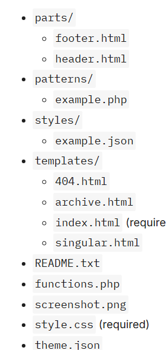
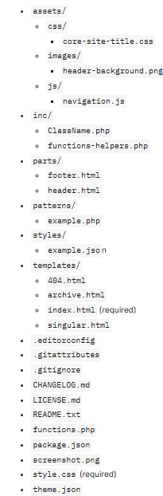

[Volver al Menú](../root.md)

# `Files and folders`

  

# `Optional files`

- `README.txt (Theme Review: Files)`: This is not used directly by the WordPress software. But it is a required file when submitting a theme to the official WordPress theme directory, meant to provide information about the theme to users.
- `functions.php (Custom Functionality)`: A PHP file that WordPress automatically loads after the theme is initialized during the page-loading process. You can use it to run custom PHP.
- `screenshot.png`: A 1200×900 screenshot image of your theme. Used for displaying your theme under Appearance > Themes in the WordPress admin and in the WordPress theme directory (if submitted there). Both .png and .jpg are acceptable file formats.
- `theme.json (Global Settings and Styles)`: Used to configure settings and styles for the site, integrating with the user interface.

# `Standard folders`

- `parts (Template Parts)`: Houses custom template parts for your theme. Parts are smaller sections that you can include within top-level templates. Often, this will include things like headers, footers, and sidebars.
- `patterns (Block Patterns)`: Reusable patterns made up of one or more blocks that users can insert via the editor interface. WordPress will automatically register files included in this folder.
- `styles (Style Variations)`: Variations on the theme’s global settings and styles stored in individual JSON files.
- `templates (Templates)`: Files that represent the overall document structure of the front-end. Templates are made up of block markup and are what site visitors see.

# `Advanced theme structure`

  

# `Optional folders`

- `assets (Including Assets)`: Many theme authors use this folder to store additional CSS, Images/Media, and JavaScript needed for their theme. This folder may also have other names, such as resources or public.
- `inc (Custom Functionality)`: Themes will often have custom PHP classes or files stored in this folder for additional functionality. This folder may also be seen named as includes, src, and more.

[TOP](#files-and-folders)
