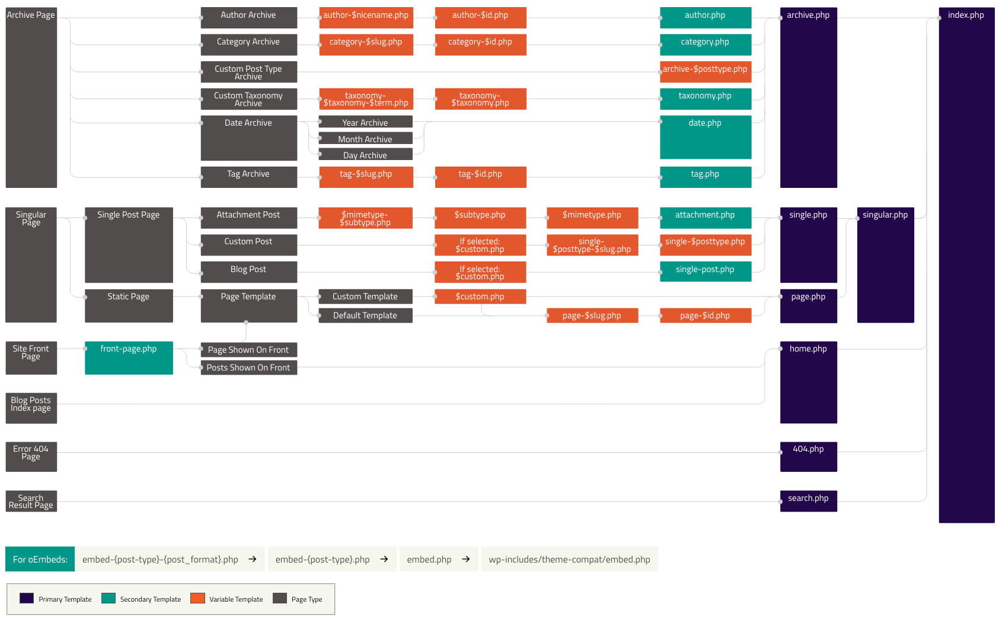

[Volver al Menú](../root.md)

# `Template - Classic Theme`

In classic themes, `Template Tags` are built-in WordPress functions you can use inside a template file to retrieve and display data (such as `the_title()` and `the_content()`).

# `Template files`

In classic themes these are PHP files that contain a mixture of `HTML`, `Template Tags`, and `PHP` code.

# `Template partials`

A template part is a piece of a template that is included as a part of another template, such as a site header.

- `header.php` or `header.html` for generating the site’s header

The `header.php` file does exactly what you would expect. It contains all the code that the browser will render for the header. This is a partial template file because unless a different template file calls the template tag, `get_header()`, the browser will not render the contents of this file.

```JSON
<!DOCTYPE html>
<html <?php language_attributes(); ?> class="no-js">
<head>
    <meta charset="<?php bloginfo( 'charset' ); ?>">
    <meta name="viewport" content="width=device-width">
    <link rel="profile" href="http://gmpg.org/xfn/11">
    <link rel="pingback" href="<?php bloginfo( 'pingback_url' ); ?>">
    <!--[if lt IE 9]>
    <script src="<?php echo esc_url( get_template_directory_uri() ); ?>/js/html5.js"></script>
    <![endif]-->
    <?php wp_head(); ?>
</head>

<body <?php body_class(); ?>>
    <div id="page" class="hfeed site">
        <a class="skip-link screen-reader-text" href="#content"><?php _e( 'Skip to content', 'twentyfifteen' ); ?></a>
        <div id="sidebar" class="sidebar">
            <header id="masthead" class="site-header" role="banner">
                <div class="site-branding">
                    <?php if ( is_front_page() && is_home() ) : ?>
                    <h1 class="site-title">
                        <a href="<?php echo esc_url( home_url( '/' ) ); ?>" rel="home"><?php bloginfo( 'name' ); ?></a>
                    </h1>
                    <?php else : ?>
                    <a href="<?php echo esc_url( home_url( '/' ) ); ?>" rel="home"><?php bloginfo( 'name' ); ?></a>
                    <?php endif;
                    $description = get_bloginfo( 'description', 'display' );
                    if ( $description || is_customize_preview() ) :
                        echo $description;
                    endif; ?>
                    <button class="secondary-toggle"><?php _e( 'Menu and widgets', 'twentyfifteen' ); ?></button>
                </div><!-- .site-branding -->
            </header><!-- .site-header -->
            <?php get_sidebar(); ?>
        </div><!-- .sidebar -->
        <div id="content" class="site-content">
```

- `footer.php` or `footer.html` for generating the footer

Much like the `header.php` file the `footer.php` is a very common template file that most themes utilize. The code in the `footer.php` file will not be rendered unless another template file pulls in the `footer.php` with get_footer() template tag. Similarly to headers, you can make variations of footers using conditional tags.

```JSON
</div><!-- .site-content -->

<footer id="colophon" class="site-footer" role="contentinfo">

	<div class="site-info">

		<?php
		/**
		 * Fires before the Twenty Fifteen footer text for footer customization.
		 *
		 * @since Twenty Fifteen 1.0
		 */
		do_action( 'twentyfifteen_credits' );
		?>
		<a href="<?php echo esc_url( __( 'https://wordpress.org/', 'twentyfifteen' ) ); ?>"><?php printf( __( 'Proudly powered by %s', 'twentyfifteen' ), 'WordPress' ); ?></a>

	</div><!-- .site-info -->

</footer><!-- .site-footer -->

</div><!-- .site -->

<?php wp_footer(); ?>

</body>
</html>
```

- `404.php`
- `sidebar.php` or `sidebar.html` for generating the sidebar

A lot of themes utilize sidebars to display widgets. For a sidebar to work in a theme it must be registered and then a template file for the sidebar must be created. You’ll learn more about registering sidebars in a later chapter. Sidebar files often have conditional statements and the `is_active_sidebar( 'sidebar-name' )` function in them to ensure a widget is in use within the sidebar so that empty HTML isn’t added to a page unnecessarily.

```JSON
<?php if ( has_nav_menu( 'primary' ) || has_nav_menu( 'social' ) || is_active_sidebar( 'sidebar-1' ) ) : ?>

	<div id="secondary" class="secondary">

		<?php if ( is_active_sidebar( 'sidebar-1' ) ) : ?>
			<div id="widget-area" class="widget-area" role="complementary">
				<?php dynamic_sidebar( 'sidebar-1' ); ?>
			</div><!-- .widget-area -->
		<?php endif; ?>

	</div><!-- .secondary -->

<?php endif; ?>
```

- `comments.php`

The comments.php file handles exactly what you would expect, comments. This is a partial template that is pulled into other template files to display comments that users leave on a page or post. Several different pages and posts show comments so it makes sense to have one file that can be pulled in when needed.

# `Common WordPress template files`

- `index.php`

The main template file. It is `required` in all themes.

- `style.css`

The main stylesheet. It is `required` in all themes and contains the information header for your theme.

- `rtl.css`

The `right-to-left` stylesheet is included automatically if the website language’s text direction is `right-to-left`.

- `front-page.php`

The front page template is always used as the site front page if it exists, regardless of what settings on `Admin > Settings > Reading`.

- `home.php`

The home page template is the `front page by default`. If you do not set WordPress to use a static front page, `this template is used to show latest posts`.

- `singular.php`

The singular template is used for posts when `single.php` is not found, or for pages when `page.php` are not found. If` singular.php` is not found,` index.php` is used.

- `single.php`

The single post template is used when a visitor requests a `single post`.

- `single-{post-type}.php`

The single post template used when a visitor requests a `single post from a custom post type`. For example, `single-book.php` would be used for displaying single posts from a custom post type named book.

- `archive-{post-type}.php`

The archive post type template is used when visitors request a `custom post type archive`. For example, `archive-books.php` would be used for displaying an archive of posts from the custom post type named books. The archive template file is used if the `archive-{post-type}` template is not present.

- `page.php`

The page template is used when visitors request `individual pages`, which are a built-in template.

- `page-{slug}.php`

The page slug template is used when visitors request a `specific` page, for example one with the “about” slug `(page-about.php)`.

- `category.php`

The category template is used when visitors request `posts by category`.

- `tag.php`

The tag template is used when visitors request `posts by tag`.

- `taxonomy.php`

The taxonomy term template is used when a visitor requests a `term in a custom taxonomy`.

- `author.php`

The author page template is used whenever a visitor loads an `author page`.

- `date.php`

The date/time template is used when posts are requested by `date or time`. For example, the pages generated with these slugs:

```JSON
http://example.com/blog/2014/
http://example.com/blog/2014/05/
http://example.com/blog/2014/05/26/
```

- `archive.php`

The archive template is used when visitors request `posts by category`, `author`, or `date`. Note: this template will be overridden if more specific templates are present like `category.php`, `author.php`, and `date.php`.

- `search.php`

The search results template is used to display a visitor’s `search results`.

- `attachment.php`

The attachment template is used when viewing a `single attachment like an image, pdf, or other media file`.

- `image.php`

The image attachment template is a more specific version of attachment.php and is used when viewing a `single image attachment`. If not present, WordPress will use `attachment.php` instead.

- `404.php`

The 404 template is used when WordPress `cannot find a post, page, or other content` that matches the visitor’s request.

- `comments.php`

The comments template in classic themes.

# `Template Hierarchy`

This article explains how WordPress determines which template file(s) to use on individual pages.

WordPress uses the <a href="https://wordpress.org/support/article/glossary/#query-string">query string</a> to decide which template or set of templates should be used to display the page. The query string is information that is contained in the link to each part of your website.

Put simply, WordPress searches down through the template hierarchy until it finds a matching template file. To determine which template file to use, WordPress:

- Matches every query string to a query type to decide which page is being requested (for example, a search page, a category page, etc);
- Selects the template in the order determined by the template hierarchy;
- Looks for template files with specific names in the current theme’s directory and uses the first matching template file as specified by the hierarchy.

If WordPress cannot find a template file with a matching name, it will skip to the next file in the hierarchy. If WordPress cannot find any matching template file, the theme’s `index.php` file will be used.

When you are using a child theme, any file you add to your child theme will over-ride the same file in the parent theme. For example, both themes contain the same template `category.php`, then child theme’s template is used.

If a child theme contains the specific template such as `category-unicorns.php` and the parent theme contains lower prioritized template such as `category.php`, then child theme’s `category-unicorns.php` is used.

Contrary, if a child theme contains general template only such as category.php and the parent theme contains the specific one such as `category-unicorns.php`, then parent’s template `category-unicorns.php` is used.



## `The Template Hierarchy In Detail`

## `Front page hierarchy`

The Front Page template hierarchy is unique among templates and can change drastically based on what the user has chosen for their Front page displays setting under Settings > Reading in the admin.

- `Your latest posts & static page`

  - front-page.php
  - Falls back to the Home template hierarchy

## `Home hierarchy`

Despite its name, the Home template is not always used for the homepage of a site. Technically, it refers to the page where your latest blog posts are shown (i.e., the blog posts index).

- `Your latest posts`

  - front-page.php
  - home.php
  - index.php

- `A static page`

  - home.php
  - index.php

### `Single hierarchy`

The Single template hierarchy is fired when a visitor lands upon a single post or a single entry from a custom post type. The following hierarchy is used to determine the template:

- {custom-template}.php - Page Template
- single-{post_type}-{slug}.php
- single-{post_type}.php
- single.php
- singular.php
- index.php

### `Page hierarchy`

The Page template hierarchy fires when someone visits a single page on your website. This hierarchy is used to determine the template:

- {custom-template}.php - Page Template
- page-{slug}.php
- page-{id}.php
- page.php
- singular.php
- index.php

### `Attachment (media) hierarchy`

`MIME_type.php`

Attachments are served by template files based on their `mime-type`. As an example, if your attachment is an image, your can customize how they display through the creation of an `image.php` template file. All images with the `post_mime_type` of `image/\*` will render though your `image.php` template file.

Attachments also support the use of a mime `subtype.php` file. To continue with the image example, you can further customize your theme to support not only an `image.php` file but a `jpg.php subtype file`.

- {mime_type}-{sub_type}.php - can be any MIME type (For example: image.php, video.php, pdf.php). For text/plain, the following path is used (in order):
- {sub_type}.php
- {mime_type}.php
- attachment.php
- Falls back to the default Single template hierarchy

```
As of WordPress 6.4, attachment pages are no longer enabled by default on new installations. Users can enable them with a plugin, so it is still good practice to test your theme and ensure it properly displays content when viewing an attachment page.
```

### `Privacy Policy page hierarchy`

- privacy-policy.php
- Falls back to the Page template hierarchy

### `Taxonomy term hierarchy`

- taxonomy-{taxonomy_slug}-{term_slug}.php
- taxonomy-{taxonomy_slug}.php
- taxonomy.php
- archive.php
- index.php

### `Category hierarchy`

- category-{slug}.php
- category-{id}.php
- category.php
- archive.php
- index.php

### `Tag hierarchy`

- tag-{slug}.php
- tag-{id}.php
- tag.php
- archive.php
- index.php

### `Post type archive hierarchy`

- archive-{post_type}.php
- archive.php
- index.php

### `Author hierarchy`

- author-{user_nicename}.php
- author-{user_id}.php
- author.php
- archive.php
- index.php

### `Date hierarchy`

- date.php
- archive.php
- index.php

### `Search hierarchy`

- search.php
- index.php

### `404 (not found) hierarchy`

- 404.php
- index.php

### `Embed hierarchy`

- embed-{post_type}-{post_format}.php
- embed-{post_type}.php
- embed.php
- Finally, WordPress ultimately falls back to its own wp-includes/theme-compat/embed.php template.

```
Embed templates are not supported by the block templates system. To build and use custom embed templates, they must be located in your theme’s root folder and use the PHP file extension.
```

## `Non-ASCII Character Handling`

Since WordPress 4.7, any dynamic part of a template name which includes non-ASCII characters in its name actually supports both the un-encoded and the encoded form, in that order. You can choose which to use.

- page-hello-world-😀.php
- page-hello-world-%f0%9f%98%80.php
- page-6.php
- page.php
- singular.php

## `Filter Hierarchy`

The WordPress template system lets you filter the hierarchy. This means that you can insert and change things at specific points of the hierarchy. The filter (located in the `get_query_template()` function) uses this filter name: "`{$type}_template`" where `$type` is the template type.

Here is a list of all available filters in the template hierarchy:

- embed_template
- 404_template
- search_template
- frontpage_template
- home_template
- privacypolicy_template
- taxonomy_template
- attachment_template
- single_template
- page_template
- singular_template
- category_template
- tag_template
- author_template
- date_template
- archive_template
- index_template

---

# `Page Templates`

Page templates are a specific type of template file that can be applied to a specific page or groups of pages.

- Page templates are used to change the look and feel of a page.
- A page template can be applied to a single page, a page section, or a class of pages.
- Page templates generally have a high level of specificity, targeting an individual page or group of pages. For example, a page template named page-about.php is more specific than the template files page.php or index.php as it will only affect a page with the slug of “about.”
- If a page template has a template name, WordPress users editing the page have control over what template will be used to render the page.

## `Uses for Page Templates`

Page templates display your site’s dynamic content on a page, e.g., posts, news updates, calendar events, media files, etc. You may decide that you want your homepage to look a specific way, that is quite different to other parts of your site. Or, you may want to display a featured image that links to a post on one part of the page, have a list of latest posts elsewhere, and use a custom navigation. You can use page templates to achieve these things.

For example, you can build page templates for:

- full-width, one-column
- two-column with a sidebar on the right
- two-column with a sidebar on the left
- three-column

## `File Organization of Page Templates`

As discussed in Organizing Theme Files, WordPress recognizes the subfolder page-templates. Therefore, it’s a good idea to store your global page templates in this folder to help keep them organized.

## `Creating Custom Page Templates for Global Use`

It’s a good idea to choose a name that describes what the template does as the name is visible to WordPress users when they are editing the page. For example, you could name your template Homepage, Blog, or Portfolio.

```JSON
<?php
/**
* Template Name: Full Width Page
*
* @package WordPress
* @subpackage Twenty_Fourteen
* @since Twenty Fourteen 1.0
*/
```

## `Creating page templates for specific post types`

By default, a custom page template will be available to the “page” post type.

```JSON
<?php
/*
Template Name: Full-width layout
Template Post Type: post, page, event
*/
// Page code here...
```

## `Page Template Functions`

These built-in WordPress functions and methods can help you work with page templates:

- `get_page_template()` returns the path of the page template used to render the page.
- `wp_get_theme()->get_page_templates()` returns all custom page templates available to the currently active theme (`get_page_templates()` is a method of the WP_Theme class). -` is_page_template()` returns true or false depending on whether a custom page template was used to render the page.
- `get_page_template_slug()` returns the value of custom field \_wp_page_template (null when the value is empty or “default”).If a page has been assigned a custom template, the filename of that template is stored as the value of a custom field named '\_wp_page_template' (in the wp_postmeta database table). (Custom fields starting with an underscore do not display in the edit screen’s custom fields module.)

---

[Comment Template](https://developer.wordpress.org/themes/template-files-section/partial-and-miscellaneous-template-files/comment-template/)

[TOP](#template---classic-theme)
