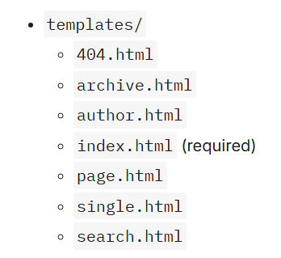
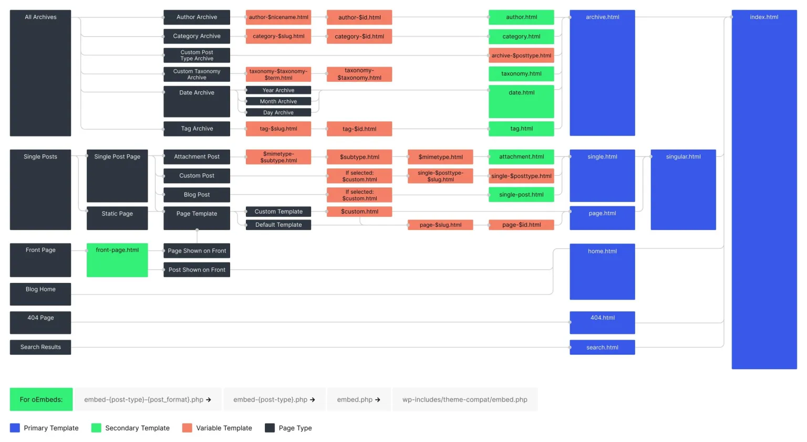

[Volver al Menú](../root.md)

# `Templates`

Theme templates represent the markup of the webpage.

Like nearly all content management systems, WordPress uses a templating system to handle the output of content on the front end of a website. In modern block themes, templates are HTML files with block markup.

---

# `What are templates?`

In a nutshell, templates take dynamic data and wrap it into structured HTML markup, which is then sent to the browser. It is not a particularly revolutionary concept, and it is one that nearly every website system with dynamic data uses.

The templating system in WordPress does a few important things:

- Parses block markup, which is used to reference static and dynamic data.
- Retrieves dynamic data (e.g., post content, site options, etc.) from the database.
- Sends the resulting HTML to the visitor’s browser.

The major difference between WordPress and most other platforms is the inclusion of block markup. Block theme templates are made entirely of blocks, which can both represent static or dynamic data. The WordPress templating system parses these blocks to ensure they output the correct content when it is sent to the visitor’s browser.

Another thing that WordPress does well is provide a visual interface to build or customize templates directly from the admin:

## `Dynamic data`

The major difference between a template and writing plain HTML files is that templates have the ability to insert dynamic data. Let’s look at an example of what this would look like if you were building your website from scratch and not using a CMS like WordPress.

```JSON
<h1>Your Website Name</h1>
```

```JSON
<!-- wp:site-title /-->
```

By using the block markup, your theme will work anywhere WordPress is installed.

---

# `Block markup`

Templates and template parts are files that are made entirely of block markup that represents individual blocks and their settings. WordPress parses this block markup and translates it to its final HTML markup, which can be understood by web browsers.

`Block markup is technically valid HTML`. WordPress uses a custom HTML comment syntax with a standardized format for the markup.

Let’s take a look at a fictional block’s markup in a template:

```JSON
<!-- wp:namespace/slug {"align":"full"} /-->
```

---

# `How to create block markup`

Instead, when building block templates, you will almost always want to build via the block editor and either save directly in the database or copy the block markup into your theme’s template files.

The easiest way to build an entire template is to do so via Appearance > Editor > Templates in the WordPress admin. Here is a look at the Twenty Twenty-Three’s Home template from that screen.

---

# `The relationship between templates and parts`

Templates represent the overall HTML output that gets sent to the browser. An easy way to think of these is as “top-level templates” because they are the top, outermost level of the template system.

Template parts are partial templates that live within top-level templates. Parts make it easy to include reusable sections without having to recreate the block markup for each of the templates.

---

# `How do templates work?`

Whenever someone visits any page on your site, WordPress takes a look at the URL, runs some logic under the hood, and figures out what type of page the visitor is looking at. That’s a very simplified explanation of it anyway. For theme development, you don’t need to know how this part of the process works too deeply—just what the end result is.

Once WordPress determines the type of page, it runs through its “template loader,” which searches for a template that matches the page type. It does this by attempting to locate templates within the template hierarchy for the page type, which is covered in detail in the Template Hierarchy documentation.

---

# `What’s in a template?`

Block theme templates are composed entirely of block markup. That’s it. Really.

OK. It’s slightly more nuanced than that. You will generally see these things in block templates:

- Block markup
- References to template parts
- References to block patterns

Here’s a look at the /templates/404.html template file, which includes all three things:

```JSON
<!-- wp:template-part {"slug":"header","tagName":"header"} /-->

<!-- wp:group {"tagName":"main","layout":{"type":"constrained"}} -->
<main class="wp-block-group">
	<!-- wp:pattern {"slug":"twentytwentythree/hidden-404"} /-->
</main>
<!-- /wp:group -->

<!-- wp:template-part {"slug":"footer","tagName":"footer"} /-->
```

---

# `Organizing templates`

With block themes, there is only one location that you can put block templates: in the theme’s /templates folder. It should be structured like this:

  

---

# `Editing templates`

To access templates from the WordPress admin, open the Appearance > Editor menu in the admin menu. Then click the Templates item in the sidebar.

- User-created templates saved in the database
- Templates from the theme’s /templates folder
- Templates dynamically added by plugins

---

# `Template Hierarchy`

  

## `Front page hierarchy`

The Front Page template hierarchy is unique among templates and can change drastically based on what the user has chosen for their Front page displays setting under Settings > Reading in the admin.

- `Your latest posts & static page`

  - front-page.html
  - Falls back to the Home template hierarchy

## `Home hierarchy`

Despite its name, the Home template is not always used for the homepage of a site. Technically, it refers to the page where your latest blog posts are shown (i.e., the blog posts index).

- `Your latest posts`

  - front-page.html
  - home.html
  - index.html

- `A static page`

  - home.html
  - index.html

### `Single hierarchy`

The Single template hierarchy is fired when a visitor lands upon a single post or a single entry from a custom post type. The following hierarchy is used to determine the template:

- {custom-template}.html
- single-{post_type}-{post_name}.html
- single-{post_type}.html
- single.html
- singular.html
- index.html

### `Page hierarchy`

The Page template hierarchy fires when someone visits a single page on your website. This hierarchy is used to determine the template:

- {custom-template}.html
- page-{post_name}.html
- page-{post_id}.html
- page.html
- index.html

### `Attachment (media) hierarchy`

- {mime_type}-{sub_type}.html
- {sub_type}.html
- {mime_type}.html
- attachment.html
- Falls back to the default Single template hierarchy

```
As of WordPress 6.4, attachment pages are no longer enabled by default on new installations. Users can enable them with a plugin, so it is still good practice to test your theme and ensure it properly displays content when viewing an attachment page.
```

### `Privacy Policy page hierarchy`

- privacy-policy.html
- Falls back to the Page template hierarchy

### `Taxonomy term hierarchy`

- taxonomy-{taxonomy_slug}-{term_slug}.html
- taxonomy-{taxonomy_slug}.html
- taxonomy.html
- archive.html
- index.html

### `Category hierarchy`

- category-{slug}.html
- category-{id}.html
- category.html
- archive.html
- index.html

### `Tag hierarchy`

- tag-{slug}.html
- tag-{id}.html
- tag.html
- archive.html
- index.html

### `Post type archive hierarchy`

- archive-{post_type}.html
- archive.html
- index.html

### `Author hierarchy`

- author-{user_nicename}.html
- author-{user_id}.html
- author.html
- archive.html
- index.html

### `Date hierarchy`

- date.html
- archive.html
- index.html

### `Search hierarchy`

- search.html
- index.html

### `404 (not found) hierarchy`

- 404.html
- index.html

### `Embed hierarchy`

- embed-{post_type}-{post_format}.php
- embed-{post_type}.php
- embed.php

```
embed-{post_type}-{post_format}.php
embed-{post_type}.php
embed.php
```

```
Embed templates are not supported by the block templates system. To build and use custom embed templates, they must be located in your theme’s root folder and use the PHP file extension.
```

---

# `Template parts`

Templates represent the top-level document structure for the front end of a website. But template parts represent smaller sections of content that can be included in one or more templates.

Some common parts are:

- Header
- Footer
- Sidebar
- Comments

A template may consist of none, one, or more parts.

Go to `Appearance` > `Editor` > `Patterns` > `Template Parts` in your WordPress admin.

Templates represent the top-level document structure for the front end of a website. But template parts represent smaller sections of content that can be included in one or more templates.

Some common parts are:

- Header
- Footer
- Sidebar
- Comments

# `How do template parts work?`

Unlike templates, parts are not automatically loaded based on the currently-viewed page. They must be included as a part of the top-level template via the Template Part block.

The Template Part block’s markup looks like this:

```JSON
<!-- wp:template-part {"slug":"your-template-part-slug"} /-->
```

# `Organizing template parts`

With block themes, you must put template parts within your theme’s /parts folder. It should be structured like this:

- parts/
  - comments.html
  - footer.html
  - header.html
  - sidebar.html

None of those are required. In fact, you don’t even have to include any template parts at all.
WordPress does not currently support nested template parts. For example, you cannot create a `/parts/header` folder and put multiple header parts within it. All template parts must be placed directly within your theme’s `/parts` folder.

---

# `Building template parts`

It’s possible to manually write the block markup code for all of your template parts. But, in most cases, you will want to work directly within the WordPress admin and its visual editor. Then, migrate the block markup from the editor to your template part files as described in Introduction to Templates.

## `Registering template parts`

While not required, you should almost always register template parts via `theme.json`. Doing so will ensure that they appear in the user interface for use with the Site and Template editors with nice labels that can be translated.

## `Adding new template parts`

Again, any new parts you add via the editor are saved in the database. You must create the template part file inside your /parts folder and copy the block markup to it if you intend to distribute your theme.

---

# `Template part areas`

Template part areas are essentially a way to organize similar template parts. They also appear as navigational elements within the user interface

By default, WordPress has three areas that you can register your templates for:

- uncategorized (labeled as General in the admin)
- header
- footer

## `Registering custom areas`

You can register as many custom areas you want by adding a filter to the default_wp_template_part_areas hook. Your callback function accepts a single parameter of $areas, which must be an array of area definitions. Each area definition must be an array with these key/value pairs defined:

```JSON
add_filter( 'default_wp_template_part_areas', 'themeslug_template_part_areas' );

function themeslug_template_part_areas( array $areas ) {
	$areas[] = array(
		'area'        => 'loop',
		'area_tag'    => 'section',
		'label'       => __( 'Loop', 'themeslug' ),
		'description' => __( 'Custom description', 'themslug' ),
		'icon'        => 'layout'
	);

	return $areas;
}
```

[TOP](#templates)
